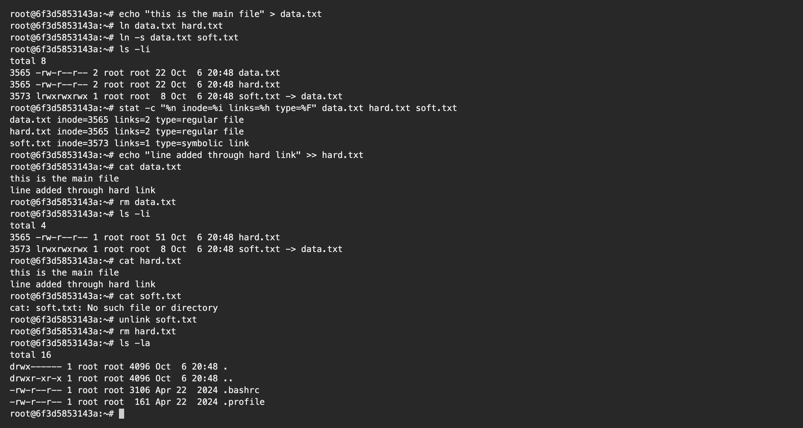
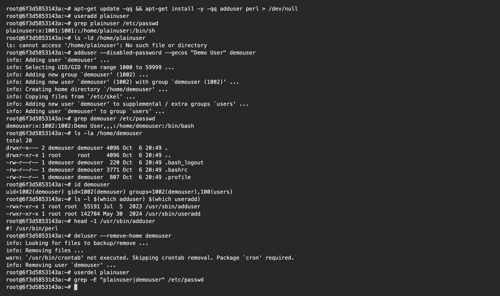
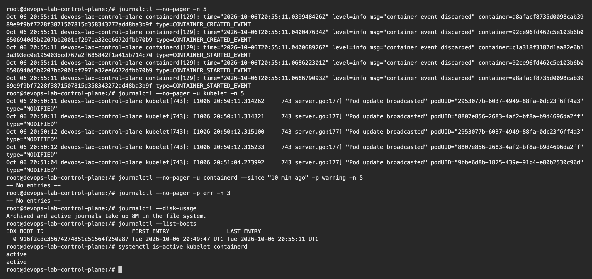

# Linux Fundamentals Homework

**Name:** Parth Dagia
**Roll No:** 24BCS10414

I use a Mac, so for Task 1 and Task 2 I started an `ubuntu:24.04` container and ran everything inside it as root. Task 3 needs systemd, which a normal container does not have, so I ran it on the control plane node of my kind cluster (that node boots with systemd and runs `kubelet` and `containerd` as services).

```bash
docker run -dit --name lab-ubuntu ubuntu:24.04 bash
docker exec -it lab-ubuntu bash
```

One thing that confused me at first: the plain Ubuntu image does not even have `adduser` or `perl`. I had to install them before Task 2, and without `perl` the `deluser --remove-home` command just refuses to run.

---

## Task 1: Hard Link vs Soft Link

| | Hard link | Soft link (symlink) |
|---|---|---|
| What it points to | The same **inode**, so the same data on disk | The **path** (name) of another file |
| Command | `ln data.txt hard.txt` | `ln -s data.txt soft.txt` |
| Separate inode | No, it shares the original inode | Yes, it is its own small file |
| Original file deleted | Data can still be read through the hard link | Link is broken (dangling) |
| Works across partitions | No | Yes |
| Can point to a directory | No | Yes |
| In `ls -l` | Looks like a normal file, link count increases | Starts with `l` and shows `name -> target` |

### What I ran

```text
$ echo "this is the main file" > data.txt

$ ln data.txt hard.txt

$ ln -s data.txt soft.txt

$ ls -li
total 8
3565 -rw-r--r-- 2 root root 22 Oct  6 20:48 data.txt
3565 -rw-r--r-- 2 root root 22 Oct  6 20:48 hard.txt
3573 lrwxrwxrwx 1 root root  8 Oct  6 20:48 soft.txt -> data.txt

$ stat -c "%n inode=%i links=%h type=%F" data.txt hard.txt soft.txt
data.txt inode=3565 links=2 type=regular file
hard.txt inode=3565 links=2 type=regular file
soft.txt inode=3573 links=1 type=symbolic link

$ echo "line added through hard link" >> hard.txt

$ cat data.txt
this is the main file
line added through hard link

$ rm data.txt

$ ls -li
total 4
3565 -rw-r--r-- 1 root root 51 Oct  6 20:48 hard.txt
3573 lrwxrwxrwx 1 root root  8 Oct  6 20:48 soft.txt -> data.txt

$ cat hard.txt
this is the main file
line added through hard link

$ cat soft.txt
cat: soft.txt: No such file or directory

$ unlink soft.txt

$ rm hard.txt

$ ls -la
total 16
drwx------ 1 root root 4096 Oct  6 20:48 .
drwxr-xr-x 1 root root 4096 Oct  6 20:48 ..
-rw-r--r-- 1 root root 3106 Apr 22  2024 .bashrc
-rw-r--r-- 1 root root  161 Apr 22  2024 .profile
```



### Observations

- `data.txt` and `hard.txt` both have inode `3565` and the link count is `2`. They are just two names for one file.
- `soft.txt` has its own inode (`3573`) and is a `symbolic link`. Its size is `8` bytes, which is exactly the length of the text `data.txt` that it stores.
- When I appended a line through `hard.txt`, reading `data.txt` showed the new line too. There is only one copy of the data.
- After `rm data.txt` the link count became `1` but `hard.txt` still had all the content. The data is freed only when the count reaches `0`.
- `soft.txt` stopped working (`No such file or directory`) because the path it points to is gone.
- `rm` or `unlink` removes only the name you give it. It does not touch the other links.

**In one line (how I would say it in an interview):** a hard link is one more name for the same inode, a soft link is a separate file that stores the path of another file.

---

## Task 2: `useradd` vs `adduser`

| | `useradd` | `adduser` |
|---|---|---|
| Type | Low level binary, present on every distro | Friendlier Perl script on Debian/Ubuntu that calls `useradd` |
| Home folder | Not created unless you pass `-m` | Created automatically |
| Default shell | `/bin/sh` | `/bin/bash` |
| Files from `/etc/skel` | Not copied without `-m` | Copied |
| Password and full name | Set later with `passwd` / `chfn` | Asked during creation |
| Good for | Scripts, works the same on all distros | Creating users by hand on Ubuntu |

**Which one I would use on Ubuntu: `adduser`.** One command gives a complete, usable account. To get the same thing with `useradd` I would need `useradd -m -s /bin/bash name` and then `passwd name`.

### What I ran

I used `--disabled-password --gecos` only so that `adduser` does not stop and ask questions, since I was running it non interactively.

```text
$ apt-get update -qq && apt-get install -y -qq adduser perl > /dev/null

$ useradd plainuser

$ grep plainuser /etc/passwd
plainuser:x:1001:1001::/home/plainuser:/bin/sh

$ ls -ld /home/plainuser
ls: cannot access '/home/plainuser': No such file or directory

$ adduser --disabled-password --gecos "Demo User" demouser
info: Adding user `demouser' ...
info: Selecting UID/GID from range 1000 to 59999 ...
info: Adding new group `demouser' (1002) ...
info: Adding new user `demouser' (1002) with group `demouser (1002)' ...
info: Creating home directory `/home/demouser' ...
info: Copying files from `/etc/skel' ...
info: Adding new user `demouser' to supplemental / extra groups `users' ...
info: Adding user `demouser' to group `users' ...

$ grep demouser /etc/passwd
demouser:x:1002:1002:Demo User,,,:/home/demouser:/bin/bash

$ ls -la /home/demouser
total 20
drwxr-x--- 2 demouser demouser 4096 Oct  6 20:49 .
drwxr-xr-x 1 root     root     4096 Oct  6 20:49 ..
-rw-r--r-- 1 demouser demouser  220 Oct  6 20:49 .bash_logout
-rw-r--r-- 1 demouser demouser 3771 Oct  6 20:49 .bashrc
-rw-r--r-- 1 demouser demouser  807 Oct  6 20:49 .profile

$ id demouser
uid=1002(demouser) gid=1002(demouser) groups=1002(demouser),100(users)

$ ls -l $(which adduser) $(which useradd)
-rwxr-xr-x 1 root root  55191 Jul  5  2023 /usr/sbin/adduser
-rwxr-xr-x 1 root root 142784 May 30  2024 /usr/sbin/useradd

$ head -1 /usr/sbin/adduser
#! /usr/bin/perl

$ deluser --remove-home demouser
info: Looking for files to backup/remove ...
info: Removing files ...
warn: `/usr/bin/crontab' not executed. Skipping crontab removal. Package `cron' required.
info: Removing user `demouser' ...

$ userdel plainuser

$ grep -E "plainuser|demouser" /etc/passwd
```



### Observations

- `useradd plainuser` only added a line in `/etc/passwd`. The shell is `/bin/sh` and `/home/plainuser` was never created.
- `adduser demouser` created a group, created `/home/demouser`, copied `.bashrc`, `.profile` and `.bash_logout` from `/etc/skel` and gave the user `/bin/bash`.
- `head -1 /usr/sbin/adduser` prints `#! /usr/bin/perl`, which proves `adduser` is a Perl script and not a compiled binary. That is also why it is smaller than `useradd`.
- `deluser --remove-home` removed the user and the home folder. `userdel` is the low level version (`userdel -r` also removes the home folder).

---

## Task 3: `journalctl`

`journalctl` is used to read the logs that `systemd-journald` collects. Kernel messages, boot messages and service logs are all in one place, and they can be filtered by unit, time and priority.

```text
$ journalctl --no-pager -n 5
Oct 06 20:55:11 devops-lab-control-plane containerd[129]: time="2026-10-06T20:55:11.039948426Z" level=info msg="container event discarded" container=a8afacf8735d0098cab3989e9f9bf7228f3871507815d358343272ad48ba3b9f type=CONTAINER_CREATED_EVENT
Oct 06 20:55:11 devops-lab-control-plane containerd[129]: time="2026-10-06T20:55:11.040047634Z" level=info msg="container event discarded" container=92ce96fd462c5e103b6b06506940d5b0207bb2001bf2971a32ee6672dfbb70b9 type=CONTAINER_CREATED_EVENT
Oct 06 20:55:11 devops-lab-control-plane containerd[129]: time="2026-10-06T20:55:11.040068926Z" level=info msg="container event discarded" container=c1a318f3187d1aa82e6b13a393ec0e195003bcd767a2f685842f1a415b714c70 type=CONTAINER_STARTED_EVENT
Oct 06 20:55:11 devops-lab-control-plane containerd[129]: time="2026-10-06T20:55:11.068622301Z" level=info msg="container event discarded" container=92ce96fd462c5e103b6b06506940d5b0207bb2001bf2971a32ee6672dfbb70b9 type=CONTAINER_STARTED_EVENT
Oct 06 20:55:11 devops-lab-control-plane containerd[129]: time="2026-10-06T20:55:11.068679093Z" level=info msg="container event discarded" container=a8afacf8735d0098cab3989e9f9bf7228f3871507815d358343272ad48ba3b9f type=CONTAINER_STARTED_EVENT

$ journalctl --no-pager -u kubelet -n 5
Oct 06 20:50:11 devops-lab-control-plane kubelet[743]: I1006 20:50:11.314262     743 server.go:177] "Pod update broadcasted" podUID="2953077b-6037-4949-88fa-0dc23f6ff4a3" type="MODIFIED"
Oct 06 20:50:11 devops-lab-control-plane kubelet[743]: I1006 20:50:11.314321     743 server.go:177] "Pod update broadcasted" podUID="8807e856-2683-4af2-bf8a-b9d4696da2ff" type="MODIFIED"
Oct 06 20:50:12 devops-lab-control-plane kubelet[743]: I1006 20:50:12.315100     743 server.go:177] "Pod update broadcasted" podUID="2953077b-6037-4949-88fa-0dc23f6ff4a3" type="MODIFIED"
Oct 06 20:50:12 devops-lab-control-plane kubelet[743]: I1006 20:50:12.315233     743 server.go:177] "Pod update broadcasted" podUID="8807e856-2683-4af2-bf8a-b9d4696da2ff" type="MODIFIED"
Oct 06 20:51:04 devops-lab-control-plane kubelet[743]: I1006 20:51:04.273992     743 server.go:177] "Pod update broadcasted" podUID="9bbe6d8b-1825-439e-91b4-e80b2530c96d" type="MODIFIED"

$ journalctl --no-pager -u containerd --since "10 min ago" -p warning -n 5
-- No entries --

$ journalctl --no-pager -p err -n 3
-- No entries --

$ journalctl --disk-usage
Archived and active journals take up 8M in the file system.

$ journalctl --list-boots
IDX BOOT ID                          FIRST ENTRY                 LAST ENTRY
  0 916f2cdc35674274851c51564f250a87 Tue 2026-10-06 20:49:47 UTC Tue 2026-10-06 20:55:11 UTC

$ systemctl is-active kubelet containerd
active
active
```



### Useful options

| Command | What it does |
|---|---|
| `journalctl` | Every log line, oldest first |
| `journalctl -n 20` | Only the last 20 lines |
| `journalctl -f` | Keep following new lines (like `tail -f`) |
| `journalctl -u kubelet` | Logs of one service (unit) |
| `journalctl -u ssh --since "1 hour ago"` | One service in a time window |
| `journalctl -p err` | Only errors and anything more serious |
| `journalctl -b` | Logs from the current boot |
| `journalctl --list-boots` | All boots the journal knows about |
| `journalctl -k` | Kernel messages only |
| `journalctl --disk-usage` | How much disk the journal uses |
| `journalctl --no-pager` | Print everything instead of opening `less` |

### Observations

- `-u <service>` is the one I will use the most. When `systemctl status` says a service failed, `journalctl -u` shows why.
- `-p err` and `--since` remove most of the noise. On this node there were no warnings or errors, so both printed `-- No entries --`.
- `systemctl is-active` confirmed that `kubelet` and `containerd` are running.

---

## Task 4: Linux Command Cheat Sheet

| Area | Commands | Used for |
|---|---|---|
| Moving around | `pwd`, `ls -la`, `cd` | Current folder, list with hidden files, change folder |
| Files and folders | `touch`, `mkdir -p`, `cp -r`, `mv`, `rm -rf` | Create, copy, move or rename, delete |
| Reading files | `cat`, `less`, `head -n 5`, `tail -f` | Print files, page through them, follow logs |
| Searching | `grep -rin "word" .`, `find / -name "*.conf"` | Search text inside files, search for files |
| Text tools | `wc -l`, `sort`, `uniq -c`, `cut -d: -f1`, `awk`, `sed` | Count, sort, remove duplicates, pick columns, replace |
| Permissions | `chmod 755`, `chmod +x`, `chown user:group` | Change mode and owner |
| Users | `whoami`, `id`, `adduser`, `passwd`, `sudo`, `su -` | Identity and user management |
| Processes | `ps aux`, `top`, `htop`, `kill -9 <pid>`, `jobs`, `bg`, `fg` | See and control processes |
| Disk and memory | `df -h`, `du -sh *`, `free -h`, `lsblk` | Free space, folder size, RAM, disks |
| Services | `systemctl status/start/stop/enable <svc>`, `journalctl -u <svc>` | Manage services and read their logs |
| Network | `ip a`, `ping`, `ss -tulnp`, `curl`, `dig` | IPs, reachability, open ports, HTTP, DNS |
| Archives | `tar -czvf a.tar.gz dir`, `tar -xzvf a.tar.gz`, `zip`, `unzip` | Compress and extract |
| Packages | `apt update`, `apt install`, `apt remove` | Install software on Ubuntu |
| Links | `ln`, `ln -s`, `unlink` | Hard and soft links |
| Help | `man`, `--help`, `which`, `history` | Docs and finding commands |

Permission numbers: read = 4, write = 2, execute = 1. So `chmod 755 file` gives the owner `rwx` (7) and group and others `r-x` (5).
