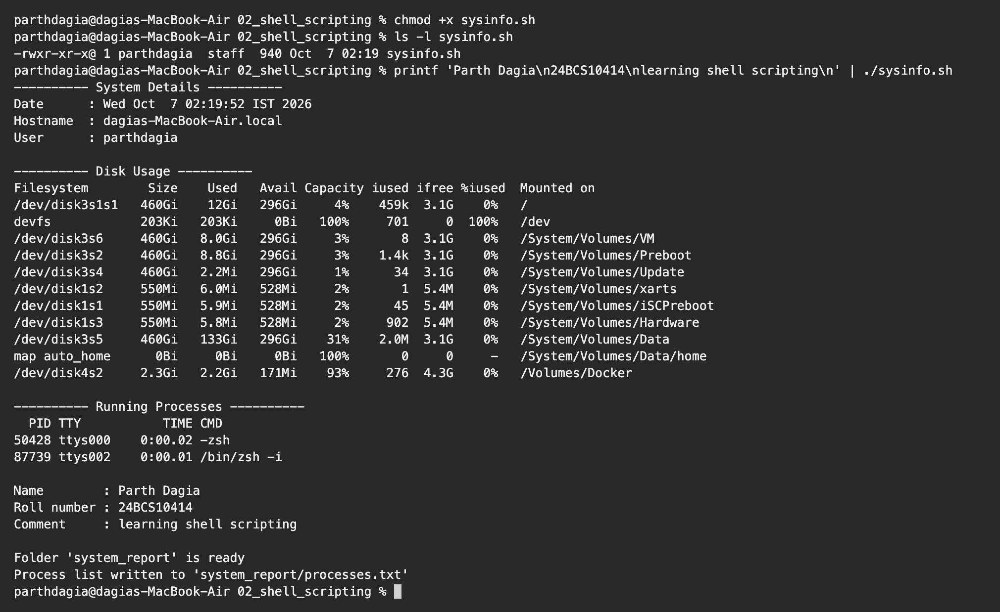
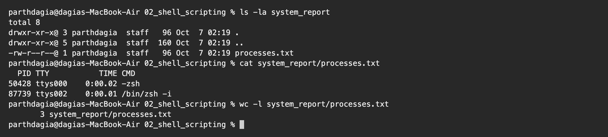

# Shell Scripting Homework

**Name:** Parth Dagia
**Roll No:** 24BCS10414

## Task: System Information Script

Script: [sysinfo.sh](sysinfo.sh)

| Requirement | Where it is in the script |
|---|---|
| Current date | `today=$(date)` |
| Hostname | `machine=$(hostname)` |
| Username | `me=$(whoami)` |
| Disk usage | `df -h` |
| Running processes | `ps` |
| Variables | `today`, `machine`, `me`, `out_dir`, `out_file`, `student_name`, `roll`, `note` |
| User input | `read -p "Enter your name: " student_name` (and two more) |
| Create a directory | `mkdir -p "$out_dir"` |
| Create a file | `touch "$out_file"` |
| Save processes with `>` | `ps > "$out_file"` |

## The script

```bash
#!/bin/bash
# sysinfo.sh - prints basic system details and saves the process list to a file

# variables
today=$(date)
machine=$(hostname)
me=$(whoami)
out_dir="system_report"
out_file="$out_dir/processes.txt"

echo "---------- System Details ----------"
echo "Date      : $today"
echo "Hostname  : $machine"
echo "User      : $me"

echo
echo "---------- Disk Usage ----------"
df -h

echo
echo "---------- Running Processes ----------"
ps

# reading input from the user
echo
read -p "Enter your name: " student_name
read -p "Enter your roll number: " roll
read -p "Write a short comment: " note

echo "Name        : $student_name"
echo "Roll number : $roll"
echo "Comment     : $note"

# make a folder and an empty file inside it
mkdir -p "$out_dir"
touch "$out_file"

# save the process list into the file with > (overwrites old content)
ps > "$out_file"

echo
echo "Folder '$out_dir' is ready"
echo "Process list written to '$out_file'"
```

## Running it

```bash
chmod +x sysinfo.sh
./sysinfo.sh
```

For the capture below I passed my three answers through a pipe with `printf`. When input comes from a pipe instead of the keyboard, bash does not print the `read -p` prompt text, so `Enter your name:` and the other prompts are not visible here. When I run `./sysinfo.sh` normally, each prompt appears and waits for me to type.

```text
$ chmod +x sysinfo.sh

$ ls -l sysinfo.sh
-rwxr-xr-x@ 1 parthdagia  staff  940 Oct  7 02:19 sysinfo.sh

$ printf 'Parth Dagia\n24BCS10414\nlearning shell scripting\n' | ./sysinfo.sh
---------- System Details ----------
Date      : Wed Oct  7 02:19:52 IST 2026
Hostname  : dagias-MacBook-Air.local
User      : parthdagia

---------- Disk Usage ----------
Filesystem        Size    Used   Avail Capacity iused ifree %iused  Mounted on
/dev/disk3s1s1   460Gi    12Gi   296Gi     4%    459k  3.1G    0%   /
devfs            203Ki   203Ki     0Bi   100%     701     0  100%   /dev
/dev/disk3s6     460Gi   8.0Gi   296Gi     3%       8  3.1G    0%   /System/Volumes/VM
/dev/disk3s2     460Gi   8.8Gi   296Gi     3%    1.4k  3.1G    0%   /System/Volumes/Preboot
/dev/disk3s4     460Gi   2.2Mi   296Gi     1%      34  3.1G    0%   /System/Volumes/Update
/dev/disk1s2     550Mi   6.0Mi   528Mi     2%       1  5.4M    0%   /System/Volumes/xarts
/dev/disk1s1     550Mi   5.9Mi   528Mi     2%      45  5.4M    0%   /System/Volumes/iSCPreboot
/dev/disk1s3     550Mi   5.8Mi   528Mi     2%     902  5.4M    0%   /System/Volumes/Hardware
/dev/disk3s5     460Gi   133Gi   296Gi    31%    2.0M  3.1G    0%   /System/Volumes/Data
map auto_home      0Bi     0Bi     0Bi   100%       0     0     -   /System/Volumes/Data/home
/dev/disk4s2     2.3Gi   2.2Gi   171Mi    93%     276  4.3G    0%   /Volumes/Docker

---------- Running Processes ----------
  PID TTY           TIME CMD
50428 ttys000    0:00.02 -zsh
87739 ttys002    0:00.01 /bin/zsh -i

Name        : Parth Dagia
Roll number : 24BCS10414
Comment     : learning shell scripting

Folder 'system_report' is ready
Process list written to 'system_report/processes.txt'
```



### Folder and file created by the script

```text
$ ls -la system_report
total 8
drwxr-xr-x@ 3 parthdagia  staff   96 Oct  7 02:19 .
drwxr-xr-x@ 5 parthdagia  staff  160 Oct  7 02:19 ..
-rw-r--r--@ 1 parthdagia  staff   96 Oct  7 02:19 processes.txt

$ cat system_report/processes.txt
  PID TTY           TIME CMD
50428 ttys000    0:00.02 -zsh
87739 ttys002    0:00.01 /bin/zsh -i

$ wc -l system_report/processes.txt
       3 system_report/processes.txt
```



## What I learned

The script is small, but it uses most of the basics from the session. My notes:

- `var=$(command)` runs the command and saves its output in the variable.
- `read -p "text" var` shows a prompt and saves what the user types into `var`.
- `>` replaces the file content every time, `>>` would add to the end instead. Running the script twice still leaves only one process list in the file.
- `mkdir -p` does not complain if the folder already exists, so the script can be run again safely.
- I put variables in double quotes (`"$out_file"`) so a path with spaces would not break the command.
