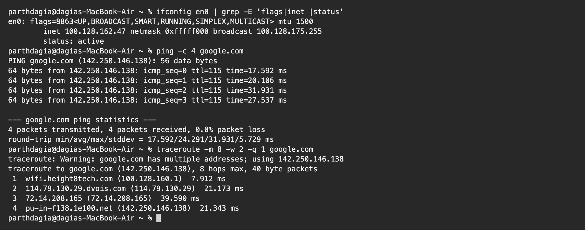
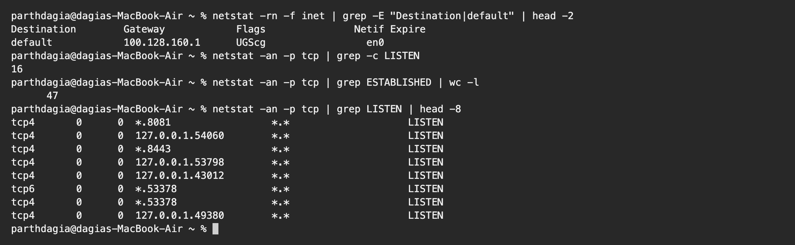
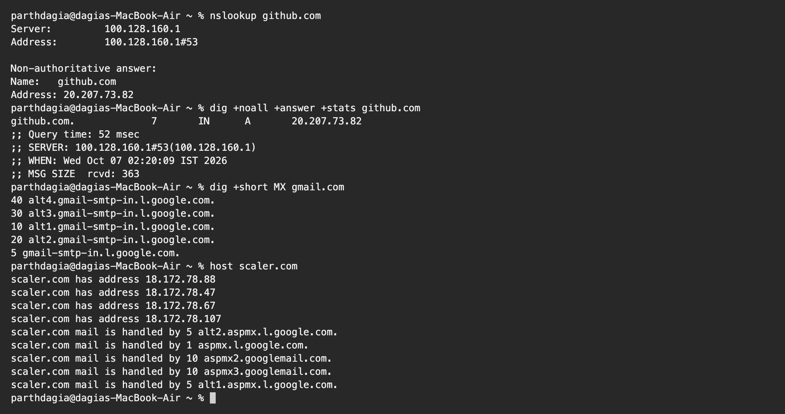
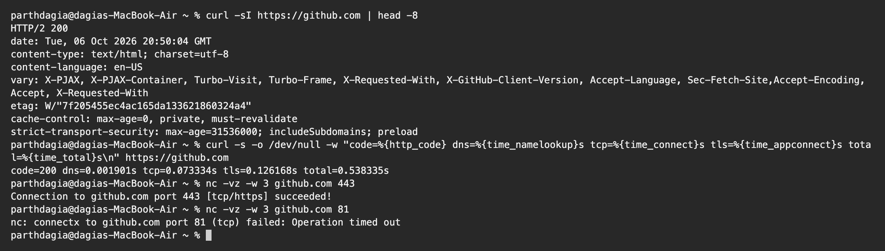

# Networking Fundamentals Homework

**Name:** Parth Dagia
**Roll No:** 24BCS10414

I ran everything on my own MacBook Air, connected over Wi-Fi. macOS uses `ifconfig` and `netstat` where Linux would use `ip a` and `ss`. I filtered a few outputs with `grep` so that my MAC address and other private details are not shown.

## Commands and what they check

| Command | OSI layer | Question it answers |
|---|---|---|
| `ifconfig` / `ip a` | 2 and 3 | What is my IP and netmask, is the interface up? |
| `ping` | 3 | Can I reach the host, and how long is the round trip? |
| `traceroute` | 3 | Which routers does my packet cross? |
| `netstat -rn` / `ip route` | 3 | Where does traffic go first (default gateway)? |
| `netstat -an` / `ss -tulnp` | 4 | Which ports are listening or connected? |
| `nc -vz` / `telnet` | 4 | Is a TCP port open on another machine? |
| `nslookup`, `dig`, `host` | 7 (DNS) | Which IP does a name point to? |
| `curl` | 7 (HTTP) | Does the web server reply, with what status? |

---

## 1. `ifconfig`, `ping` and `traceroute`

```text
$ ifconfig en0 | grep -E 'flags|inet |status'
en0: flags=8863<UP,BROADCAST,SMART,RUNNING,SIMPLEX,MULTICAST> mtu 1500
        inet 100.128.162.47 netmask 0xfffff000 broadcast 100.128.175.255
        status: active

$ ping -c 4 google.com
PING google.com (142.250.146.138): 56 data bytes
64 bytes from 142.250.146.138: icmp_seq=0 ttl=115 time=17.592 ms
64 bytes from 142.250.146.138: icmp_seq=1 ttl=115 time=20.106 ms
64 bytes from 142.250.146.138: icmp_seq=2 ttl=115 time=31.931 ms
64 bytes from 142.250.146.138: icmp_seq=3 ttl=115 time=27.537 ms

--- google.com ping statistics ---
4 packets transmitted, 4 packets received, 0.0% packet loss
round-trip min/avg/max/stddev = 17.592/24.291/31.931/5.729 ms

$ traceroute -m 8 -w 2 -q 1 google.com
traceroute: Warning: google.com has multiple addresses; using 142.250.146.138
traceroute to google.com (142.250.146.138), 8 hops max, 40 byte packets
 1  wifi.height8tech.com (100.128.160.1)  7.912 ms
 2  114.79.130.29.dvois.com (114.79.130.29)  21.173 ms
 3  72.14.208.165 (72.14.208.165)  39.590 ms
 4  pu-in-f138.1e100.net (142.250.146.138)  21.343 ms
```



**ifconfig:** my Wi-Fi interface `en0` is `UP` and `active` with the address `100.128.162.47`. The netmask `0xfffff000` is `255.255.240.0`, which is a `/20`. That leaves 12 host bits, so 2^12 minus 2 = 4094 usable hosts, and the broadcast is `100.128.175.255`. The `100.64.0.0/10` block is not one of the normal private ranges, it is the "shared address space" that ISPs and campus networks use behind carrier grade NAT. Either way this address is not reachable from the internet.

**ping:** sends ICMP echo requests. All 4 replies came back (`0.0% packet loss`) with an average of about 24 ms. `ttl=115` tells me the reply passed through several routers, because each router lowers the TTL by one. Ping also tested DNS for free, because `google.com` had to be resolved first.

**traceroute:** sends packets with TTL 1, 2, 3 and so on, and each router that drops a packet reports back. Hop 1 is my default gateway `100.128.160.1`, hop 2 is the ISP, hop 3 is already Google's network and hop 4 is the server. If a hop shows `*`, that router just did not answer the probe, it does not mean the path is broken.

## 2. `netstat`: routes and ports

```text
$ netstat -rn -f inet | grep -E "Destination|default" | head -2
Destination        Gateway            Flags               Netif Expire
default            100.128.160.1      UGScg                 en0

$ netstat -an -p tcp | grep -c LISTEN
16

$ netstat -an -p tcp | grep ESTABLISHED | wc -l
      47

$ netstat -an -p tcp | grep LISTEN | head -8
tcp4       0      0  *.8081                 *.*                    LISTEN
tcp4       0      0  127.0.0.1.54060        *.*                    LISTEN
tcp4       0      0  *.8443                 *.*                    LISTEN
tcp4       0      0  127.0.0.1.53798        *.*                    LISTEN
tcp4       0      0  127.0.0.1.43012        *.*                    LISTEN
tcp6       0      0  *.53378                *.*                    LISTEN
tcp4       0      0  *.53378                *.*                    LISTEN
tcp4       0      0  127.0.0.1.49380        *.*                    LISTEN
```



The `default` route sends everything that is not local to `100.128.160.1` through `en0`. My laptop had 16 TCP sockets in `LISTEN` state and 47 connections in `ESTABLISHED`. A socket bound to `127.0.0.1.port` only accepts connections from my own machine, while `*.port` accepts them from the network. `*.8081` and `*.8443` are the ports Docker opened for my kind cluster (used in the Ingress homework). On Linux the same check is `ss -tulnp`.

## 3. DNS: `nslookup`, `dig`, `host`

```text
$ nslookup github.com
Server:         100.128.160.1
Address:        100.128.160.1#53

Non-authoritative answer:
Name:   github.com
Address: 20.207.73.82

$ dig +noall +answer +stats github.com
github.com.             7       IN      A       20.207.73.82
;; Query time: 52 msec
;; SERVER: 100.128.160.1#53(100.128.160.1)
;; WHEN: Wed Oct 07 02:20:09 IST 2026
;; MSG SIZE  rcvd: 363

$ dig +short MX gmail.com
40 alt4.gmail-smtp-in.l.google.com.
30 alt3.gmail-smtp-in.l.google.com.
10 alt1.gmail-smtp-in.l.google.com.
20 alt2.gmail-smtp-in.l.google.com.
5 gmail-smtp-in.l.google.com.

$ host scaler.com
scaler.com has address 18.172.78.88
scaler.com has address 18.172.78.47
scaler.com has address 18.172.78.67
scaler.com has address 18.172.78.107
scaler.com mail is handled by 5 alt2.aspmx.l.google.com.
scaler.com mail is handled by 1 aspmx.l.google.com.
scaler.com mail is handled by 10 aspmx2.googlemail.com.
scaler.com mail is handled by 10 aspmx3.googlemail.com.
scaler.com mail is handled by 5 alt1.aspmx.l.google.com.
```



- The resolver that answered is my gateway `100.128.160.1` on port 53.
- `Non-authoritative answer` means the answer came from a cache and not from GitHub's own name servers.
- In the `dig` line, `7` is the remaining TTL in seconds, `IN A` means an IPv4 address record, and the query took 52 ms.
- `MX` records are the mail servers. The lowest number (`5 gmail-smtp-in`) is tried first.
- `host scaler.com` returned four A records (load balancing) and the Google mail servers that handle email for the domain.

## 4. `curl` and `nc`

```text
$ curl -sI https://github.com | head -8
HTTP/2 200
date: Tue, 06 Oct 2026 20:50:04 GMT
content-type: text/html; charset=utf-8
content-language: en-US
vary: X-PJAX, X-PJAX-Container, Turbo-Visit, Turbo-Frame, X-Requested-With, X-GitHub-Client-Version, Accept-Language, Sec-Fetch-Site,Accept-Encoding, Accept, X-Requested-With
etag: W/"7f205455ec4ac165da133621860324a4"
cache-control: max-age=0, private, must-revalidate
strict-transport-security: max-age=31536000; includeSubdomains; preload

$ curl -s -o /dev/null -w "code=%{http_code} dns=%{time_namelookup}s tcp=%{time_connect}s tls=%{time_appconnect}s total=%{time_total}s\n" https://github.com
code=200 dns=0.001901s tcp=0.073334s tls=0.126168s total=0.538335s

$ nc -vz -w 3 github.com 443
Connection to github.com port 443 [tcp/https] succeeded!

$ nc -vz -w 3 github.com 81
nc: connectx to github.com port 81 (tcp) failed: Operation timed out
```



- `curl -I` asks only for headers. `HTTP/2 200` means the page is fine.
- With `-w` I split the request time into DNS (about 2 ms), TCP connect (73 ms), TLS handshake (126 ms) and total (538 ms). This is a quick way to see which step is slow.
- `telnet` is not shipped with new macOS versions, so I used `nc -vz` to test ports. Port 443 on github.com is open. Port 81 timed out, which means a firewall dropped the packets silently. A port that is simply closed would answer `Connection refused` right away.

---

## IP address classes (session notes)

| Class | First octet | Default mask | Network bits / host bits | Usable hosts |
|---|---|---|---|---|
| A | 1 to 126 | 255.0.0.0 (`/8`) | 8 / 24 | 2^24 minus 2 |
| B | 128 to 191 | 255.255.0.0 (`/16`) | 16 / 16 | 2^16 minus 2 |
| C | 192 to 223 | 255.255.255.0 (`/24`) | 24 / 8 | 254 |
| D | 224 to 239 | multicast | none | none |

`127.x.x.x` is reserved for loopback. Private ranges: `10.0.0.0/8`, `172.16.0.0/12`, `192.168.0.0/16`.

We subtract 2 because the first address is the network address and the last is the broadcast. Example: `192.168.10.25/24` is in network `192.168.10.0`, the broadcast is `192.168.10.255` and usable hosts are `.1` to `.254`.

## My troubleshooting order

This is the order I will follow from now on when "the internet is not working":

1. `ifconfig`: do I even have an IP?
2. `ping <gateway>`: is the local network OK?
3. `ping 8.8.8.8`: does the internet work by IP?
4. `nslookup <name>`: is DNS working?
5. `nc -vz <host> <port>`: is the port open?
6. `curl -I <url>`: is the application replying?
