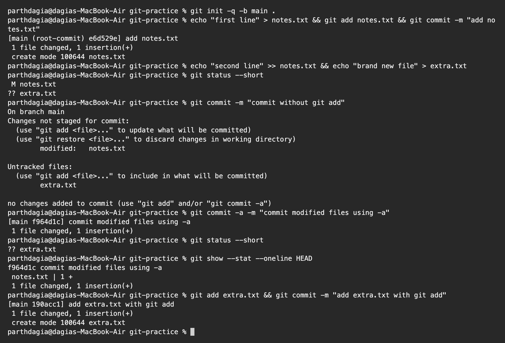
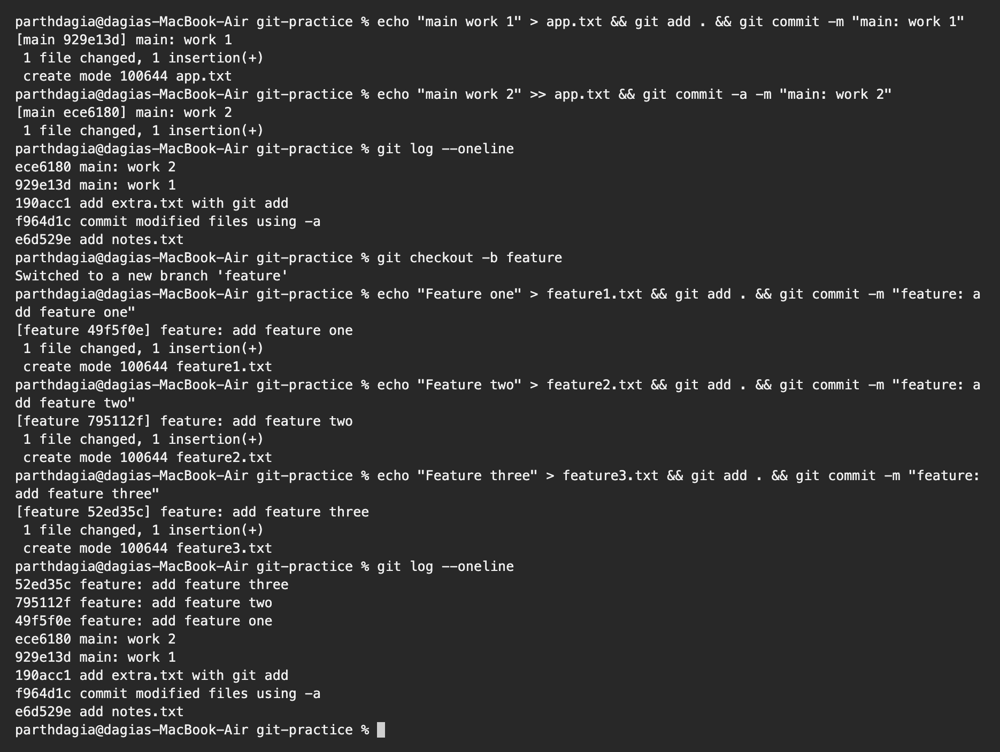
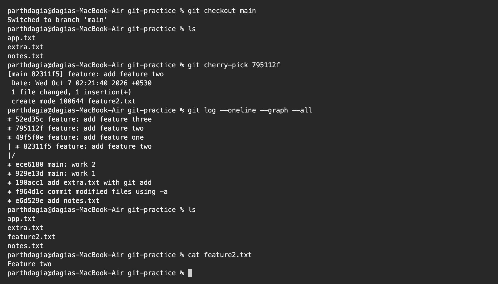

# Git and GitHub Homework

**Name:** Parth Dagia
**Roll No:** 24BCS10414

I did both tasks in a fresh practice repository (`~/git-practice`) made with `git init`. My name and email were already set globally with `git config --global user.name` and `user.email`, so commits use them automatically.

---

## Task 1: `git commit -m` vs `git commit -a -m`

| | `git commit -m "msg"` | `git commit -a -m "msg"` |
|---|---|---|
| What goes into the commit | Only what I staged with `git add` | Every tracked file that was **modified or deleted**, staged for me |
| New untracked files | Only if I `git add` them | **Never** |
| Need `git add` first | Yes | No, but only for files Git already tracks |
| Main risk | Forgetting to stage something | Committing a change I did not mean to include |

### Practice

I edited a file that Git already tracks and also created a completely new file, then tried both commands.

```text
$ git init -q -b main .

$ echo "first line" > notes.txt && git add notes.txt && git commit -m "add notes.txt"
[main (root-commit) e6d529e] add notes.txt
 1 file changed, 1 insertion(+)
 create mode 100644 notes.txt

$ echo "second line" >> notes.txt && echo "brand new file" > extra.txt

$ git status --short
 M notes.txt
?? extra.txt

$ git commit -m "commit without git add"
On branch main
Changes not staged for commit:
  (use "git add <file>..." to update what will be committed)
  (use "git restore <file>..." to discard changes in working directory)
        modified:   notes.txt

Untracked files:
  (use "git add <file>..." to include in what will be committed)
        extra.txt

no changes added to commit (use "git add" and/or "git commit -a")

$ git commit -a -m "commit modified files using -a"
[main f964d1c] commit modified files using -a
 1 file changed, 1 insertion(+)

$ git status --short
?? extra.txt

$ git show --stat --oneline HEAD
f964d1c commit modified files using -a
 notes.txt | 1 +
 1 file changed, 1 insertion(+)

$ git add extra.txt && git commit -m "add extra.txt with git add"
[main 190acc1] add extra.txt with git add
 1 file changed, 1 insertion(+)
 create mode 100644 extra.txt
```



### What happened

- Plain `git commit -m` did nothing and said `no changes added to commit`, because I had not staged anything.
- `git commit -a -m` committed the change in `notes.txt` without me running `git add`.
- `extra.txt` was still `??` (untracked) after that. `-a` only works for files Git already knows about, so a new file always needs one `git add`.

---

## Task 2: `git cherry-pick`

`git cherry-pick <hash>` takes the change from **one** commit and applies it on the branch I am on, as a new commit. It is handy when I need just one fix from another branch and not the whole branch.

### Steps

1. Made two commits on `main` and checked them with `git log --oneline`.
2. Created a `feature` branch and made 3 commits on it.
3. Found the hash of `feature: add feature two` in the log.
4. Went back to `main` and cherry-picked only that commit.
5. Checked that only `feature2.txt` came to `main`.

```text
$ echo "main work 1" > app.txt && git add . && git commit -m "main: work 1"
[main 929e13d] main: work 1
 1 file changed, 1 insertion(+)
 create mode 100644 app.txt

$ echo "main work 2" >> app.txt && git commit -a -m "main: work 2"
[main ece6180] main: work 2
 1 file changed, 1 insertion(+)

$ git log --oneline
ece6180 main: work 2
929e13d main: work 1
190acc1 add extra.txt with git add
f964d1c commit modified files using -a
e6d529e add notes.txt

$ git checkout -b feature
Switched to a new branch 'feature'

$ echo "Feature one" > feature1.txt && git add . && git commit -m "feature: add feature one"
[feature 49f5f0e] feature: add feature one
 1 file changed, 1 insertion(+)
 create mode 100644 feature1.txt

$ echo "Feature two" > feature2.txt && git add . && git commit -m "feature: add feature two"
[feature 795112f] feature: add feature two
 1 file changed, 1 insertion(+)
 create mode 100644 feature2.txt

$ echo "Feature three" > feature3.txt && git add . && git commit -m "feature: add feature three"
[feature 52ed35c] feature: add feature three
 1 file changed, 1 insertion(+)
 create mode 100644 feature3.txt

$ git log --oneline
52ed35c feature: add feature three
795112f feature: add feature two
49f5f0e feature: add feature one
ece6180 main: work 2
929e13d main: work 1
190acc1 add extra.txt with git add
f964d1c commit modified files using -a
e6d529e add notes.txt
```



```text
$ git checkout main
Switched to branch 'main'

$ ls
app.txt
extra.txt
notes.txt

$ git cherry-pick 795112f
[main 82311f5] feature: add feature two
 Date: Wed Oct 7 02:21:40 2026 +0530
 1 file changed, 1 insertion(+)
 create mode 100644 feature2.txt

$ git log --oneline --graph --all
* 52ed35c feature: add feature three
* 795112f feature: add feature two
* 49f5f0e feature: add feature one
| * 82311f5 feature: add feature two
|/
* ece6180 main: work 2
* 929e13d main: work 1
* 190acc1 add extra.txt with git add
* f964d1c commit modified files using -a
* e6d529e add notes.txt

$ ls
app.txt
extra.txt
feature2.txt
notes.txt

$ cat feature2.txt
Feature two
```



### What happened

I was a bit surprised the hash changed, so I checked the graph to understand it.

- Before the cherry-pick, `main` had none of the feature files.
- After `git cherry-pick 795112f`, `main` has `feature2.txt` only. `feature1.txt` and `feature3.txt` are still only on `feature`.
- The new commit on `main` got a different hash (`82311f5`) even though the message and change are the same as `795112f`. It is a copy with a different parent, so it is a different commit.
- The graph shows `main` and `feature` splitting after `main: work 2`.
- If the picked commit had changed lines that are also different on `main`, Git would stop with a conflict. I would then fix the file, `git add` it and run `git cherry-pick --continue`, or cancel with `git cherry-pick --abort`.
