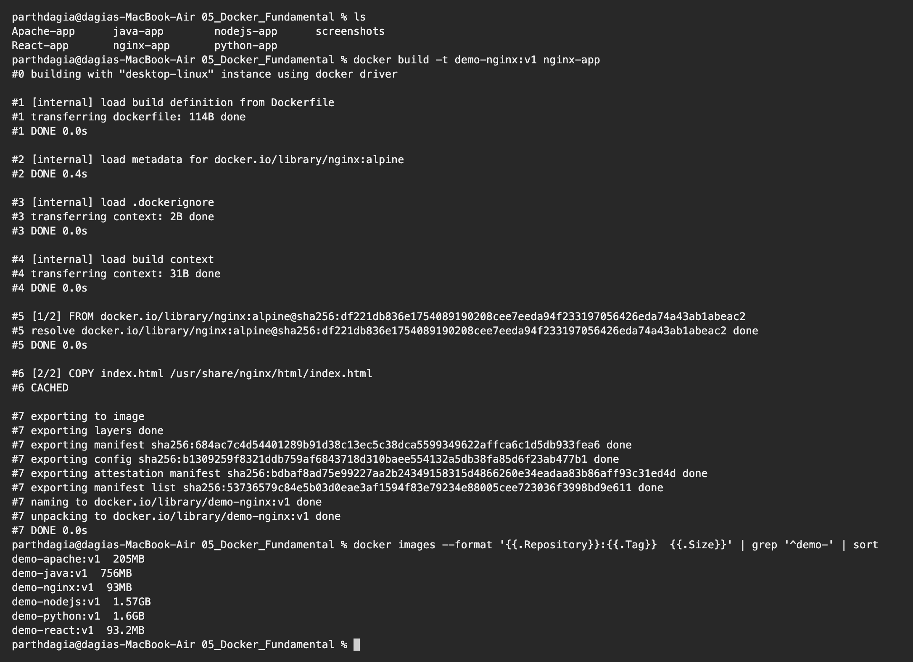
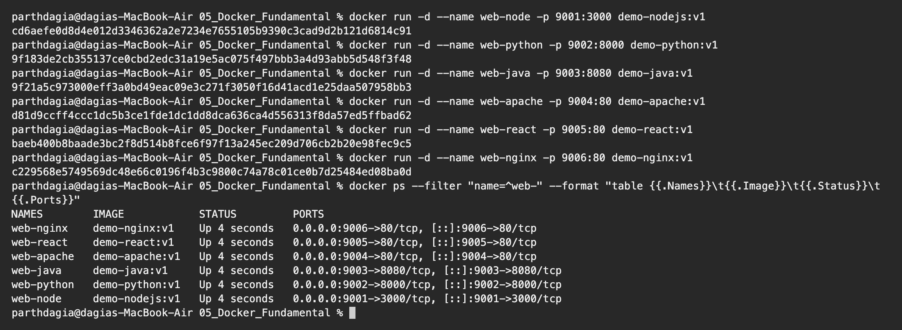
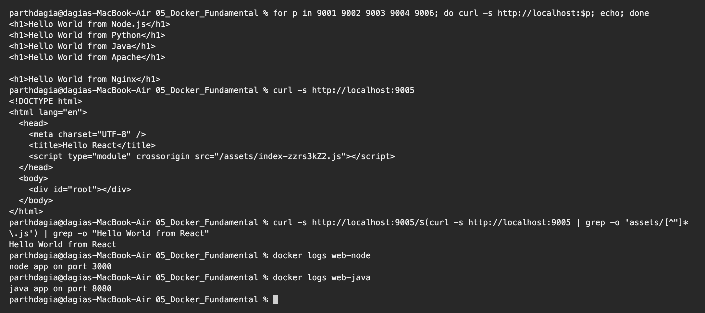

# Docker Fundamentals Homework

**Name:** Parth Dagia
**Roll No:** 24BCS10414

## Task: Hello World web apps in Docker

The task asked for Hello World apps, so I made six small ones to try different stacks. Each folder has the code and its own `Dockerfile`.

| # | Folder | Stack | Base image | Port inside container | Port on my Mac |
|---|---|---|---|---|---|
| 1 | [nodejs-app](nodejs-app) | Node.js `http` module | `node:20` | 3000 | 9001 |
| 2 | [python-app](python-app) | Python `http.server` | `python:3.12` | 8000 | 9002 |
| 3 | [java-app](java-app) | Java `HttpServer` | `eclipse-temurin:21` | 8080 | 9003 |
| 4 | [Apache-app](Apache-app) | Apache httpd static page | `httpd:2.4` | 80 | 9004 |
| 5 | [React-app](React-app) | React + Vite, served by Nginx (multi stage) | `node:20-alpine` then `nginx:alpine` | 80 | 9005 |
| 6 | [nginx-app](nginx-app) | Nginx static page | `nginx:alpine` | 80 | 9006 |

## Step 1: Build the images

```bash
docker build -t demo-nodejs:v1 nodejs-app
docker build -t demo-python:v1 python-app
docker build -t demo-java:v1   java-app
docker build -t demo-apache:v1 Apache-app
docker build -t demo-react:v1  React-app
docker build -t demo-nginx:v1  nginx-app
```

Below is one of the builds (Nginx, the layer was already cached) and the list of all six images.

```text
$ ls
Apache-app      java-app        nodejs-app      screenshots
React-app       nginx-app       python-app

$ docker build -t demo-nginx:v1 nginx-app
#0 building with "desktop-linux" instance using docker driver

#1 [internal] load build definition from Dockerfile
#1 transferring dockerfile: 114B done
#1 DONE 0.0s

#2 [internal] load metadata for docker.io/library/nginx:alpine
#2 DONE 0.4s

#3 [internal] load .dockerignore
#3 transferring context: 2B done
#3 DONE 0.0s

#4 [internal] load build context
#4 transferring context: 31B done
#4 DONE 0.0s

#5 [1/2] FROM docker.io/library/nginx:alpine@sha256:df221db836e1754089190208cee7eeda94f233197056426eda74a43ab1abeac2
#5 resolve docker.io/library/nginx:alpine@sha256:df221db836e1754089190208cee7eeda94f233197056426eda74a43ab1abeac2 done
#5 DONE 0.0s

#6 [2/2] COPY index.html /usr/share/nginx/html/index.html
#6 CACHED

#7 exporting to image
#7 exporting layers done
#7 exporting manifest sha256:684ac7c4d54401289b91d38c13ec5c38dca5599349622affca6c1d5db933fea6 done
#7 exporting config sha256:b1309259f8321ddb759af6843718d310baee554132a5db38fa85d6f23ab477b1 done
#7 exporting attestation manifest sha256:bdbaf8ad75e99227aa2b24349158315d4866260e34eadaa83b86aff93c31ed4d done
#7 exporting manifest list sha256:53736579c84e5b03d0eae3af1594f83e79234e88005cee723036f3998bd9e611 done
#7 naming to docker.io/library/demo-nginx:v1 done
#7 unpacking to docker.io/library/demo-nginx:v1 done
#7 DONE 0.0s

$ docker images --format '{{.Repository}}:{{.Tag}}  {{.Size}}' | grep '^demo-' | sort
demo-apache:v1  205MB
demo-java:v1  756MB
demo-nginx:v1  93MB
demo-nodejs:v1  1.57GB
demo-python:v1  1.6GB
demo-react:v1  93.2MB
```



## Step 2: Run the containers

`-d` runs it in the background, `--name` gives it a name I can use later, and `-p host:container` publishes the port.

```text
$ docker run -d --name web-node -p 9001:3000 demo-nodejs:v1
cd6aefe0d8d4e012d3346362a2e7234e7655105b9390c3cad9d2b121d6814c91

$ docker run -d --name web-python -p 9002:8000 demo-python:v1
9f183de2cb355137ce0cbd2edc31a19e5ac075f497bbb3a4d93abb5d548f3f48

$ docker run -d --name web-java -p 9003:8080 demo-java:v1
9f21a5c973000eff3a0bd49eac09e3c271f3050f16d41acd1e25daa507958bb3

$ docker run -d --name web-apache -p 9004:80 demo-apache:v1
d81d9ccff4ccc1dc5b3ce1fde1dc1dd8dca636ca4d556313f8da57ed5ffbad62

$ docker run -d --name web-react -p 9005:80 demo-react:v1
baeb400b8baade3bc2f8d514b8fce6f97f13a245ec209d706cb2b20e98fec9c5

$ docker run -d --name web-nginx -p 9006:80 demo-nginx:v1
c229568e5749569dc48e66c0196f4b3c9800c74a78c01ce0b7d25484ed08ba0d

$ docker ps --filter "name=^web-" --format "table {{.Names}}\t{{.Image}}\t{{.Status}}\t{{.Ports}}"
NAMES        IMAGE            STATUS         PORTS
web-nginx    demo-nginx:v1    Up 4 seconds   0.0.0.0:9006->80/tcp, [::]:9006->80/tcp
web-react    demo-react:v1    Up 4 seconds   0.0.0.0:9005->80/tcp, [::]:9005->80/tcp
web-apache   demo-apache:v1   Up 4 seconds   0.0.0.0:9004->80/tcp, [::]:9004->80/tcp
web-java     demo-java:v1     Up 4 seconds   0.0.0.0:9003->8080/tcp, [::]:9003->8080/tcp
web-python   demo-python:v1   Up 4 seconds   0.0.0.0:9002->8000/tcp, [::]:9002->8000/tcp
web-node     demo-nodejs:v1   Up 4 seconds   0.0.0.0:9001->3000/tcp, [::]:9001->3000/tcp
```



## Step 3: Check Hello World

The same URLs open in the browser. Here I used `curl` so the output is in the terminal.

```text
$ for p in 9001 9002 9003 9004 9006; do curl -s http://localhost:$p; echo; done
<h1>Hello World from Node.js</h1>
<h1>Hello World from Python</h1>
<h1>Hello World from Java</h1>
<h1>Hello World from Apache</h1>

<h1>Hello World from Nginx</h1>

$ curl -s http://localhost:9005
<!DOCTYPE html>
<html lang="en">
  <head>
    <meta charset="UTF-8" />
    <title>Hello React</title>
    <script type="module" crossorigin src="/assets/index-zzrs3kZ2.js"></script>
  </head>
  <body>
    <div id="root"></div>
  </body>
</html>

$ curl -s http://localhost:9005/$(curl -s http://localhost:9005 | grep -o 'assets/[^"]*\.js') | grep -o "Hello World from React"
Hello World from React

$ docker logs web-node
node app on port 3000

$ docker logs web-java
java app on port 8080
```



The React page only contains an empty `<div id="root">` and a JS file, because React builds the heading in the browser. To prove the text is really in what Nginx serves, I pulled the JS bundle and searched it for `Hello World from React`. Opening <http://localhost:9005> in the browser shows that heading.

## Step 4: Clean up

```bash
docker rm -f web-node web-python web-java web-apache web-react web-nginx
```

## What I learned

The Python and Node images being around 1.6 GB each surprised me the most.

- A `Dockerfile` is the recipe. `FROM` picks the base image, `WORKDIR` sets the folder, `COPY` adds my files, `RUN` runs during build, `CMD` runs when the container starts, `EXPOSE` documents the port.
- `EXPOSE` does not open anything by itself. The app is reachable from my Mac only because of `-p 9001:3000`.
- The server inside the container must listen on `0.0.0.0`. If it listens on `127.0.0.1` the published port will not answer.
- The base image decides most of the size. `node:20` and `python:3.12` images are about 1.6 GB, while the Nginx ones are about 93 MB. Using `-alpine` or `-slim` tags is the easiest way to shrink an image.
- The React app uses a **multi stage build**. The first stage (`node:20-alpine`) runs `npm install` and `npm run build`. The second stage (`nginx:alpine`) only copies the `dist` folder, so the final image has no Node.js and no `node_modules`.
- `docker logs <name>` shows what the app printed. The Node and Java apps print the port they started on.
