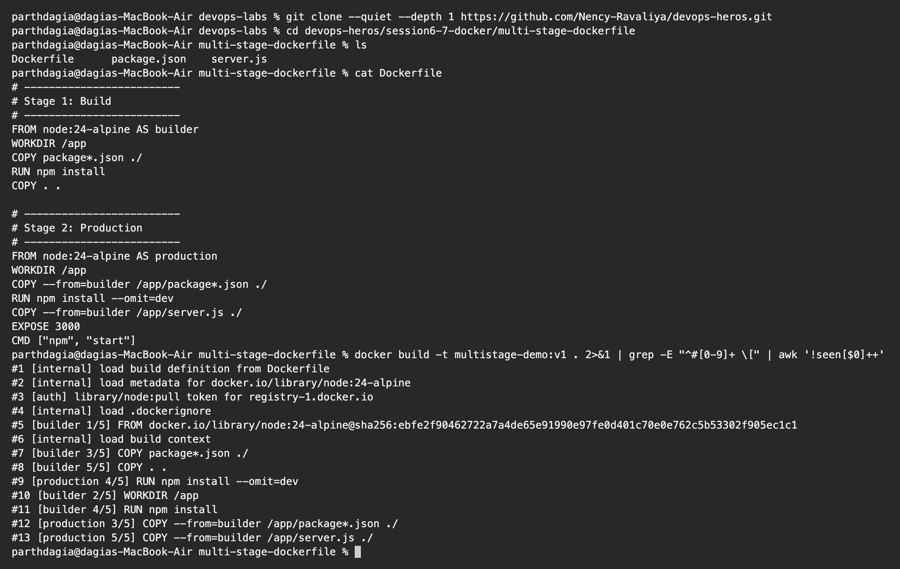
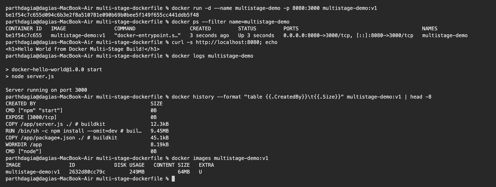
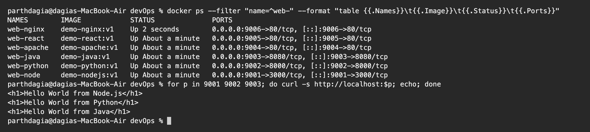

# Dockerfiles and Images: Multi Stage Build Homework

**Name:** Parth Dagia
**Enrollment / Roll No:** 24BCS10414

---

## Task 1: Run the multi stage Dockerfile

Source: [`session6-7-docker/multi-stage-dockerfile`](https://github.com/Nency-Ravaliya/devops-heros/tree/main/session6-7-docker/multi-stage-dockerfile) in the class repository.

### 1. Clone the repo and 2. build the image

I filtered the build log to only the step names so it is easy to read. Both stages can be seen: `[builder 1/5]` to `[builder 5/5]` is stage 1 and `[production 3/5]` to `[production 5/5]` is stage 2.

```text
$ git clone --quiet --depth 1 https://github.com/Nency-Ravaliya/devops-heros.git

$ cd devops-heros/session6-7-docker/multi-stage-dockerfile

$ ls
Dockerfile      package.json    server.js

$ cat Dockerfile
# -------------------------
# Stage 1: Build
# -------------------------
FROM node:24-alpine AS builder
WORKDIR /app
COPY package*.json ./
RUN npm install
COPY . .

# -------------------------
# Stage 2: Production
# -------------------------
FROM node:24-alpine AS production
WORKDIR /app
COPY --from=builder /app/package*.json ./
RUN npm install --omit=dev
COPY --from=builder /app/server.js ./
EXPOSE 3000
CMD ["npm", "start"]

$ docker build -t multistage-demo:v1 . 2>&1 | grep -E "^#[0-9]+ \[" | awk '!seen[$0]++'
#1 [internal] load build definition from Dockerfile
#2 [internal] load metadata for docker.io/library/node:24-alpine
#3 [auth] library/node:pull token for registry-1.docker.io
#4 [internal] load .dockerignore
#5 [builder 1/5] FROM docker.io/library/node:24-alpine@sha256:ebfe2f90462722a7a4de65e91990e97fe0d401c70e0e762c5b53302f905ec1c1
#6 [internal] load build context
#7 [builder 3/5] COPY package*.json ./
#8 [builder 5/5] COPY . .
#9 [production 4/5] RUN npm install --omit=dev
#10 [builder 2/5] WORKDIR /app
#11 [builder 4/5] RUN npm install
#12 [production 3/5] COPY --from=builder /app/package*.json ./
#13 [production 5/5] COPY --from=builder /app/server.js ./
```



### 3. Run it on port 8080, 4. check `docker ps`, 5. open the app

The Node app listens on 3000 inside the container, so I mapped my port **8080** to it with `-p 8080:3000`.

```text
$ docker run -d --name multistage-demo -p 8080:3000 multistage-demo:v1
be1f54c7c655d094c6b3e2f8a510781e090b69b0bee5f149f655cc441ddb5f48

$ docker ps --filter name=multistage-demo
CONTAINER ID   IMAGE                COMMAND                  CREATED         STATUS         PORTS                                         NAMES
be1f54c7c655   multistage-demo:v1   "docker-entrypoint.s…"   3 seconds ago   Up 3 seconds   0.0.0.0:8080->3000/tcp, [::]:8080->3000/tcp   multistage-demo

$ curl -s http://localhost:8080; echo
<h1>Hello World from Docker Multi-Stage Build!</h1>

$ docker logs multistage-demo

> docker-hello-world@1.0.0 start
> node server.js

Server running on port 3000

$ docker history --format "table {{.CreatedBy}}\t{{.Size}}" multistage-demo:v1 | head -8
CREATED BY                                      SIZE
CMD ["npm" "start"]                             0B
EXPOSE [3000/tcp]                               0B
COPY /app/server.js ./ # buildkit               12.3kB
RUN /bin/sh -c npm install --omit=dev # buil…   9.45MB
COPY /app/package*.json ./ # buildkit           45.1kB
WORKDIR /app                                    8.19kB
CMD ["node"]                                    0B

$ docker images multistage-demo:v1
IMAGE                ID             DISK USAGE   CONTENT SIZE   EXTRA
multistage-demo:v1   2632d80cc79c        249MB           64MB   U
```



- `docker ps` shows `0.0.0.0:8080->3000/tcp`, so the app is published on port 8080.
- `curl http://localhost:8080` returns **Hello World from Docker Multi-Stage Build!** and the same page opens in the browser.
- `docker history` shows that the final image only has `package.json`, the production dependencies from `npm install --omit=dev` (9.45 MB) and `server.js`. Nothing else from the builder stage was carried over.
- Final image size: `multistage-demo:v1` is **249 MB** on disk (64 MB compressed content).

---

## Task 2: Documentation

This README is the documentation. It has my name, my enrollment number, the output of the app running, and the `docker ps` output with the container on port 8080.

---

## Task 3: Deploy at least 3 different types of applications

I deployed six (Node.js, Python, Java, Apache, React, Nginx). The code, Dockerfiles and full outputs are in [05_Docker_Fundamental](../05_Docker_Fundamental/README.md). The three required ones:

| App | Dockerfile | Run command | Response |
|---|---|---|---|
| Node.js | [nodejs-app/Dockerfile](../05_Docker_Fundamental/nodejs-app/Dockerfile) | `docker run -d -p 9001:3000 demo-nodejs:v1` | `<h1>Hello World from Node.js</h1>` |
| Python | [python-app/Dockerfile](../05_Docker_Fundamental/python-app/Dockerfile) | `docker run -d -p 9002:8000 demo-python:v1` | `<h1>Hello World from Python</h1>` |
| Java | [java-app/Dockerfile](../05_Docker_Fundamental/java-app/Dockerfile) | `docker run -d -p 9003:8080 demo-java:v1` | `<h1>Hello World from Java</h1>` |

```text
$ docker ps --filter "name=^web-" --format "table {{.Names}}\t{{.Image}}\t{{.Status}}\t{{.Ports}}"
NAMES        IMAGE            STATUS              PORTS
web-nginx    demo-nginx:v1    Up 2 seconds        0.0.0.0:9006->80/tcp, [::]:9006->80/tcp
web-react    demo-react:v1    Up About a minute   0.0.0.0:9005->80/tcp, [::]:9005->80/tcp
web-apache   demo-apache:v1   Up About a minute   0.0.0.0:9004->80/tcp, [::]:9004->80/tcp
web-java     demo-java:v1     Up About a minute   0.0.0.0:9003->8080/tcp, [::]:9003->8080/tcp
web-python   demo-python:v1   Up About a minute   0.0.0.0:9002->8000/tcp, [::]:9002->8000/tcp
web-node     demo-nodejs:v1   Up About a minute   0.0.0.0:9001->3000/tcp, [::]:9001->3000/tcp

$ for p in 9001 9002 9003; do curl -s http://localhost:$p; echo; done
<h1>Hello World from Node.js</h1>
<h1>Hello World from Python</h1>
<h1>Hello World from Java</h1>
```



---

## What I understood about multi stage builds

Before this I always used a single `FROM`. Seeing the `docker history` output made it clear why two stages help.

- A multi stage Dockerfile has more than one `FROM`. Every `FROM` starts a new stage, and I can name it, for example `AS builder`.
- `COPY --from=builder <src> <dest>` copies only the files I choose from an earlier stage. Compilers, dev dependencies, caches and source code in that stage are left behind.
- Only the **last** stage becomes the image I run.
- Benefits: smaller image, faster push and pull, quicker deployments and fewer things an attacker could use, because build tools are not in production.
- The savings are biggest for compiled code (Go, Java, frontend builds), where the last stage can be a tiny runtime or just Nginx. My React app in `05_Docker_Fundamental/React-app` uses the same idea and ends up at about 93 MB.
- `docker build --target builder .` stops at a named stage, which helps when debugging the build.
