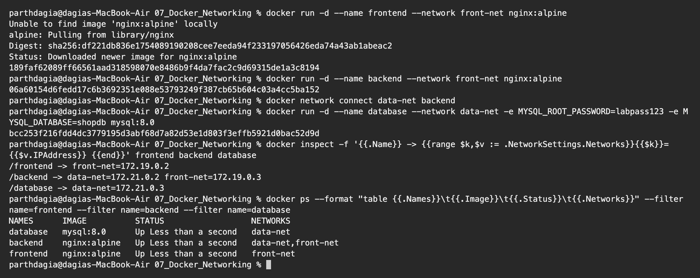
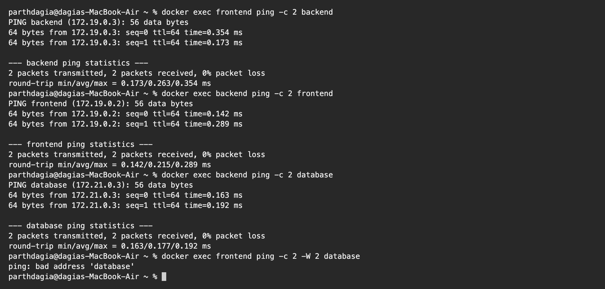
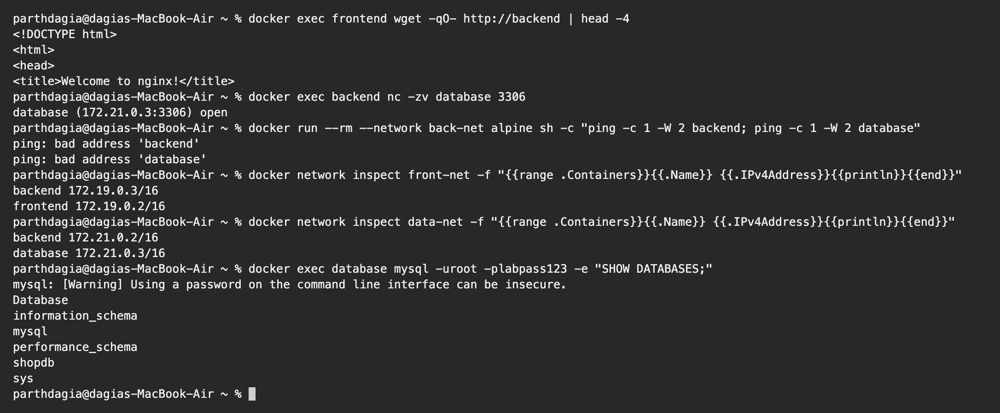
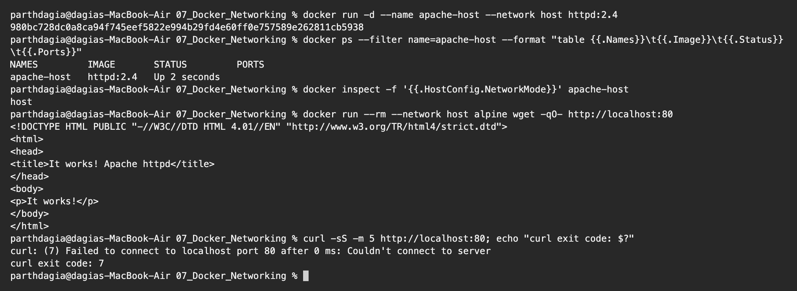
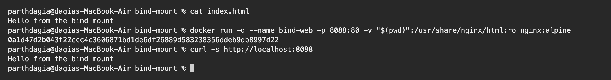
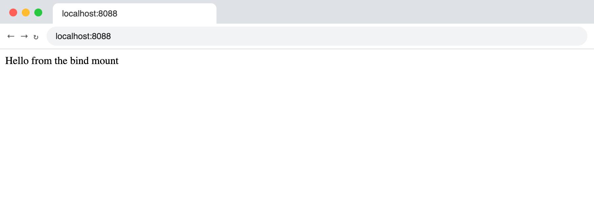
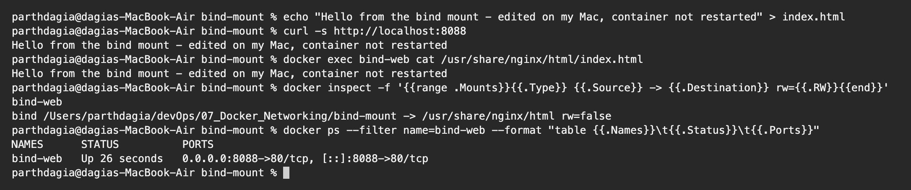

# Docker Networking and Volumes Homework

**Name:** Parth Dagia
**Roll No:** 24BCS10414

All commands were run on my Mac with Docker Desktop. The host network part behaved differently from what I expected on Mac, I explained it below.

---

## Task 1: Container networking

**Goal:** 3 containers (frontend, backend, database), 3 networks, the backend joined to 2 networks, then test who can talk to whom.

### Plan

```text
     front-net                    data-net                    back-net
+-----------------+        +-----------------+        +-------------------+
|  frontend       |        |  database       |        |  (test container  |
|  backend <------+--------+-> backend       |        |   only, to show   |
+-----------------+        +-----------------+        |   isolation)      |
                                                      +-------------------+
```

- `frontend` (nginx:alpine) on `front-net`
- `backend` (nginx:alpine) on `front-net` **and** `data-net`
- `database` (mysql:8.0) on `data-net`
- `back-net` is the third network. I start a temporary alpine container on it to show that it cannot see the others.

This is the normal 3 tier rule: the frontend should never reach the database directly, only the backend can.

### Creating the networks

```text
$ docker network create front-net
421dddc74143cad44b052f26857f9275e3cf5a52363035279cc8e7ffe107c314

$ docker network create back-net
2803b1bcf01c3f3660b80971244fc90b464f267a11443f047dc4f16454360502

$ docker network create data-net
9bb801735a84a662eefae75dab22ab0aa8ae4e847268c8a73ac414284257ab81

$ docker network ls --filter name=-net
NETWORK ID     NAME        DRIVER    SCOPE
2803b1bcf01c   back-net    bridge    local
9bb801735a84   data-net    bridge    local
421dddc74143   front-net   bridge    local
```


### Starting the containers

```text
$ docker run -d --name frontend --network front-net nginx:alpine
Unable to find image 'nginx:alpine' locally
alpine: Pulling from library/nginx
Digest: sha256:df221db836e1754089190208cee7eeda94f233197056426eda74a43ab1abeac2
Status: Downloaded newer image for nginx:alpine
189faf62089ff66561aad318598070e8486b9f4da7fac2c9d69315de1a3c8194

$ docker run -d --name backend --network front-net nginx:alpine
06a60154d6fedd17c6b3692351e088e53793249f387cb65b604c03a4cc5ba152

$ docker network connect data-net backend

$ docker run -d --name database --network data-net -e MYSQL_ROOT_PASSWORD=labpass123 -e MYSQL_DATABASE=shopdb mysql:8.0
bcc253f216fdd4dc3779195d3abf68d7a82d53e1d803f3effb5921d0bac52d9d

$ docker inspect -f '{{.Name}} -> {{range $k,$v := .NetworkSettings.Networks}}{{$k}}={{$v.IPAddress}} {{end}}' frontend backend database
/frontend -> front-net=172.19.0.2
/backend -> data-net=172.21.0.2 front-net=172.19.0.3
/database -> data-net=172.21.0.3

$ docker ps --format "table {{.Names}}\t{{.Image}}\t{{.Status}}\t{{.Networks}}" --filter name=frontend --filter name=backend --filter name=database
NAMES      IMAGE          STATUS                  NETWORKS
database   mysql:8.0      Up Less than a second   data-net
backend    nginx:alpine   Up Less than a second   data-net,front-net
frontend   nginx:alpine   Up Less than a second   front-net
```



`backend` has two IPs, one from each network (`172.19.0.3` on `front-net` and `172.21.0.2` on `data-net`).

### Ping tests

```text
$ docker exec frontend ping -c 2 backend
PING backend (172.19.0.3): 56 data bytes
64 bytes from 172.19.0.3: seq=0 ttl=64 time=0.354 ms
64 bytes from 172.19.0.3: seq=1 ttl=64 time=0.173 ms

--- backend ping statistics ---
2 packets transmitted, 2 packets received, 0% packet loss
round-trip min/avg/max = 0.173/0.263/0.354 ms

$ docker exec backend ping -c 2 frontend
PING frontend (172.19.0.2): 56 data bytes
64 bytes from 172.19.0.2: seq=0 ttl=64 time=0.142 ms
64 bytes from 172.19.0.2: seq=1 ttl=64 time=0.289 ms

--- frontend ping statistics ---
2 packets transmitted, 2 packets received, 0% packet loss
round-trip min/avg/max = 0.142/0.215/0.289 ms

$ docker exec backend ping -c 2 database
PING database (172.21.0.3): 56 data bytes
64 bytes from 172.21.0.3: seq=0 ttl=64 time=0.163 ms
64 bytes from 172.21.0.3: seq=1 ttl=64 time=0.192 ms

--- database ping statistics ---
2 packets transmitted, 2 packets received, 0% packet loss
round-trip min/avg/max = 0.163/0.177/0.192 ms

$ docker exec frontend ping -c 2 -W 2 database
ping: bad address 'database'
```



### HTTP, MySQL port and isolation tests

MySQL takes some seconds to start, so I waited a bit before testing port 3306, otherwise the port check fails.

```text
$ docker exec frontend wget -qO- http://backend | head -4
<!DOCTYPE html>
<html>
<head>
<title>Welcome to nginx!</title>

$ docker exec backend nc -zv database 3306
database (172.21.0.3:3306) open

$ docker run --rm --network back-net alpine sh -c "ping -c 1 -W 2 backend; ping -c 1 -W 2 database"
ping: bad address 'backend'
ping: bad address 'database'

$ docker network inspect front-net -f "{{range .Containers}}{{.Name}} {{.IPv4Address}}{{println}}{{end}}"
backend 172.19.0.3/16
frontend 172.19.0.2/16

$ docker network inspect data-net -f "{{range .Containers}}{{.Name}} {{.IPv4Address}}{{println}}{{end}}"
backend 172.21.0.2/16
database 172.21.0.3/16

$ docker exec database mysql -uroot -plabpass123 -e "SHOW DATABASES;"
mysql: [Warning] Using a password on the command line interface can be insecure.
Database
information_schema
mysql
performance_schema
shopdb
sys
```



### Result

| From → To | Works? | Reason |
|---|---|---|
| frontend → backend | Yes | Both on `front-net` |
| backend → frontend | Yes | Both on `front-net` |
| backend → database (ping and port 3306) | Yes | Both on `data-net` |
| frontend → database | **No** (`bad address`) | No common network, so the name does not even resolve |
| container on `back-net` → backend or database | **No** | Different network, completely isolated |

### What I learned

- User defined bridge networks come with a built in DNS, so containers find each other by **name**. The default `bridge` network does not give this.
- `docker network connect` adds a running container to another network, and it gets one IP per network.
- A network is an isolation boundary. Two containers can talk only if they share at least one network.

Clean up:

```bash
docker rm -f frontend backend database
docker network rm front-net back-net data-net
```

---

## Task 2: Host network

**Goal:** run Apache with `--network host` and reach it on port 80 without any `-p`.

```text
$ docker run -d --name apache-host --network host httpd:2.4
980bc728dc0a8ca94f745eef5822e994b29fd4e60ff0e757589e262811cb5938

$ docker ps --filter name=apache-host --format "table {{.Names}}\t{{.Image}}\t{{.Status}}\t{{.Ports}}"
NAMES         IMAGE       STATUS         PORTS
apache-host   httpd:2.4   Up 2 seconds

$ docker inspect -f '{{.HostConfig.NetworkMode}}' apache-host
host

$ docker run --rm --network host alpine wget -qO- http://localhost:80
<!DOCTYPE HTML PUBLIC "-//W3C//DTD HTML 4.01//EN" "http://www.w3.org/TR/html4/strict.dtd">
<html>
<head>
<title>It works! Apache httpd</title>
</head>
<body>
<p>It works!</p>
</body>
</html>

$ curl -sS -m 5 http://localhost:80; echo "curl exit code: $?"
curl: (7) Failed to connect to localhost port 80 after 0 ms: Couldn't connect to server
curl exit code: 7
```



- `PORTS` is empty because nothing is published. With `--network host` the container uses the network stack of the Docker host directly, so Apache listens on the host's port 80.
- The second container (also on the host network) got **It works!** from `http://localhost:80`.

### Why `curl` from my Mac failed

`curl http://localhost:80` from the macOS terminal was refused (exit code 7). On macOS, Docker runs inside a small Linux VM, so "host" means **that VM**, not my Mac. That is why I tested from another container that shares the same host network. On a real Linux machine, `curl localhost:80` and the browser would work directly. Newer Docker Desktop versions also have an optional host networking setting that forwards these ports to the Mac.

### What I learned

- `--network host` removes the network isolation: no container IP, no NAT, and `-p` is ignored.
- It is a little faster and is used for things like monitoring agents, but two containers cannot use the same port and it is less secure.

---

## Task 3: Bind mount

**Goal:** serve a folder from my Mac through Nginx and see changes without restarting the container.

Folder: [bind-mount](bind-mount) with one `index.html`.

### Start the container

```text
$ cat index.html
Hello from the bind mount

$ docker run -d --name bind-web -p 8088:80 -v "$(pwd)":/usr/share/nginx/html:ro nginx:alpine
0a1d47d2b043f22ccc4c3606871bd1de6df26889d583238356ddeb9db8997d22

$ curl -s http://localhost:8088
Hello from the bind mount
```



Browser at `http://localhost:8088` before editing:



### Edit the file on my Mac (no restart)

```text
$ echo "Hello from the bind mount - edited on my Mac, container not restarted" > index.html

$ curl -s http://localhost:8088
Hello from the bind mount - edited on my Mac, container not restarted

$ docker exec bind-web cat /usr/share/nginx/html/index.html
Hello from the bind mount - edited on my Mac, container not restarted

$ docker inspect -f '{{range .Mounts}}{{.Type}} {{.Source}} -> {{.Destination}} rw={{.RW}}{{end}}' bind-web
bind /Users/parthdagia/devOps/07_Docker_Networking/bind-mount -> /usr/share/nginx/html rw=false

$ docker ps --filter name=bind-web --format "table {{.Names}}\t{{.Status}}\t{{.Ports}}"
NAMES      STATUS          PORTS
bind-web   Up 26 seconds   0.0.0.0:8088->80/tcp, [::]:8088->80/tcp
```



Browser after the edit:


### What I learned

- `-v "$(pwd)":/usr/share/nginx/html:ro` puts my local folder on top of the Nginx web root. `:ro` makes it read only for the container (`rw=false` in `docker inspect`).
- I changed `index.html` on my Mac and the next request already returned the new text. `docker ps` still shows the same uptime, so there was **no rebuild and no restart**.
- Bind mounts are great while developing. For data that Docker should manage and keep (like a database), named **volumes** (`docker volume create`) are better, because they do not depend on a folder path on my laptop.

---

## Task 4: Overlay network (research)

### What it is

An overlay network is a virtual network that stretches across **several Docker hosts**. Containers on different machines get IPs from the same subnet and talk as if they were on one LAN.

### How it works between hosts

- It needs a cluster, normally **Docker Swarm**: `docker swarm init` on the manager and `docker swarm join` on the workers.
- Traffic between hosts uses **VXLAN**. The container packet is wrapped inside a UDP packet (port 4789), sent over the normal network and unwrapped on the other host.
- The nodes talk on TCP 2377 (cluster management) and TCP/UDP 7946 (node discovery).
- Each overlay has its own DNS, so services are reached by service name, and Swarm load balances between replicas using a virtual IP.
- Swarm creates an overlay called `ingress` for published ports (routing mesh), so a published port answers on every node, even nodes where the container is not running.
- Traffic can be encrypted with `--opt encrypted`.

### Commands

```bash
docker swarm init
docker network create -d overlay --attachable my-overlay
docker service create --name web --network my-overlay --replicas 3 nginx
docker network ls --filter driver=overlay
```

`--attachable` lets normal containers (not only Swarm services) join the network.

### Where it is used

- Microservices running on many servers that need to call each other by name.
- Scaling one service across many hosts behind one name.
- High availability: if a host dies the container is started on another host and keeps the same service name.

### Network drivers compared

| Driver | Scope | Isolation | Typical use |
|---|---|---|---|
| `bridge` | One host | Yes, per network | Default, apps with several containers on one machine |
| `host` | One host | None | Best network performance, monitoring agents |
| `overlay` | Many hosts | Yes, per network | Swarm services across a cluster |
| `none` | No network | Full | Containers that need no network at all |
