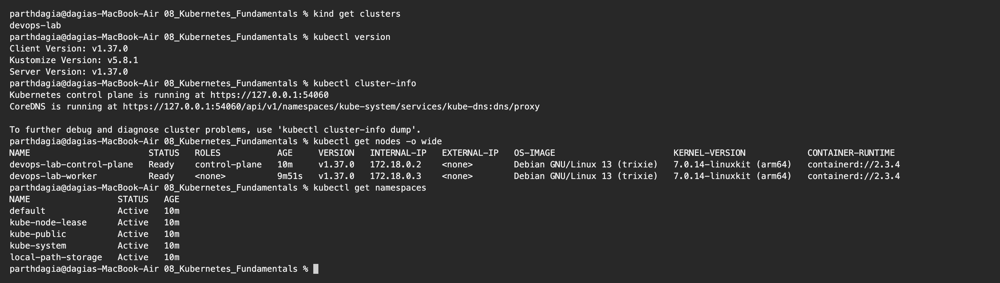
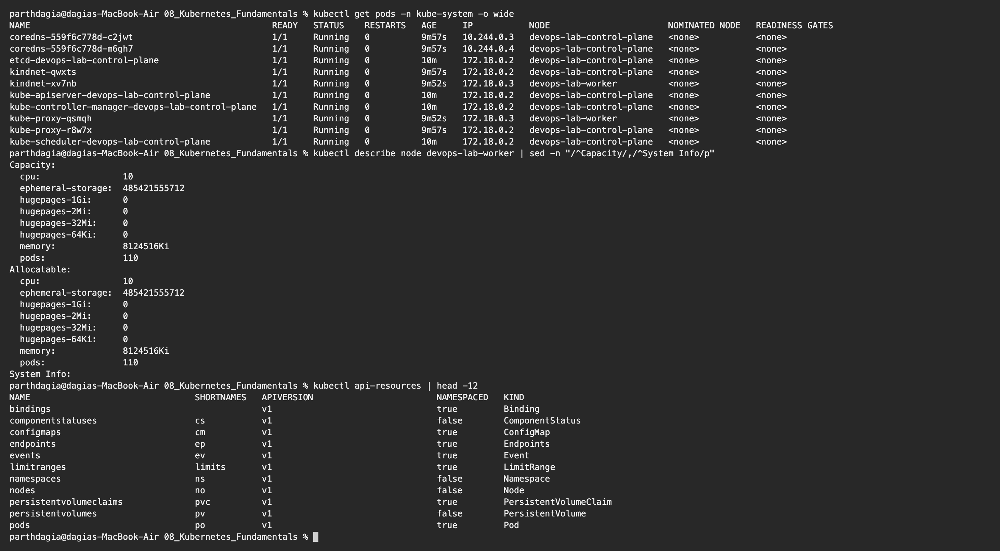
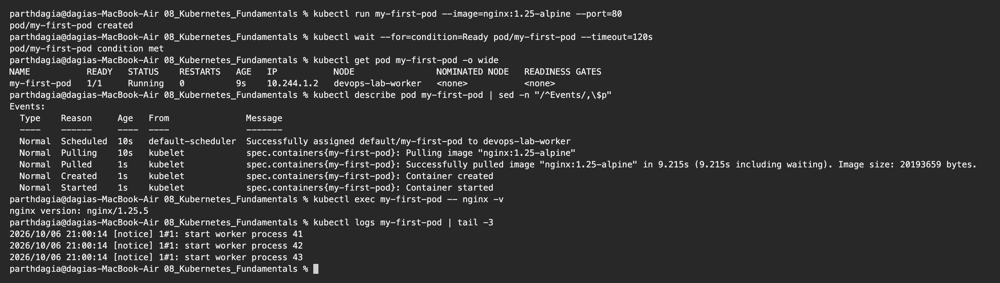
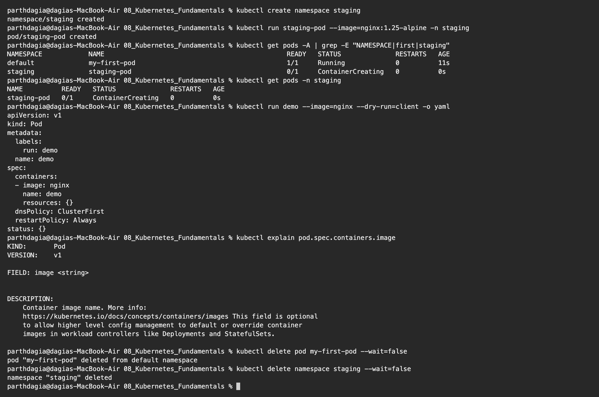

# Kubernetes Fundamentals Homework

**Name:** Parth Dagia
**Roll No:** 24BCS10414

For all the Kubernetes homework I use a local 2 node cluster (1 control plane + 1 worker) made with **kind** (Kubernetes IN Docker). Minikube would also work, I picked kind because creating and deleting the cluster is quick.

Cluster config: [kind-cluster.yaml](kind-cluster.yaml)

```bash
brew install kind
kind create cluster --config kind-cluster.yaml
```

The config also labels the control plane node `ingress-ready=true` and maps its ports 80 and 443 to `localhost:8081` and `localhost:8443`. I need that later for the Ingress homework.

---

## 1. Architecture

| Component | Where it runs | Job |
|---|---|---|
| `kube-apiserver` | Control plane | Front door of the cluster. `kubectl` and every component talk only to it |
| `etcd` | Control plane | Key value store that holds the full cluster state |
| `kube-scheduler` | Control plane | Picks a node for every new Pod |
| `kube-controller-manager` | Control plane | Runs the loops that keep the real state equal to the desired state |
| `kubelet` | Every node | Agent that starts the Pod's containers and reports their status |
| `kube-proxy` | Every node | Sets up the network rules behind Services |
| Container runtime (`containerd`) | Every node | Actually runs the containers |
| `CoreDNS` | Add on | DNS names for Services and Pods |

Kubernetes is **declarative**. I write the state I want in YAML and the controllers keep working until the cluster matches it.

## 2. Cluster information

```text
$ kind get clusters
devops-lab

$ kubectl version
Client Version: v1.37.0
Kustomize Version: v5.8.1
Server Version: v1.37.0

$ kubectl cluster-info
Kubernetes control plane is running at https://127.0.0.1:54060
CoreDNS is running at https://127.0.0.1:54060/api/v1/namespaces/kube-system/services/kube-dns:dns/proxy

To further debug and diagnose cluster problems, use 'kubectl cluster-info dump'.

$ kubectl get nodes -o wide
NAME                       STATUS   ROLES           AGE     VERSION   INTERNAL-IP   EXTERNAL-IP   OS-IMAGE                       KERNEL-VERSION            CONTAINER-RUNTIME
devops-lab-control-plane   Ready    control-plane   10m     v1.37.0   172.18.0.2    <none>        Debian GNU/Linux 13 (trixie)   7.0.14-linuxkit (arm64)   containerd://2.3.4
devops-lab-worker          Ready    <none>          9m51s   v1.37.0   172.18.0.3    <none>        Debian GNU/Linux 13 (trixie)   7.0.14-linuxkit (arm64)   containerd://2.3.4

$ kubectl get namespaces
NAME                 STATUS   AGE
default              Active   10m
kube-node-lease      Active   10m
kube-public          Active   10m
kube-system          Active   10m
local-path-storage   Active   10m
```



Client and server are both v1.37 and both nodes are `Ready`. Each kind "node" is really a Docker container running Debian with `containerd` inside. Default namespaces: `default` (my stuff), `kube-system` (cluster components), `kube-public`, `kube-node-lease` (node heartbeats) and `local-path-storage` (added by kind for volumes).

## 3. The control plane is just Pods

```text
$ kubectl get pods -n kube-system -o wide
NAME                                               READY   STATUS    RESTARTS   AGE     IP           NODE                       NOMINATED NODE   READINESS GATES
coredns-559f6c778d-c2jwt                           1/1     Running   0          9m57s   10.244.0.3   devops-lab-control-plane   <none>           <none>
coredns-559f6c778d-m6gh7                           1/1     Running   0          9m57s   10.244.0.4   devops-lab-control-plane   <none>           <none>
etcd-devops-lab-control-plane                      1/1     Running   0          10m     172.18.0.2   devops-lab-control-plane   <none>           <none>
kindnet-qwxts                                      1/1     Running   0          9m57s   172.18.0.2   devops-lab-control-plane   <none>           <none>
kindnet-xv7nb                                      1/1     Running   0          9m52s   172.18.0.3   devops-lab-worker          <none>           <none>
kube-apiserver-devops-lab-control-plane            1/1     Running   0          10m     172.18.0.2   devops-lab-control-plane   <none>           <none>
kube-controller-manager-devops-lab-control-plane   1/1     Running   0          10m     172.18.0.2   devops-lab-control-plane   <none>           <none>
kube-proxy-qsmqh                                   1/1     Running   0          9m52s   172.18.0.3   devops-lab-worker          <none>           <none>
kube-proxy-r8w7x                                   1/1     Running   0          9m57s   172.18.0.2   devops-lab-control-plane   <none>           <none>
kube-scheduler-devops-lab-control-plane            1/1     Running   0          10m     172.18.0.2   devops-lab-control-plane   <none>           <none>

$ kubectl describe node devops-lab-worker | sed -n "/^Capacity/,/^System Info/p"
Capacity:
  cpu:                10
  ephemeral-storage:  485421555712
  hugepages-1Gi:      0
  hugepages-2Mi:      0
  hugepages-32Mi:     0
  hugepages-64Ki:     0
  memory:             8124516Ki
  pods:               110
Allocatable:
  cpu:                10
  ephemeral-storage:  485421555712
  hugepages-1Gi:      0
  hugepages-2Mi:      0
  hugepages-32Mi:     0
  hugepages-64Ki:     0
  memory:             8124516Ki
  pods:               110
System Info:

$ kubectl api-resources | head -12
NAME                                SHORTNAMES   APIVERSION                        NAMESPACED   KIND
bindings                                         v1                                true         Binding
componentstatuses                   cs           v1                                false        ComponentStatus
configmaps                          cm           v1                                true         ConfigMap
endpoints                           ep           v1                                true         Endpoints
events                              ev           v1                                true         Event
limitranges                         limits       v1                                true         LimitRange
namespaces                          ns           v1                                false        Namespace
nodes                               no           v1                                false        Node
persistentvolumeclaims              pvc          v1                                true         PersistentVolumeClaim
persistentvolumes                   pv           v1                                false        PersistentVolume
pods                                po           v1                                true         Pod
```



- Every component from the table is running here: `etcd`, `kube-apiserver`, `kube-controller-manager` and `kube-scheduler` on the control plane node, plus one `kube-proxy` and one `kindnet` (the network plugin) **on each node**. `coredns` runs 2 copies.
- `Allocatable` is what the scheduler is allowed to give to Pods on that node. Here: 10 CPUs, about 7.7 GiB memory and at most 110 Pods.
- `kubectl api-resources` lists every object type with its short name (`po`, `cm`, `ns`, ...) and whether it lives inside a namespace.

## 4. My first Pod

```text
$ kubectl run my-first-pod --image=nginx:1.25-alpine --port=80
pod/my-first-pod created

$ kubectl wait --for=condition=Ready pod/my-first-pod --timeout=120s
pod/my-first-pod condition met

$ kubectl get pod my-first-pod -o wide
NAME           READY   STATUS    RESTARTS   AGE   IP           NODE                NOMINATED NODE   READINESS GATES
my-first-pod   1/1     Running   0          9s    10.244.1.2   devops-lab-worker   <none>           <none>

$ kubectl describe pod my-first-pod | sed -n "/^Events/,\$p"
Events:
  Type    Reason     Age   From               Message
  ----    ------     ----  ----               -------
  Normal  Scheduled  10s   default-scheduler  Successfully assigned default/my-first-pod to devops-lab-worker
  Normal  Pulling    10s   kubelet            spec.containers{my-first-pod}: Pulling image "nginx:1.25-alpine"
  Normal  Pulled     1s    kubelet            spec.containers{my-first-pod}: Successfully pulled image "nginx:1.25-alpine" in 9.215s (9.215s including waiting). Image size: 20193659 bytes.
  Normal  Created    1s    kubelet            spec.containers{my-first-pod}: Container created
  Normal  Started    1s    kubelet            spec.containers{my-first-pod}: Container started

$ kubectl exec my-first-pod -- nginx -v
nginx version: nginx/1.25.5

$ kubectl logs my-first-pod | tail -3
2026/10/06 21:00:14 [notice] 1#1: start worker process 41
2026/10/06 21:00:14 [notice] 1#1: start worker process 42
2026/10/06 21:00:14 [notice] 1#1: start worker process 43
```



The `Events` show what happens to a Pod step by step:
**Scheduled** (the scheduler picked `devops-lab-worker`) → **Pulling / Pulled** (kubelet asked containerd for the image) → **Created** → **Started**. The Pod got its own IP `10.244.1.2` from the Pod network. `kubectl exec` runs a command inside the container and `kubectl logs` prints what the container wrote to stdout.

## 5. Namespaces, YAML generation and docs

```text
$ kubectl create namespace staging
namespace/staging created

$ kubectl run staging-pod --image=nginx:1.25-alpine -n staging
pod/staging-pod created

$ kubectl get pods -A | grep -E "NAMESPACE|first|staging"
NAMESPACE            NAME                                               READY   STATUS              RESTARTS   AGE
default              my-first-pod                                       1/1     Running             0          11s
staging              staging-pod                                        0/1     ContainerCreating   0          0s

$ kubectl get pods -n staging
NAME          READY   STATUS              RESTARTS   AGE
staging-pod   0/1     ContainerCreating   0          0s

$ kubectl run demo --image=nginx --dry-run=client -o yaml
apiVersion: v1
kind: Pod
metadata:
  labels:
    run: demo
  name: demo
spec:
  containers:
  - image: nginx
    name: demo
    resources: {}
  dnsPolicy: ClusterFirst
  restartPolicy: Always
status: {}

$ kubectl explain pod.spec.containers.image
KIND:       Pod
VERSION:    v1

FIELD: image <string>


DESCRIPTION:
    Container image name. More info:
    https://kubernetes.io/docs/concepts/containers/images This field is optional
    to allow higher level config management to default or override container
    images in workload controllers like Deployments and StatefulSets.


$ kubectl delete pod my-first-pod --wait=false
pod "my-first-pod" deleted from default namespace

$ kubectl delete namespace staging --wait=false
namespace "staging" deleted
```



- Namespaces split one cluster into separate areas (teams, dev/staging/prod). `-n staging` works in one namespace and `-A` shows all of them. The same Pod name can exist in two namespaces.
- `--dry-run=client -o yaml` prints the YAML without creating anything. That is the quickest way to start a manifest.
- `kubectl explain` is built in documentation for any field.
- Deleting a namespace deletes everything inside it.

---

## kubectl cheat sheet

| Command | Use |
|---|---|
| `kubectl get <type> [-o wide] [-n ns] [-A]` | List objects |
| `kubectl describe <type> <name>` | Details and events, first thing to check when debugging |
| `kubectl logs <pod> [-f] [--previous]` | Container logs |
| `kubectl exec -it <pod> -- sh` | Shell inside a container |
| `kubectl apply -f file.yaml` | Create or update from YAML |
| `kubectl delete -f file.yaml` | Delete what the YAML created |
| `kubectl run` / `kubectl create` | Quick imperative commands |
| `kubectl explain <type.field>` | Field documentation |
| `kubectl config get-contexts` | Which cluster am I talking to |
