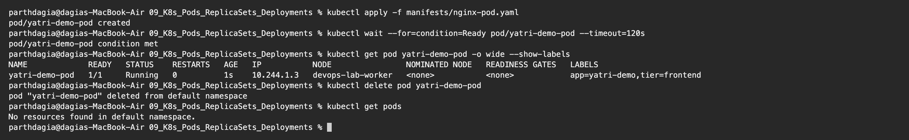
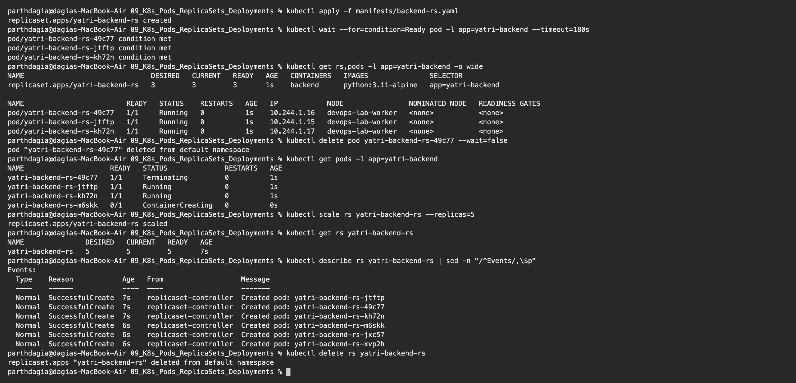
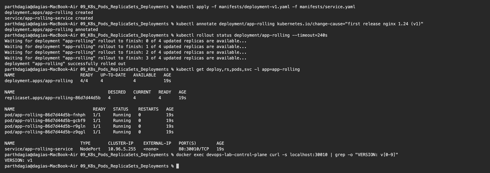
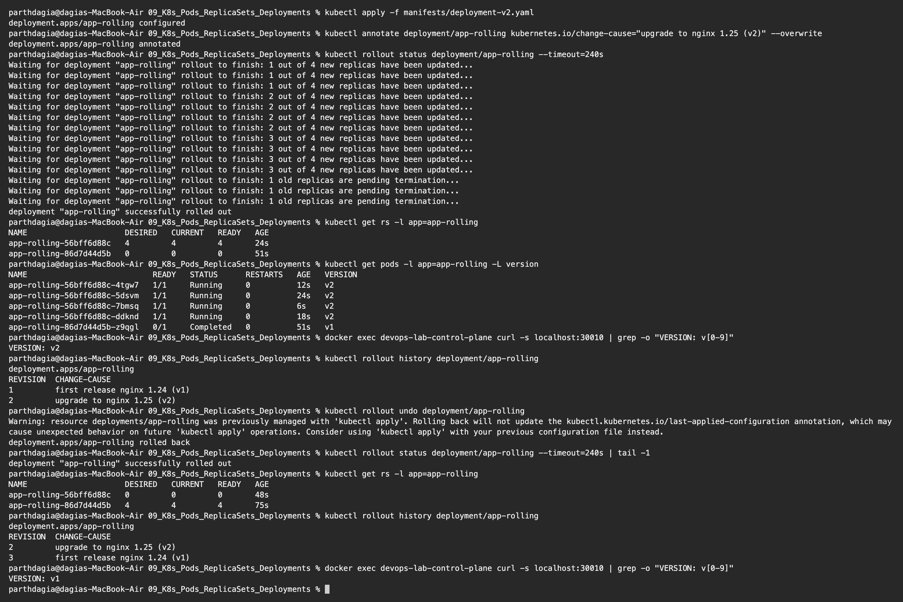
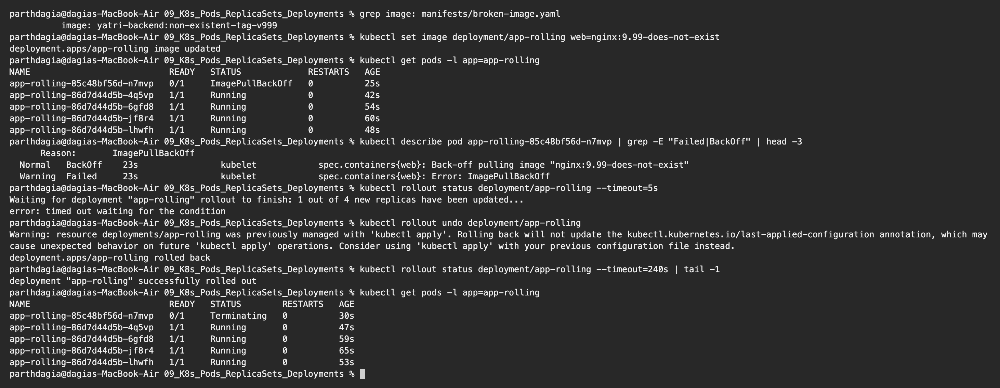
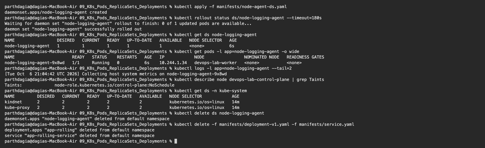

# Kubernetes Pods, ReplicaSets and Deployments Homework

**Name:** Parth Dagia
**Roll No:** 24BCS10414

The manifests come from the class repository ([session10-k8s-core-objects](https://github.com/Nency-Ravaliya/devops-heros/tree/main/session10-k8s-core-objects)) and are copied into [manifests/](manifests). I ran them on my local 2 node kind cluster.

| Object | What it gives |
|---|---|
| **Pod** | Smallest unit. One or more containers sharing an IP and volumes. Nothing brings it back if it dies |
| **ReplicaSet** | Keeps N copies of a Pod running (self healing and scaling) |
| **Deployment** | Manages ReplicaSets, adds rolling updates, history and rollback |
| **DaemonSet** | One Pod on every node that is allowed to run it |

---

## 1. Pod

[manifests/nginx-pod.yaml](manifests/nginx-pod.yaml)

```text
$ kubectl apply -f manifests/nginx-pod.yaml
pod/yatri-demo-pod created

$ kubectl wait --for=condition=Ready pod/yatri-demo-pod --timeout=120s
pod/yatri-demo-pod condition met

$ kubectl get pod yatri-demo-pod -o wide --show-labels
NAME             READY   STATUS    RESTARTS   AGE   IP           NODE                NOMINATED NODE   READINESS GATES   LABELS
yatri-demo-pod   1/1     Running   0          1s    10.244.1.3   devops-lab-worker   <none>           <none>            app=yatri-demo,tier=frontend

$ kubectl delete pod yatri-demo-pod
pod "yatri-demo-pod" deleted from default namespace

$ kubectl get pods
No resources found in default namespace.
```



A Pod created on its own has no protection. After `kubectl delete pod` nothing was left and nobody recreated it. That is why in real setups Pods are created by a controller, not by hand.

## 2. ReplicaSet: self healing and scaling

[manifests/backend-rs.yaml](manifests/backend-rs.yaml) wants `replicas: 3` with the selector `app=yatri-backend`.

```text
$ kubectl apply -f manifests/backend-rs.yaml
replicaset.apps/yatri-backend-rs created

$ kubectl wait --for=condition=Ready pod -l app=yatri-backend --timeout=180s
pod/yatri-backend-rs-49c77 condition met
pod/yatri-backend-rs-jtftp condition met
pod/yatri-backend-rs-kh72n condition met

$ kubectl get rs,pods -l app=yatri-backend -o wide
NAME                               DESIRED   CURRENT   READY   AGE   CONTAINERS   IMAGES               SELECTOR
replicaset.apps/yatri-backend-rs   3         3         3       1s    backend      python:3.11-alpine   app=yatri-backend

NAME                         READY   STATUS    RESTARTS   AGE   IP            NODE                NOMINATED NODE   READINESS GATES
pod/yatri-backend-rs-49c77   1/1     Running   0          1s    10.244.1.16   devops-lab-worker   <none>           <none>
pod/yatri-backend-rs-jtftp   1/1     Running   0          1s    10.244.1.15   devops-lab-worker   <none>           <none>
pod/yatri-backend-rs-kh72n   1/1     Running   0          1s    10.244.1.17   devops-lab-worker   <none>           <none>

$ kubectl delete pod yatri-backend-rs-49c77 --wait=false
pod "yatri-backend-rs-49c77" deleted from default namespace

$ kubectl get pods -l app=yatri-backend
NAME                     READY   STATUS              RESTARTS   AGE
yatri-backend-rs-49c77   1/1     Terminating         0          1s
yatri-backend-rs-jtftp   1/1     Running             0          1s
yatri-backend-rs-kh72n   1/1     Running             0          1s
yatri-backend-rs-m6skk   0/1     ContainerCreating   0          0s

$ kubectl scale rs yatri-backend-rs --replicas=5
replicaset.apps/yatri-backend-rs scaled

$ kubectl get rs yatri-backend-rs
NAME               DESIRED   CURRENT   READY   AGE
yatri-backend-rs   5         5         5       7s

$ kubectl describe rs yatri-backend-rs | sed -n "/^Events/,\$p"
Events:
  Type    Reason            Age   From                   Message
  ----    ------            ----  ----                   -------
  Normal  SuccessfulCreate  7s    replicaset-controller  Created pod: yatri-backend-rs-jtftp
  Normal  SuccessfulCreate  7s    replicaset-controller  Created pod: yatri-backend-rs-49c77
  Normal  SuccessfulCreate  7s    replicaset-controller  Created pod: yatri-backend-rs-kh72n
  Normal  SuccessfulCreate  6s    replicaset-controller  Created pod: yatri-backend-rs-m6skk
  Normal  SuccessfulCreate  6s    replicaset-controller  Created pod: yatri-backend-rs-jxc57
  Normal  SuccessfulCreate  6s    replicaset-controller  Created pod: yatri-backend-rs-xvp2h

$ kubectl delete rs yatri-backend-rs
replicaset.apps "yatri-backend-rs" deleted from default namespace
```



- I deleted `yatri-backend-rs-49c77`. In the very next command a new Pod (`yatri-backend-rs-m6skk`) was already `ContainerCreating` while the old one was `Terminating`. The ReplicaSet never lets the count stay below 3.
- The ReplicaSet finds its Pods only through the **label selector**. Pod names are the ReplicaSet name plus a random suffix.
- `kubectl scale --replicas=5` added 2 more Pods, and every creation is listed as `SuccessfulCreate` in the events.
- A ReplicaSet cannot do a controlled version upgrade. That is what a Deployment is for.

**Problem I hit:** the first time I ran this, the Pods from my previous try were still `Terminating` and showed up in my output. These Python Pods take the full 30 second grace period to stop, so I deleted the ReplicaSet, waited for all Pods to go away, and ran the steps again.

## 3. Deployment: rolling update, history, rollback

[manifests/deployment-v1.yaml](manifests/deployment-v1.yaml) (nginx 1.24, page shows `VERSION: v1`), [manifests/deployment-v2.yaml](manifests/deployment-v2.yaml) (nginx 1.25, page shows `VERSION: v2`) and [manifests/service.yaml](manifests/service.yaml) (NodePort 30010). The strategy is `RollingUpdate` with `maxSurge: 1` and `maxUnavailable: 0`.

Since kind nodes are Docker containers, I check the NodePort with `curl` from inside the control plane node container.

### Version 1

```text
$ kubectl apply -f manifests/deployment-v1.yaml -f manifests/service.yaml
deployment.apps/app-rolling created
service/app-rolling-service created

$ kubectl annotate deployment/app-rolling kubernetes.io/change-cause="first release nginx 1.24 (v1)"
deployment.apps/app-rolling annotated

$ kubectl rollout status deployment/app-rolling --timeout=240s
Waiting for deployment "app-rolling" rollout to finish: 0 of 4 updated replicas are available...
Waiting for deployment "app-rolling" rollout to finish: 1 of 4 updated replicas are available...
Waiting for deployment "app-rolling" rollout to finish: 2 of 4 updated replicas are available...
Waiting for deployment "app-rolling" rollout to finish: 3 of 4 updated replicas are available...
deployment "app-rolling" successfully rolled out

$ kubectl get deploy,rs,pods,svc -l app=app-rolling
NAME                          READY   UP-TO-DATE   AVAILABLE   AGE
deployment.apps/app-rolling   4/4     4            4           19s

NAME                                     DESIRED   CURRENT   READY   AGE
replicaset.apps/app-rolling-86d7d44d5b   4         4         4       19s

NAME                               READY   STATUS    RESTARTS   AGE
pod/app-rolling-86d7d44d5b-fnhph   1/1     Running   0          19s
pod/app-rolling-86d7d44d5b-gcbf9   1/1     Running   0          19s
pod/app-rolling-86d7d44d5b-r9gln   1/1     Running   0          19s
pod/app-rolling-86d7d44d5b-z9qgl   1/1     Running   0          19s

NAME                          TYPE       CLUSTER-IP    EXTERNAL-IP   PORT(S)        AGE
service/app-rolling-service   NodePort   10.96.5.255   <none>        80:30010/TCP   19s

$ docker exec devops-lab-control-plane curl -s localhost:30010 | grep -o "VERSION: v[0-9]"
VERSION: v1
```



### Upgrade to v2, then roll back

```text
$ kubectl apply -f manifests/deployment-v2.yaml
deployment.apps/app-rolling configured

$ kubectl annotate deployment/app-rolling kubernetes.io/change-cause="upgrade to nginx 1.25 (v2)" --overwrite
deployment.apps/app-rolling annotated

$ kubectl rollout status deployment/app-rolling --timeout=240s
Waiting for deployment "app-rolling" rollout to finish: 1 out of 4 new replicas have been updated...
Waiting for deployment "app-rolling" rollout to finish: 1 out of 4 new replicas have been updated...
Waiting for deployment "app-rolling" rollout to finish: 1 out of 4 new replicas have been updated...
Waiting for deployment "app-rolling" rollout to finish: 2 out of 4 new replicas have been updated...
Waiting for deployment "app-rolling" rollout to finish: 2 out of 4 new replicas have been updated...
Waiting for deployment "app-rolling" rollout to finish: 2 out of 4 new replicas have been updated...
Waiting for deployment "app-rolling" rollout to finish: 2 out of 4 new replicas have been updated...
Waiting for deployment "app-rolling" rollout to finish: 3 out of 4 new replicas have been updated...
Waiting for deployment "app-rolling" rollout to finish: 3 out of 4 new replicas have been updated...
Waiting for deployment "app-rolling" rollout to finish: 3 out of 4 new replicas have been updated...
Waiting for deployment "app-rolling" rollout to finish: 3 out of 4 new replicas have been updated...
Waiting for deployment "app-rolling" rollout to finish: 1 old replicas are pending termination...
Waiting for deployment "app-rolling" rollout to finish: 1 old replicas are pending termination...
Waiting for deployment "app-rolling" rollout to finish: 1 old replicas are pending termination...
deployment "app-rolling" successfully rolled out

$ kubectl get rs -l app=app-rolling
NAME                     DESIRED   CURRENT   READY   AGE
app-rolling-56bff6d88c   4         4         4       24s
app-rolling-86d7d44d5b   0         0         0       51s

$ kubectl get pods -l app=app-rolling -L version
NAME                           READY   STATUS      RESTARTS   AGE   VERSION
app-rolling-56bff6d88c-4tgw7   1/1     Running     0          12s   v2
app-rolling-56bff6d88c-5dsvm   1/1     Running     0          24s   v2
app-rolling-56bff6d88c-7bmsq   1/1     Running     0          6s    v2
app-rolling-56bff6d88c-ddknd   1/1     Running     0          18s   v2
app-rolling-86d7d44d5b-z9qgl   0/1     Completed   0          51s   v1

$ docker exec devops-lab-control-plane curl -s localhost:30010 | grep -o "VERSION: v[0-9]"
VERSION: v2

$ kubectl rollout history deployment/app-rolling
deployment.apps/app-rolling
REVISION  CHANGE-CAUSE
1         first release nginx 1.24 (v1)
2         upgrade to nginx 1.25 (v2)

$ kubectl rollout undo deployment/app-rolling
Warning: resource deployments/app-rolling was previously managed with 'kubectl apply'. Rolling back will not update the kubectl.kubernetes.io/last-applied-configuration annotation, which may cause unexpected behavior on future 'kubectl apply' operations. Consider using 'kubectl apply' with your previous configuration file instead.
deployment.apps/app-rolling rolled back

$ kubectl rollout status deployment/app-rolling --timeout=240s | tail -1
deployment "app-rolling" successfully rolled out

$ kubectl get rs -l app=app-rolling
NAME                     DESIRED   CURRENT   READY   AGE
app-rolling-56bff6d88c   0         0         0       48s
app-rolling-86d7d44d5b   4         4         4       75s

$ kubectl rollout history deployment/app-rolling
deployment.apps/app-rolling
REVISION  CHANGE-CAUSE
2         upgrade to nginx 1.25 (v2)
3         first release nginx 1.24 (v1)

$ docker exec devops-lab-control-plane curl -s localhost:30010 | grep -o "VERSION: v[0-9]"
VERSION: v1
```



### What I understood

- The chain is **Deployment → ReplicaSet → Pods**, and the Pod name shows it: `app-rolling` + ReplicaSet hash `86d7d44d5b` + random suffix.
- Applying v2 made a **new ReplicaSet** (`56bff6d88c`). It was scaled up one Pod at a time while the old one (`86d7d44d5b`) was scaled down to 0. Because of `maxSurge: 1` and `maxUnavailable: 0`, a new Pod had to be ready before an old one was removed, so the app never went down. The page answered `VERSION: v2` afterwards.
- The old ReplicaSet stays around with 0 replicas. That makes rollback fast: `kubectl rollout undo` simply scaled `86d7d44d5b` back to 4 and the page showed `VERSION: v1` again.
- After the undo, revision 1 became revision 3 in the history. A rollback is saved as a new revision.
- I used the `kubernetes.io/change-cause` annotation to fill the `CHANGE-CAUSE` column, so the history explains each release.

## 4. Troubleshooting: a broken image

The class file [manifests/broken-image.yaml](manifests/broken-image.yaml) breaks a Deployment by using a tag that does not exist. I did the same thing on my running Deployment with `kubectl set image`.

```text
$ grep image: manifests/broken-image.yaml
          image: yatri-backend:non-existent-tag-v999

$ kubectl set image deployment/app-rolling web=nginx:9.99-does-not-exist
deployment.apps/app-rolling image updated

$ kubectl get pods -l app=app-rolling
NAME                           READY   STATUS             RESTARTS   AGE
app-rolling-85c48bf56d-n7mvp   0/1     ImagePullBackOff   0          25s
app-rolling-86d7d44d5b-4q5vp   1/1     Running            0          42s
app-rolling-86d7d44d5b-6gfd8   1/1     Running            0          54s
app-rolling-86d7d44d5b-jf8r4   1/1     Running            0          60s
app-rolling-86d7d44d5b-lhwfh   1/1     Running            0          48s

$ kubectl describe pod app-rolling-85c48bf56d-n7mvp | grep -E "Failed|BackOff" | head -3
      Reason:       ImagePullBackOff
  Normal   BackOff    23s                kubelet            spec.containers{web}: Back-off pulling image "nginx:9.99-does-not-exist"
  Warning  Failed     23s                kubelet            spec.containers{web}: Error: ImagePullBackOff

$ kubectl rollout status deployment/app-rolling --timeout=5s
Waiting for deployment "app-rolling" rollout to finish: 1 out of 4 new replicas have been updated...
error: timed out waiting for the condition

$ kubectl rollout undo deployment/app-rolling
Warning: resource deployments/app-rolling was previously managed with 'kubectl apply'. Rolling back will not update the kubectl.kubernetes.io/last-applied-configuration annotation, which may cause unexpected behavior on future 'kubectl apply' operations. Consider using 'kubectl apply' with your previous configuration file instead.
deployment.apps/app-rolling rolled back

$ kubectl rollout status deployment/app-rolling --timeout=240s | tail -1
deployment "app-rolling" successfully rolled out

$ kubectl get pods -l app=app-rolling
NAME                           READY   STATUS        RESTARTS   AGE
app-rolling-85c48bf56d-n7mvp   0/1     Terminating   0          30s
app-rolling-86d7d44d5b-4q5vp   1/1     Running       0          47s
app-rolling-86d7d44d5b-6gfd8   1/1     Running       0          59s
app-rolling-86d7d44d5b-jf8r4   1/1     Running       0          65s
app-rolling-86d7d44d5b-lhwfh   1/1     Running       0          53s
```



- The new Pod got stuck in `ImagePullBackOff`. `kubectl describe pod` showed the reason: `Back-off pulling image "nginx:9.99-does-not-exist"`.
- The rolling update **kept the app safe**. The 4 old Pods stayed `Running` because the new Pod never became ready, so Kubernetes did not remove any old ones. `rollout status` just kept waiting.
- `kubectl rollout undo` went back to the working version and the broken Pod was removed.

My debugging order: `kubectl get pods` → `kubectl describe pod` (look at Events) → `kubectl logs` (add `--previous` for `CrashLoopBackOff`).

## 5. DaemonSet

[manifests/node-agent-ds.yaml](manifests/node-agent-ds.yaml)

```text
$ kubectl apply -f manifests/node-agent-ds.yaml
daemonset.apps/node-logging-agent created

$ kubectl rollout status ds/node-logging-agent --timeout=180s
Waiting for daemon set "node-logging-agent" rollout to finish: 0 of 1 updated pods are available...
daemon set "node-logging-agent" successfully rolled out

$ kubectl get ds node-logging-agent
NAME                 DESIRED   CURRENT   READY   UP-TO-DATE   AVAILABLE   NODE SELECTOR   AGE
node-logging-agent   1         1         1       1            1           <none>          6s

$ kubectl get pods -l app=node-logging-agent -o wide
NAME                       READY   STATUS    RESTARTS   AGE   IP            NODE                NOMINATED NODE   READINESS GATES
node-logging-agent-9x8wd   1/1     Running   0          6s    10.244.1.34   devops-lab-worker   <none>           <none>

$ kubectl logs -l app=node-logging-agent --tail=2
[Tue Oct  6 21:04:42 UTC 2026] Collecting host system metrics on node-logging-agent-9x8wd

$ kubectl describe node devops-lab-control-plane | grep Taints
Taints:             node-role.kubernetes.io/control-plane:NoSchedule

$ kubectl get ds -n kube-system
NAME         DESIRED   CURRENT   READY   UP-TO-DATE   AVAILABLE   NODE SELECTOR            AGE
kindnet      2         2         2       2            2           kubernetes.io/os=linux   14m
kube-proxy   2         2         2       2            2           kubernetes.io/os=linux   14m

$ kubectl delete ds node-logging-agent
daemonset.apps "node-logging-agent" deleted from default namespace

$ kubectl delete -f manifests/deployment-v1.yaml -f manifests/service.yaml
deployment.apps "app-rolling" deleted from default namespace
service "app-rolling-service" deleted from default namespace
```



A DaemonSet has no `replicas` field. The number of Pods follows the number of nodes. `DESIRED` is 1 on my 2 node cluster because the control plane node has the `NoSchedule` taint and this DaemonSet has no toleration for it, so only the worker qualifies. `kube-proxy` and `kindnet` are DaemonSets too, and they show `DESIRED 2` because they tolerate that taint. Common uses: log collectors, monitoring agents, network plugins.

---

## Pod status cheat sheet

| Status | Meaning | What I check first |
|---|---|---|
| `Pending` | Not placed on a node yet | `describe pod`: not enough CPU/memory, taints, PVC not bound |
| `ContainerCreating` | Pulling the image or mounting volumes | Wait a bit, then `describe pod` |
| `ErrImagePull` / `ImagePullBackOff` | Wrong image or tag, or no access to the registry | Image name, tag, pull secret |
| `CrashLoopBackOff` | Container starts and crashes again and again | `kubectl logs --previous` |
| `Running` but `0/1` ready | Readiness probe failing | Probe path and port, app logs |
| `Completed` | Container exited with code 0 | Normal for Jobs |
| `Terminating` | Shutting down (30s grace period by default) | Usually nothing |
