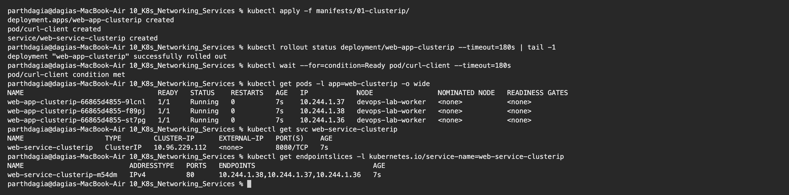
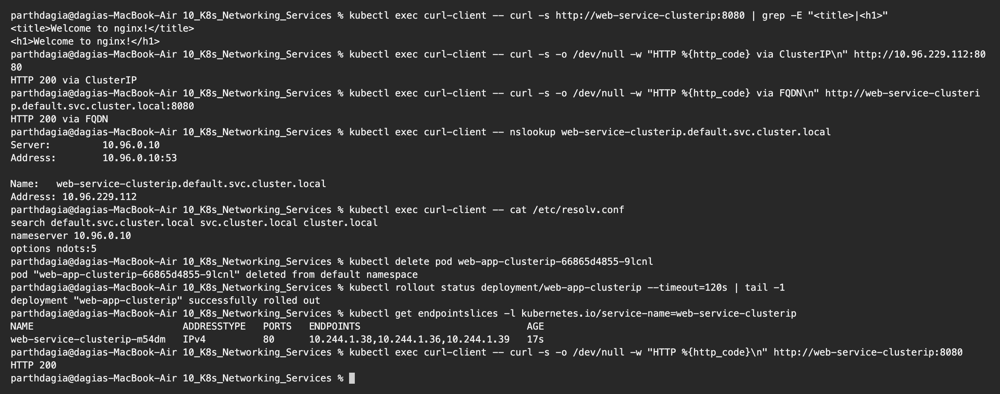
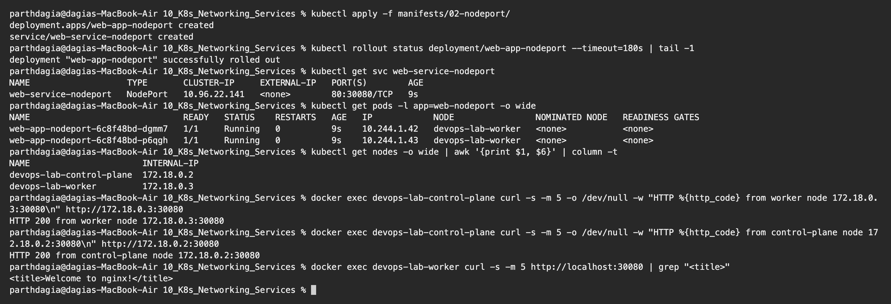
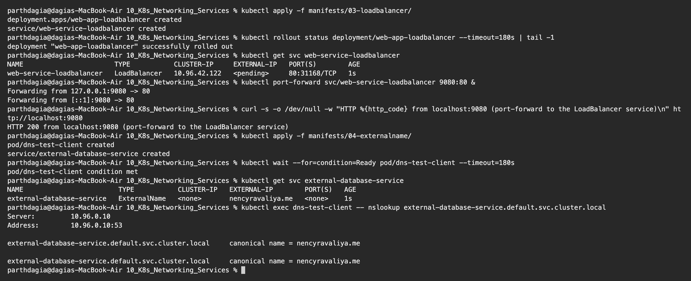
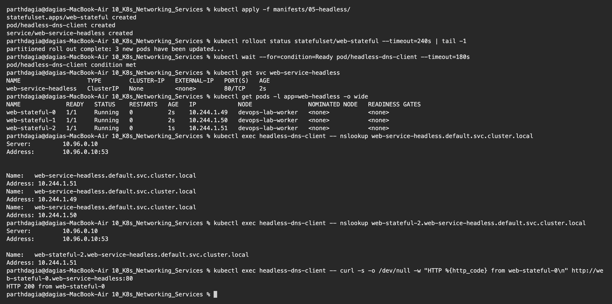
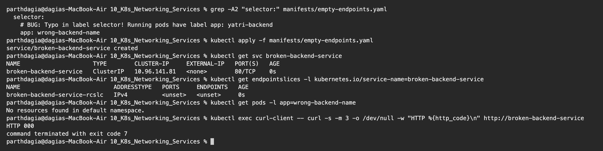

# Kubernetes Networking and Services Homework

**Name:** Parth Dagia
**Roll No:** 24BCS10414

The manifests come from the class repository ([session-11-kubernetes-services](https://github.com/Nency-Ravaliya/devops-heros/tree/main/session-11-kubernetes-services)) and are copied into [manifests/](manifests). I tried all five Service types on my local kind cluster.

## Why we need Services

Pods come and go, and a new Pod gets a **new IP**. So nothing should depend on a Pod IP. A Service gives a **fixed name and a fixed virtual IP** in front of all Pods that match its selector, and spreads the traffic between them.

| Type | Reachable from | How | Used for |
|---|---|---|---|
| **ClusterIP** (default) | Inside the cluster | Virtual IP + DNS name | Service to service calls, databases |
| **NodePort** | Outside, via `<NodeIP>:30000-32767` | Same port opened on every node | Demos, on prem without a load balancer |
| **LoadBalancer** | Internet | Cloud creates an external load balancer | Main entry point on a cloud |
| **ExternalName** | Inside the cluster | DNS `CNAME` to an outside hostname | Giving an external DB or API a cluster name |
| **Headless** (`clusterIP: None`) | Inside the cluster | DNS returns the **Pod IPs** | StatefulSets, databases, peer discovery |

Ports: `port` = Service port, `targetPort` = container port, `nodePort` = port opened on every node.

---

## 1. ClusterIP

[manifests/01-clusterip](manifests/01-clusterip): 3 Nginx Pods, a Service that maps `8080 → 80`, and a `curl-client` Pod to test from inside the cluster.

```text
$ kubectl apply -f manifests/01-clusterip/
deployment.apps/web-app-clusterip created
pod/curl-client created
service/web-service-clusterip created

$ kubectl rollout status deployment/web-app-clusterip --timeout=180s | tail -1
deployment "web-app-clusterip" successfully rolled out

$ kubectl wait --for=condition=Ready pod/curl-client --timeout=180s
pod/curl-client condition met

$ kubectl get pods -l app=web-clusterip -o wide
NAME                                 READY   STATUS    RESTARTS   AGE   IP            NODE                NOMINATED NODE   READINESS GATES
web-app-clusterip-66865d4855-9lcnl   1/1     Running   0          7s    10.244.1.37   devops-lab-worker   <none>           <none>
web-app-clusterip-66865d4855-f89pj   1/1     Running   0          7s    10.244.1.38   devops-lab-worker   <none>           <none>
web-app-clusterip-66865d4855-st7pg   1/1     Running   0          7s    10.244.1.36   devops-lab-worker   <none>           <none>

$ kubectl get svc web-service-clusterip
NAME                    TYPE        CLUSTER-IP      EXTERNAL-IP   PORT(S)    AGE
web-service-clusterip   ClusterIP   10.96.229.112   <none>        8080/TCP   7s

$ kubectl get endpointslices -l kubernetes.io/service-name=web-service-clusterip
NAME                          ADDRESSTYPE   PORTS   ENDPOINTS                             AGE
web-service-clusterip-m54dm   IPv4          80      10.244.1.38,10.244.1.37,10.244.1.36   7s
```



The Service got the virtual IP `10.96.229.112` and its EndpointSlice lists the three Pod IPs on port 80. `EXTERNAL-IP` is `<none>`, so it is internal only.

### Calling it by name, IP and FQDN, and replacing a Pod

```text
$ kubectl exec curl-client -- curl -s http://web-service-clusterip:8080 | grep -E "<title>|<h1>"
<title>Welcome to nginx!</title>
<h1>Welcome to nginx!</h1>

$ kubectl exec curl-client -- curl -s -o /dev/null -w "HTTP %{http_code} via ClusterIP\n" http://10.96.229.112:8080
HTTP 200 via ClusterIP

$ kubectl exec curl-client -- curl -s -o /dev/null -w "HTTP %{http_code} via FQDN\n" http://web-service-clusterip.default.svc.cluster.local:8080
HTTP 200 via FQDN

$ kubectl exec curl-client -- nslookup web-service-clusterip.default.svc.cluster.local
Server:         10.96.0.10
Address:        10.96.0.10:53

Name:   web-service-clusterip.default.svc.cluster.local
Address: 10.96.229.112

$ kubectl exec curl-client -- cat /etc/resolv.conf
search default.svc.cluster.local svc.cluster.local cluster.local
nameserver 10.96.0.10
options ndots:5

$ kubectl delete pod web-app-clusterip-66865d4855-9lcnl
pod "web-app-clusterip-66865d4855-9lcnl" deleted from default namespace

$ kubectl rollout status deployment/web-app-clusterip --timeout=120s | tail -1
deployment "web-app-clusterip" successfully rolled out

$ kubectl get endpointslices -l kubernetes.io/service-name=web-service-clusterip
NAME                          ADDRESSTYPE   PORTS   ENDPOINTS                             AGE
web-service-clusterip-m54dm   IPv4          80      10.244.1.38,10.244.1.36,10.244.1.39   17s

$ kubectl exec curl-client -- curl -s -o /dev/null -w "HTTP %{http_code}\n" http://web-service-clusterip:8080
HTTP 200
```



- The Service answered by **short name**, by **ClusterIP** and by **FQDN** (`web-service-clusterip.default.svc.cluster.local`).
- The short name works because of the `search default.svc.cluster.local svc.cluster.local cluster.local` line in the Pod's `/etc/resolv.conf`. The nameserver `10.96.0.10` is CoreDNS.
- FQDN format: `<service>.<namespace>.svc.cluster.local`. From another namespace I need at least `<service>.<namespace>`.
- I deleted the Pod with IP `10.244.1.37`. The Deployment created a new one (`10.244.1.39`) and the EndpointSlice updated **by itself**. The client used the same name and still got `HTTP 200`. That is the whole point of a Service.
- New Kubernetes versions use `EndpointSlices`. `kubectl get endpoints` still works but prints a deprecation warning.

## 2. NodePort

[manifests/02-nodeport](manifests/02-nodeport): `port: 80`, `targetPort: 80`, `nodePort: 30080`.

```text
$ kubectl apply -f manifests/02-nodeport/
deployment.apps/web-app-nodeport created
service/web-service-nodeport created

$ kubectl rollout status deployment/web-app-nodeport --timeout=180s | tail -1
deployment "web-app-nodeport" successfully rolled out

$ kubectl get svc web-service-nodeport
NAME                   TYPE       CLUSTER-IP     EXTERNAL-IP   PORT(S)        AGE
web-service-nodeport   NodePort   10.96.22.141   <none>        80:30080/TCP   9s

$ kubectl get pods -l app=web-nodeport -o wide
NAME                              READY   STATUS    RESTARTS   AGE   IP            NODE                NOMINATED NODE   READINESS GATES
web-app-nodeport-6c8f48bd-dgmm7   1/1     Running   0          9s    10.244.1.42   devops-lab-worker   <none>           <none>
web-app-nodeport-6c8f48bd-p6qgh   1/1     Running   0          9s    10.244.1.43   devops-lab-worker   <none>           <none>

$ kubectl get nodes -o wide | awk '{print $1, $6}' | column -t
NAME                      INTERNAL-IP
devops-lab-control-plane  172.18.0.2
devops-lab-worker         172.18.0.3

$ docker exec devops-lab-control-plane curl -s -m 5 -o /dev/null -w "HTTP %{http_code} from worker node 172.18.0.3:30080\n" http://172.18.0.3:30080
HTTP 200 from worker node 172.18.0.3:30080

$ docker exec devops-lab-control-plane curl -s -m 5 -o /dev/null -w "HTTP %{http_code} from control-plane node 172.18.0.2:30080\n" http://172.18.0.2:30080
HTTP 200 from control-plane node 172.18.0.2:30080

$ docker exec devops-lab-worker curl -s -m 5 http://localhost:30080 | grep "<title>"
<title>Welcome to nginx!</title>
```



- `80:30080/TCP` means port 30080 is open on **every node**. Both node IPs answered, including the control plane node where no app Pod runs. `kube-proxy` forwards the request to a matching Pod wherever it is.
- **Problem I hit:** my first `curl` to port 30080 gave `HTTP 000` right after creating the Service. kube-proxy needs a few seconds to set up the rules. I deleted everything, waited a little after the rollout and tried again, then it worked.
- A NodePort Service still has a ClusterIP. The types build on each other: LoadBalancer includes NodePort, which includes ClusterIP.
- kind nodes are Docker containers, so `172.18.0.x` is only reachable inside Docker's network. That is why I ran `curl` from inside the node containers. On Minikube it would be `curl $(minikube ip):30080`.

## 3. LoadBalancer and 4. ExternalName

[manifests/03-loadbalancer](manifests/03-loadbalancer), [manifests/04-externalname](manifests/04-externalname)

```text
$ kubectl apply -f manifests/03-loadbalancer/
deployment.apps/web-app-loadbalancer created
service/web-service-loadbalancer created

$ kubectl rollout status deployment/web-app-loadbalancer --timeout=180s | tail -1
deployment "web-app-loadbalancer" successfully rolled out

$ kubectl get svc web-service-loadbalancer
NAME                       TYPE           CLUSTER-IP     EXTERNAL-IP   PORT(S)        AGE
web-service-loadbalancer   LoadBalancer   10.96.42.122   <pending>     80:31168/TCP   1s

$ kubectl port-forward svc/web-service-loadbalancer 9080:80 &
Forwarding from 127.0.0.1:9080 -> 80
Forwarding from [::1]:9080 -> 80

$ curl -s -o /dev/null -w "HTTP %{http_code} from localhost:9080 (port-forward to the LoadBalancer service)\n" http://localhost:9080
HTTP 200 from localhost:9080 (port-forward to the LoadBalancer service)

$ kubectl apply -f manifests/04-externalname/
pod/dns-test-client created
service/external-database-service created

$ kubectl wait --for=condition=Ready pod/dns-test-client --timeout=180s
pod/dns-test-client condition met

$ kubectl get svc external-database-service
NAME                        TYPE           CLUSTER-IP   EXTERNAL-IP        PORT(S)   AGE
external-database-service   ExternalName   <none>       nencyravaliya.me   <none>    1s

$ kubectl exec dns-test-client -- nslookup external-database-service.default.svc.cluster.local
Server:         10.96.0.10
Address:        10.96.0.10:53

external-database-service.default.svc.cluster.local     canonical name = nencyravaliya.me

external-database-service.default.svc.cluster.local     canonical name = nencyravaliya.me
```



**LoadBalancer:**

- `EXTERNAL-IP` stays `<pending>` on a local cluster because there is no cloud to create a real load balancer. On AWS, GCP or Azure a public IP or hostname would show up. Locally, `minikube tunnel`, MetalLB or `cloud-provider-kind` can play that role.
- It still got a NodePort (`80:31168`) and a ClusterIP, so it works. I tested it with `kubectl port-forward` and got `HTTP 200`.
- Every LoadBalancer is a separate paid cloud resource. Usually there is one LoadBalancer in front of an **Ingress controller**, which then routes to many ClusterIP Services.

**ExternalName:**

- No ClusterIP, no selector and no Pods. CoreDNS just answers with a `CNAME` (`canonical name = nencyravaliya.me`).
- Apps can use the in cluster name `external-database-service`. If the external database moves, only the Service changes, not the app.

## 5. Headless Service with a StatefulSet

[manifests/05-headless](manifests/05-headless)

```text
$ kubectl apply -f manifests/05-headless/
statefulset.apps/web-stateful created
pod/headless-dns-client created
service/web-service-headless created

$ kubectl rollout status statefulset/web-stateful --timeout=240s | tail -1
partitioned roll out complete: 3 new pods have been updated...

$ kubectl wait --for=condition=Ready pod/headless-dns-client --timeout=180s
pod/headless-dns-client condition met

$ kubectl get svc web-service-headless
NAME                   TYPE        CLUSTER-IP   EXTERNAL-IP   PORT(S)   AGE
web-service-headless   ClusterIP   None         <none>        80/TCP    2s

$ kubectl get pods -l app=web-headless -o wide
NAME             READY   STATUS    RESTARTS   AGE   IP            NODE                NOMINATED NODE   READINESS GATES
web-stateful-0   1/1     Running   0          2s    10.244.1.49   devops-lab-worker   <none>           <none>
web-stateful-1   1/1     Running   0          2s    10.244.1.50   devops-lab-worker   <none>           <none>
web-stateful-2   1/1     Running   0          1s    10.244.1.51   devops-lab-worker   <none>           <none>

$ kubectl exec headless-dns-client -- nslookup web-service-headless.default.svc.cluster.local
Server:         10.96.0.10
Address:        10.96.0.10:53


Name:   web-service-headless.default.svc.cluster.local
Address: 10.244.1.51
Name:   web-service-headless.default.svc.cluster.local
Address: 10.244.1.49
Name:   web-service-headless.default.svc.cluster.local
Address: 10.244.1.50

$ kubectl exec headless-dns-client -- nslookup web-stateful-2.web-service-headless.default.svc.cluster.local
Server:         10.96.0.10
Address:        10.96.0.10:53

Name:   web-stateful-2.web-service-headless.default.svc.cluster.local
Address: 10.244.1.51

$ kubectl exec headless-dns-client -- curl -s -o /dev/null -w "HTTP %{http_code} from web-stateful-0\n" http://web-stateful-0.web-service-headless:80
HTTP 200 from web-stateful-0
```



- With `clusterIP: None` there is no virtual IP and no load balancing. A DNS lookup of the Service returns **all three Pod IPs** and the client picks one.
- StatefulSet Pods have **fixed names** (`web-stateful-0`, `-1`, `-2`), and each gets its own DNS record `<pod>.<service>.<namespace>.svc.cluster.local`. `web-stateful-2` resolved to exactly its own IP `10.244.1.51`.
- Databases and clustered apps (MySQL replication, Kafka, MongoDB) need this, because one replica has to talk to one specific other replica.

## 6. Troubleshooting: empty endpoints

[manifests/empty-endpoints.yaml](manifests/empty-endpoints.yaml) uses the selector `app: wrong-backend-name`, which no Pod has.

```text
$ grep -A2 "selector:" manifests/empty-endpoints.yaml
  selector:
    # BUG: Typo in label selector! Running pods have label app: yatri-backend
    app: wrong-backend-name

$ kubectl apply -f manifests/empty-endpoints.yaml
service/broken-backend-service created

$ kubectl get svc broken-backend-service
NAME                     TYPE        CLUSTER-IP     EXTERNAL-IP   PORT(S)   AGE
broken-backend-service   ClusterIP   10.96.141.81   <none>        80/TCP    0s

$ kubectl get endpointslices -l kubernetes.io/service-name=broken-backend-service
NAME                           ADDRESSTYPE   PORTS     ENDPOINTS   AGE
broken-backend-service-rcslc   IPv4          <unset>   <unset>     0s

$ kubectl get pods -l app=wrong-backend-name
No resources found in default namespace.

$ kubectl exec curl-client -- curl -s -m 3 -o /dev/null -w "HTTP %{http_code}\n" http://broken-backend-service
HTTP 000
command terminated with exit code 7
```



The Service is created with no error, but its EndpointSlice is `<unset>` and a request fails right away (curl exit code 7, connection refused). When a Service does not answer I check:

1. `kubectl get endpointslices`: is the list empty?
2. `kubectl get pods --show-labels`: does the Service `selector` match the Pod labels **exactly**?
3. Is `targetPort` the port the container really listens on?
4. Are the Pods `Ready`? Pods that are not ready are removed from the endpoints.
5. Is CoreDNS running? `kubectl get pods -n kube-system -l k8s-app=kube-dns`

## Clean up

```bash
kubectl delete -f manifests/01-clusterip -f manifests/02-nodeport -f manifests/03-loadbalancer \
               -f manifests/04-externalname -f manifests/05-headless -f manifests/empty-endpoints.yaml
```
