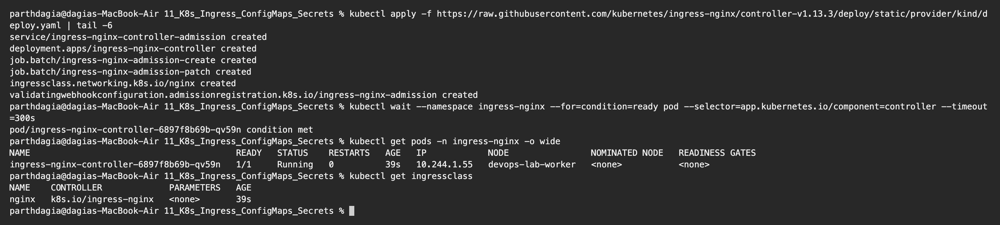
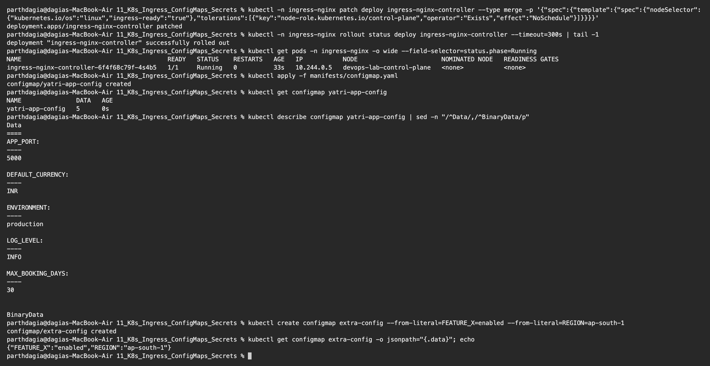
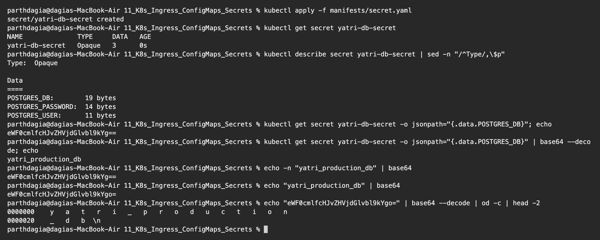
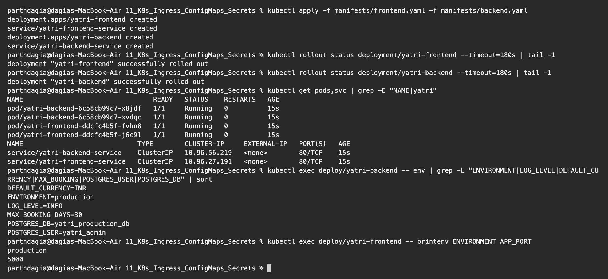
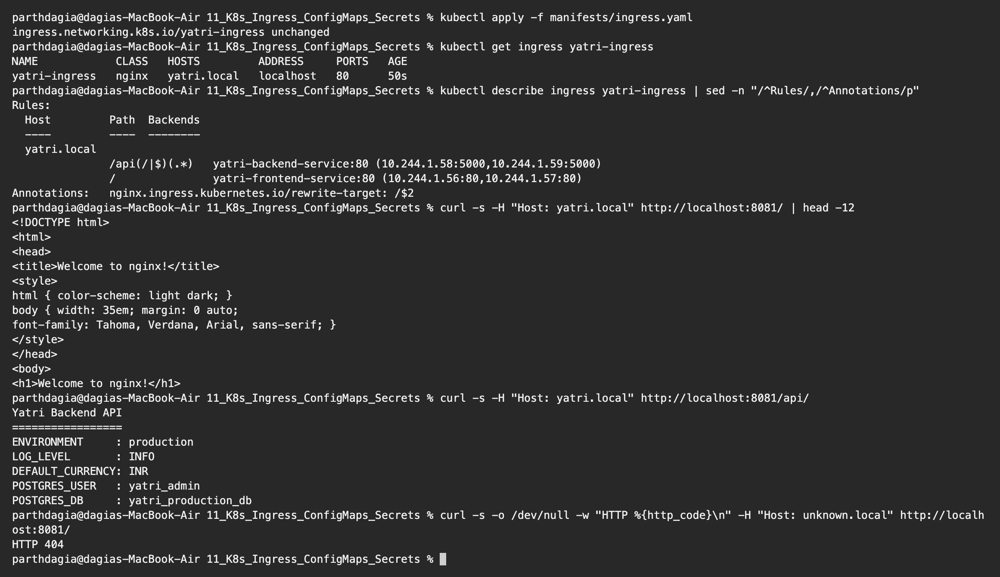
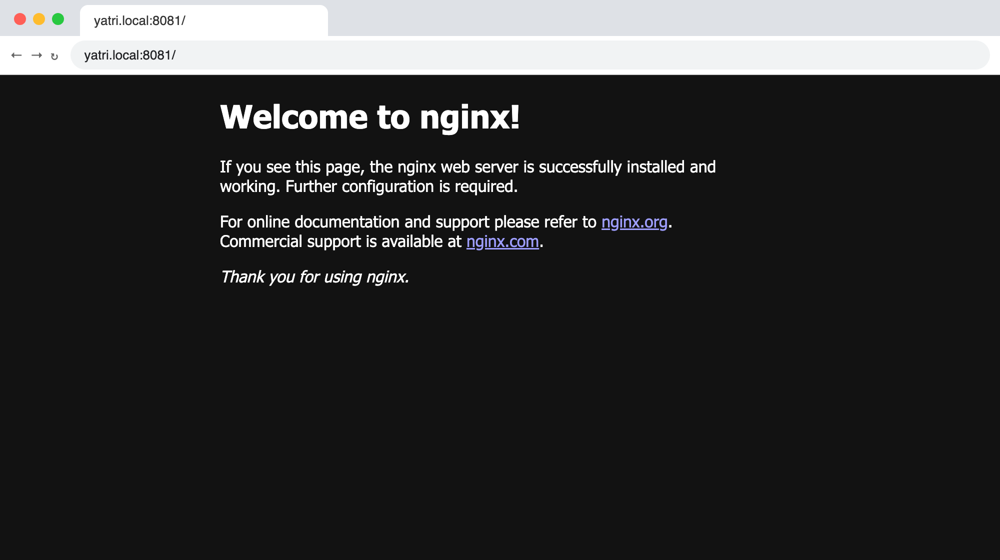
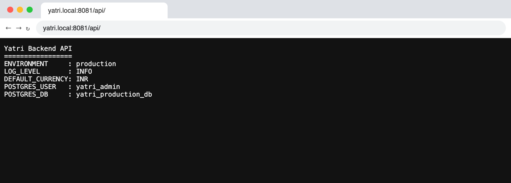

# Kubernetes Ingress, ConfigMaps and Secrets Homework

**Name:** Parth Dagia
**Roll No:** 24BCS10414

The manifests come from the class repository ([session-12-ingress-configmaps-secrets/04-full-demo](https://github.com/Nency-Ravaliya/devops-heros/tree/main/session-12-ingress-configmaps-secrets/04-full-demo)) and are copied into [manifests/](manifests). I ran them on my local kind cluster.

| Object | Purpose |
|---|---|
| **ConfigMap** | Normal (non secret) settings as key value pairs, kept outside the image |
| **Secret** | Sensitive values like passwords and tokens, stored base64 encoded |
| **Ingress** | HTTP routing rules (host and path) from one entry point to many Services |
| **Ingress Controller** | The real reverse proxy (NGINX here) that reads Ingress objects and applies them |

What I built:

```text
                     Host: yatri.local
 curl / browser ───────────────────► NGINX Ingress Controller
                                          │
                     path /               │              path /api/...
                     ▼                                          ▼
         yatri-frontend-service                    yatri-backend-service    (ClusterIP)
                     ▼                                          ▼
              2 Nginx Pods                            2 Python API Pods
                                                     ▲                 ▲
                                               ConfigMap            Secret
                                           yatri-app-config     yatri-db-secret
```

---

## 0. Install the Ingress controller

In class we used `minikube addons enable ingress`. On kind the same NGINX controller is installed from its official manifest. My kind cluster maps port 80 of the control plane node to `localhost:8081` on my Mac (see [kind-cluster.yaml](../08_Kubernetes_Fundamentals/kind-cluster.yaml)).

```text
$ kubectl apply -f https://raw.githubusercontent.com/kubernetes/ingress-nginx/controller-v1.13.3/deploy/static/provider/kind/deploy.yaml | tail -6
service/ingress-nginx-controller-admission created
deployment.apps/ingress-nginx-controller created
job.batch/ingress-nginx-admission-create created
job.batch/ingress-nginx-admission-patch created
ingressclass.networking.k8s.io/nginx created
validatingwebhookconfiguration.admissionregistration.k8s.io/ingress-nginx-admission created

$ kubectl wait --namespace ingress-nginx --for=condition=ready pod --selector=app.kubernetes.io/component=controller --timeout=300s
pod/ingress-nginx-controller-6897f8b69b-qv59n condition met

$ kubectl get pods -n ingress-nginx -o wide
NAME                                        READY   STATUS    RESTARTS   AGE   IP            NODE                NOMINATED NODE   READINESS GATES
ingress-nginx-controller-6897f8b69b-qv59n   1/1     Running   0          39s   10.244.1.55   devops-lab-worker   <none>           <none>

$ kubectl get ingressclass
NAME    CONTROLLER             PARAMETERS   AGE
nginx   k8s.io/ingress-nginx   <none>       39s
```



This part took me some time to understand. The controller first started on the worker node, but on kind it has to run on the node that has the port mapping (the one labelled `ingress-ready=true`). So I added a node selector and a toleration for the control plane taint, which moved it there.

## 1. ConfigMap

[manifests/configmap.yaml](manifests/configmap.yaml)

```text
$ kubectl -n ingress-nginx patch deploy ingress-nginx-controller --type merge -p '{"spec":{"template":{"spec":{"nodeSelector":{"kubernetes.io/os":"linux","ingress-ready":"true"},"tolerations":[{"key":"node-role.kubernetes.io/control-plane","operator":"Exists","effect":"NoSchedule"}]}}}}'
deployment.apps/ingress-nginx-controller patched

$ kubectl -n ingress-nginx rollout status deploy ingress-nginx-controller --timeout=300s | tail -1
deployment "ingress-nginx-controller" successfully rolled out

$ kubectl get pods -n ingress-nginx -o wide --field-selector=status.phase=Running
NAME                                        READY   STATUS    RESTARTS   AGE   IP           NODE                       NOMINATED NODE   READINESS GATES
ingress-nginx-controller-6f4f68c79f-4s4b5   1/1     Running   0          33s   10.244.0.5   devops-lab-control-plane   <none>           <none>

$ kubectl apply -f manifests/configmap.yaml
configmap/yatri-app-config created

$ kubectl get configmap yatri-app-config
NAME               DATA   AGE
yatri-app-config   5      0s

$ kubectl describe configmap yatri-app-config | sed -n "/^Data/,/^BinaryData/p"
Data
====
APP_PORT:
----
5000

DEFAULT_CURRENCY:
----
INR

ENVIRONMENT:
----
production

LOG_LEVEL:
----
INFO

MAX_BOOKING_DAYS:
----
30


BinaryData

$ kubectl create configmap extra-config --from-literal=FEATURE_X=enabled --from-literal=REGION=ap-south-1
configmap/extra-config created

$ kubectl get configmap extra-config -o jsonpath="{.data}"; echo
{"FEATURE_X":"enabled","REGION":"ap-south-1"}
```



- After the patch the controller Pod runs on `devops-lab-control-plane`.
- A ConfigMap is plain text. I can create it from YAML or straight from the command line (`--from-literal`, `--from-file`).
- The same image can run in dev and prod with a different ConfigMap, so changing settings does not need a new image.

## 2. Secret

[manifests/secret.yaml](manifests/secret.yaml)

```text
$ kubectl apply -f manifests/secret.yaml
secret/yatri-db-secret created

$ kubectl get secret yatri-db-secret
NAME              TYPE     DATA   AGE
yatri-db-secret   Opaque   3      0s

$ kubectl describe secret yatri-db-secret | sed -n "/^Type/,\$p"
Type:  Opaque

Data
====
POSTGRES_DB:        19 bytes
POSTGRES_PASSWORD:  14 bytes
POSTGRES_USER:      11 bytes

$ kubectl get secret yatri-db-secret -o jsonpath="{.data.POSTGRES_DB}"; echo
eWF0cmlfcHJvZHVjdGlvbl9kYg==

$ kubectl get secret yatri-db-secret -o jsonpath="{.data.POSTGRES_DB}" | base64 --decode; echo
yatri_production_db

$ echo -n "yatri_production_db" | base64
eWF0cmlfcHJvZHVjdGlvbl9kYg==

$ echo "yatri_production_db" | base64
eWF0cmlfcHJvZHVjdGlvbl9kYgo=

$ echo "eWF0cmlfcHJvZHVjdGlvbl9kYgo=" | base64 --decode | od -c | head -2
0000000    y   a   t   r   i   _   p   r   o   d   u   c   t   i   o   n
0000020    _   d   b  \n
```



- `kubectl describe secret` only shows the **size** of each value, never the value itself.
- Values under `data:` are **base64 encoded, not encrypted**. Anyone allowed to read the Secret can decode it with `base64 --decode`. The real protection is RBAC, encrypting etcd at rest, and not committing Secret YAML to Git (or using Sealed Secrets / a vault).
- **The newline trap:** `echo -n "yatri_production_db" | base64` gives `...kYg==`, but without `-n` it gives `...kYgo=`. `od -c` shows why: the decoded value ends with `\n`. That hidden newline would end up inside the password or DB name and cause login errors that are very hard to find. So always use `echo -n`, or write the values under `stringData:` and let Kubernetes encode them.

## 3. Deploy the apps and inject the config

[manifests/frontend.yaml](manifests/frontend.yaml), [manifests/backend.yaml](manifests/backend.yaml)

The backend uses both ways of injecting values:

```yaml
envFrom:
  - configMapRef:
      name: yatri-app-config          # every key becomes an env variable
env:
  - name: POSTGRES_USER
    valueFrom:
      secretKeyRef:                   # one key picked from the Secret
        name: yatri-db-secret
        key: POSTGRES_USER
```

```text
$ kubectl apply -f manifests/frontend.yaml -f manifests/backend.yaml
deployment.apps/yatri-frontend created
service/yatri-frontend-service created
deployment.apps/yatri-backend created
service/yatri-backend-service created

$ kubectl rollout status deployment/yatri-frontend --timeout=180s | tail -1
deployment "yatri-frontend" successfully rolled out

$ kubectl rollout status deployment/yatri-backend --timeout=180s | tail -1
deployment "yatri-backend" successfully rolled out

$ kubectl get pods,svc | grep -E "NAME|yatri"
NAME                                 READY   STATUS    RESTARTS   AGE
pod/yatri-backend-6c58cb99c7-x8jdf   1/1     Running   0          15s
pod/yatri-backend-6c58cb99c7-xvdqc   1/1     Running   0          15s
pod/yatri-frontend-ddcfc4b5f-fvhn8   1/1     Running   0          15s
pod/yatri-frontend-ddcfc4b5f-j6c9l   1/1     Running   0          15s
NAME                             TYPE        CLUSTER-IP     EXTERNAL-IP   PORT(S)   AGE
service/yatri-backend-service    ClusterIP   10.96.56.219   <none>        80/TCP    15s
service/yatri-frontend-service   ClusterIP   10.96.27.191   <none>        80/TCP    15s

$ kubectl exec deploy/yatri-backend -- env | grep -E "ENVIRONMENT|LOG_LEVEL|DEFAULT_CURRENCY|MAX_BOOKING|POSTGRES_USER|POSTGRES_DB" | sort
DEFAULT_CURRENCY=INR
ENVIRONMENT=production
LOG_LEVEL=INFO
MAX_BOOKING_DAYS=30
POSTGRES_DB=yatri_production_db
POSTGRES_USER=yatri_admin

$ kubectl exec deploy/yatri-frontend -- printenv ENVIRONMENT APP_PORT
production
5000
```



Inside the container, the ConfigMap keys and the **decoded** Secret values are just normal environment variables, so the app does not need to know anything about Kubernetes. The frontend also got the ConfigMap values through `envFrom`. Env variables are read only when the container starts, so after changing a ConfigMap I would need `kubectl rollout restart deployment/<name>`. A ConfigMap mounted as a volume updates on its own.

## 4. Ingress

[manifests/ingress.yaml](manifests/ingress.yaml): host `yatri.local`, `/api(/|$)(.*)` goes to the backend with `rewrite-target: /$2`, and `/` goes to the frontend.

In the terminal I sent the `Host` header with `curl` instead of editing `/etc/hosts`. The controller routes by that header, so the result is the same.

```text
$ kubectl apply -f manifests/ingress.yaml
ingress.networking.k8s.io/yatri-ingress unchanged

$ kubectl get ingress yatri-ingress
NAME            CLASS   HOSTS         ADDRESS     PORTS   AGE
yatri-ingress   nginx   yatri.local   localhost   80      50s

$ kubectl describe ingress yatri-ingress | sed -n "/^Rules/,/^Annotations/p"
Rules:
  Host         Path  Backends
  ----         ----  --------
  yatri.local
               /api(/|$)(.*)   yatri-backend-service:80 (10.244.1.58:5000,10.244.1.59:5000)
               /               yatri-frontend-service:80 (10.244.1.56:80,10.244.1.57:80)
Annotations:   nginx.ingress.kubernetes.io/rewrite-target: /$2

$ curl -s -H "Host: yatri.local" http://localhost:8081/ | head -12
<!DOCTYPE html>
<html>
<head>
<title>Welcome to nginx!</title>
<style>
html { color-scheme: light dark; }
body { width: 35em; margin: 0 auto;
font-family: Tahoma, Verdana, Arial, sans-serif; }
</style>
</head>
<body>
<h1>Welcome to nginx!</h1>

$ curl -s -H "Host: yatri.local" http://localhost:8081/api/
Yatri Backend API
=================
ENVIRONMENT     : production
LOG_LEVEL       : INFO
DEFAULT_CURRENCY: INR
POSTGRES_USER   : yatri_admin
POSTGRES_DB     : yatri_production_db

$ curl -s -o /dev/null -w "HTTP %{http_code}\n" -H "Host: unknown.local" http://localhost:8081/
HTTP 404
```



### In the browser

For the browser I pointed `yatri.local` to `127.0.0.1` and opened `http://yatri.local:8081/`.

Frontend at `/`:



Backend at `/api/`:



### What I understood

- **One entry point, two Services.** `/` returned the Nginx frontend page and `/api/` returned the backend API. Both Services are plain ClusterIP, nothing else is exposed.
- The backend reply shows `ENVIRONMENT: production` and `DEFAULT_CURRENCY: INR` from the **ConfigMap** and `POSTGRES_USER: yatri_admin` from the **Secret**. So the whole chain works: Ingress → Service → Pod → config.
- `rewrite-target: /$2` strips the `/api` part, so the backend receives `/` and not `/api/`.
- A request for an unknown host (`unknown.local`) got `404` from the controller's default backend because no rule matches. The routing really is by host.
- `ingressClassName: nginx` decides which controller handles the Ingress. Without a running controller, an Ingress object does nothing.
- Compared to one LoadBalancer per Service, an Ingress needs only one external IP and also gives path and host routing and TLS termination in one place.

## 5. Clean up

```bash
kubectl delete -f manifests/
kubectl delete configmap extra-config
```
