# Session 12: Kubernetes Ingress, ConfigMaps and Secrets

**Name:** Parth Dagia
**Roll No:** 24BCS10414

In session 11 I ran the class demo (`yatri` app). For this session I built my own small **Campus Portal** app in a separate namespace `session12` and did every task again on my local kind cluster, plus the troubleshooting scenario from the class repo ([session-12-ingress-configmaps-secrets/troubleshooting](https://github.com/Nency-Ravaliya/devops-heros/tree/main/session-12-ingress-configmaps-secrets/troubleshooting)).

| Task | What | Files |
|---|---|---|
| 1 | ConfigMap | [manifests/01-configmap/](manifests/01-configmap) |
| 2 | Secret | [manifests/02-secret/](manifests/02-secret) |
| 3 | Ingress | [manifests/03-ingress/](manifests/03-ingress) |
| 4 | Ingress vs Ingress Controller | [ingress-vs-ingress-controller/README.md](ingress-vs-ingress-controller/README.md) |
| 5 | Troubleshooting (Secret newline bug) | [troubleshooting/README.md](troubleshooting/README.md) |

What I built:

```text
                       Host: campus.local            Host: api.campus.local
 curl / browser ─────────────────────► NGINX Ingress Controller ◄──────────────
 (localhost:8081)                          │
              path /                       │ path /api            any path
                 ▼                         ▼                         ▼
          campus-web Service        campus-api Service  ◄────────────┘   (ClusterIP)
                 ▼                         ▼
        2 Nginx Pods                 2 Python Pods
  (index.html from a ConfigMap)   (ENVIRONMENT from ConfigMap, DB_USER from Secret)
```

My kind cluster maps port 80 of the control plane node to `localhost:8081` on my Mac, and the NGINX Ingress Controller is already installed from session 11 (see [11_K8s_Ingress_ConfigMaps_Secrets](../11_K8s_Ingress_ConfigMaps_Secrets/README.md#0-install-the-ingress-controller)).

---

## Task 1: ConfigMap

[manifests/01-configmap/configmap.yaml](manifests/01-configmap/configmap.yaml) has two ConfigMaps:

- `campus-config`: five normal settings (`APP_NAME`, `ENVIRONMENT`, `LOG_LEVEL`, `MAX_UPLOAD_MB`, `FEATURE_DARK_MODE`)
- `campus-settings-file`: a whole `app.properties` file

### Create the ConfigMap and store the values

```text
$ kubectl apply -f manifests/00-namespace.yaml
namespace/session12 created

$ kubectl apply -f manifests/01-configmap/configmap.yaml
configmap/campus-config created
configmap/campus-settings-file created

$ kubectl get configmap -n session12
NAME                   DATA   AGE
campus-config          5      0s
campus-settings-file   1      0s
kube-root-ca.crt       1      0s

$ kubectl describe configmap campus-config -n session12 | sed -n "/^Data/,/^BinaryData/p"
Data
====
APP_NAME:
----
Campus Portal

ENVIRONMENT:
----
staging

FEATURE_DARK_MODE:
----
true

LOG_LEVEL:
----
debug

MAX_UPLOAD_MB:
----
20


BinaryData

$ kubectl get configmap campus-settings-file -n session12 -o jsonpath="{.data.app\.properties}"
theme=dark
items.per.page=25
support.email=help@campus.local
```

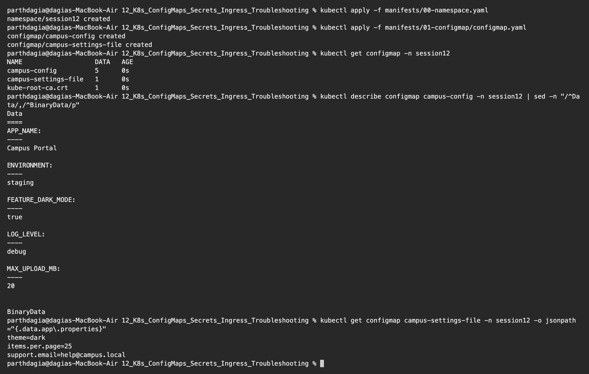

### Inject it into a Pod and verify inside the container

[manifests/01-configmap/pod.yaml](manifests/01-configmap/pod.yaml) uses all three ways of injecting a ConfigMap:

```yaml
envFrom:
  - configMapRef:
      name: campus-config          # 1) every key becomes an env variable
env:
  - name: PORTAL_TITLE
    valueFrom:
      configMapKeyRef:             # 2) one key, under a new name
        name: campus-config
        key: APP_NAME
volumes:
  - name: settings
    configMap:
      name: campus-settings-file   # 3) mounted as a file in /etc/campus
```

```text
$ kubectl apply -f manifests/01-configmap/pod.yaml
pod/configmap-demo created

$ kubectl wait --for=condition=Ready pod/configmap-demo -n session12 --timeout=120s
pod/configmap-demo condition met

$ kubectl exec -n session12 configmap-demo -- sh -c 'env | grep -E "APP_NAME|ENVIRONMENT|LOG_LEVEL|MAX_UPLOAD|FEATURE_|PORTAL_TITLE" | sort'
APP_NAME=Campus Portal
ENVIRONMENT=staging
FEATURE_DARK_MODE=true
LOG_LEVEL=debug
MAX_UPLOAD_MB=20
PORTAL_TITLE=Campus Portal

$ kubectl exec -n session12 configmap-demo -- ls -l /etc/campus
total 0
lrwxrwxrwx    1 root     root            21 Oct  6 21:20 app.properties -> ..data/app.properties

$ kubectl exec -n session12 configmap-demo -- cat /etc/campus/app.properties
theme=dark
items.per.page=25
support.email=help@campus.local
```

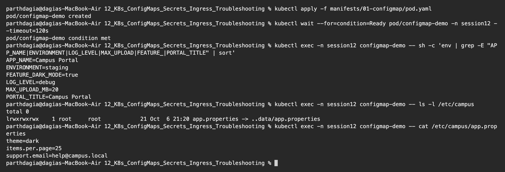

All five keys are env variables inside the container, `PORTAL_TITLE` got the value of `APP_NAME`, and `/etc/campus/app.properties` is the file from the ConfigMap. The file is a symlink to `..data/`, which is how the kubelet swaps in new versions.

### What happens when I change the ConfigMap

```text
$ kubectl patch configmap campus-config -n session12 --type merge -p '{"data":{"LOG_LEVEL":"info"}}'
configmap/campus-config patched

$ kubectl patch configmap campus-settings-file -n session12 --type merge -p '{"data":{"app.properties":"theme=light\nitems.per.page=50\nsupport.email=help@campus.local\n"}}'
configmap/campus-settings-file patched

$ kubectl exec -n session12 configmap-demo -- printenv LOG_LEVEL
debug

$ kubectl exec -n session12 configmap-demo -- cat /etc/campus/app.properties
theme=light
items.per.page=50
support.email=help@campus.local

$ kubectl delete pod configmap-demo -n session12 --wait=true
pod "configmap-demo" deleted from session12 namespace

$ kubectl apply -f manifests/01-configmap/pod.yaml
pod/configmap-demo created

$ kubectl wait --for=condition=Ready pod/configmap-demo -n session12 --timeout=120s
pod/configmap-demo condition met

$ kubectl exec -n session12 configmap-demo -- printenv LOG_LEVEL
info
```

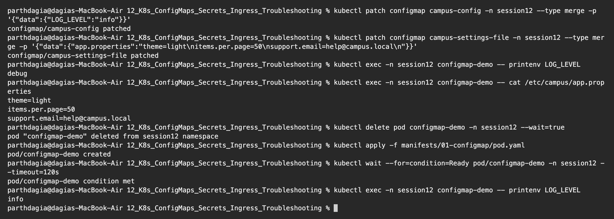

- The **mounted file** changed by itself (`theme=light`, `items.per.page=50`) after about a minute, without restarting the Pod.
- The **env variable** `LOG_LEVEL` was still `debug`. Env variables are set only when the container starts. After I recreated the Pod it showed `info`. For a Deployment the same thing is done with `kubectl rollout restart`.

## Task 2: Secret

[manifests/02-secret/secret.yaml](manifests/02-secret/secret.yaml) stores `DB_USER` and `DB_PASSWORD` base64 encoded under `data:` (made with `echo -n ... | base64`) and `API_KEY` as plain text under `stringData:` (Kubernetes encodes it for me).

### Create the Secret and store the sensitive values

```text
$ echo -n "Campus@2026" | base64
Q2FtcHVzQDIwMjY=

$ kubectl apply -f manifests/02-secret/secret.yaml
secret/campus-db-secret created

$ kubectl get secret campus-db-secret -n session12
NAME               TYPE     DATA   AGE
campus-db-secret   Opaque   3      0s

$ kubectl describe secret campus-db-secret -n session12 | sed -n "/^Type/,\$p"
Type:  Opaque

Data
====
API_KEY:      14 bytes
DB_PASSWORD:  11 bytes
DB_USER:      12 bytes

$ kubectl get secret campus-db-secret -n session12 -o jsonpath="{.data}"; echo
{"API_KEY":"ZGVtby1rZXktMTIzNDU=","DB_PASSWORD":"Q2FtcHVzQDIwMjY=","DB_USER":"Y2FtcHVzX2FkbWlu"}

$ kubectl get secret campus-db-secret -n session12 -o jsonpath="{.data.DB_PASSWORD}" | base64 --decode; echo
Campus@2026
```

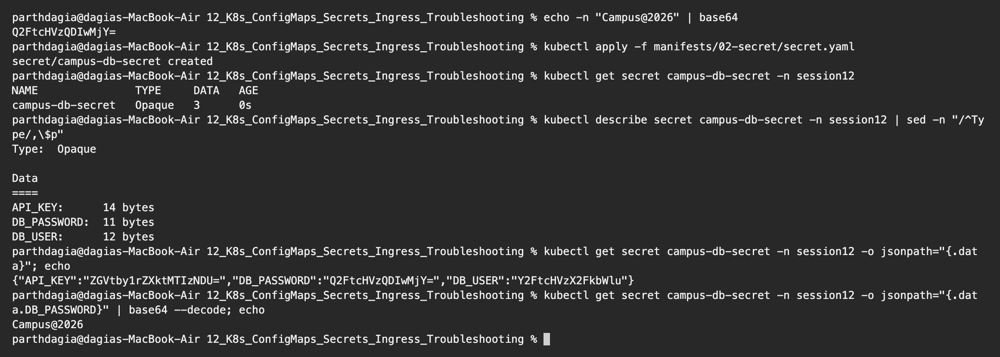

`kubectl describe` hides the values and only shows their size. But anyone who can run `kubectl get secret` can read and decode them, because **base64 is encoding, not encryption**. The `API_KEY` I wrote as plain text under `stringData` is stored base64 encoded like the others.

### Inject it into a Pod and verify inside the container

[manifests/02-secret/pod.yaml](manifests/02-secret/pod.yaml) uses `secretKeyRef` for env variables and also mounts the whole Secret as files with `defaultMode: 0400`.

```text
$ kubectl apply -f manifests/02-secret/pod.yaml
pod/secret-demo created

$ kubectl wait --for=condition=Ready pod/secret-demo -n session12 --timeout=120s
pod/secret-demo condition met

$ kubectl exec -n session12 secret-demo -- printenv DB_USER DB_PASSWORD
campus_admin
Campus@2026

$ kubectl exec -n session12 secret-demo -- ls -lL /etc/campus-secrets
total 12
-r--------    1 root     root            14 Oct  6 21:22 API_KEY
-r--------    1 root     root            11 Oct  6 21:22 DB_PASSWORD
-r--------    1 root     root            12 Oct  6 21:22 DB_USER

$ kubectl exec -n session12 secret-demo -- sh -c 'for f in /etc/campus-secrets/*; do echo "$f = $(cat $f)"; done'
/etc/campus-secrets/API_KEY = demo-key-12345
/etc/campus-secrets/DB_PASSWORD = Campus@2026
/etc/campus-secrets/DB_USER = campus_admin

$ kubectl exec -n session12 secret-demo -- mount | grep campus-secrets
tmpfs on /etc/campus-secrets type tmpfs (ro,relatime,size=8124516k,noswap)

$ kubectl get pod secret-demo -n session12 -o jsonpath="{.spec.containers[0].env}"; echo
[{"name":"DB_USER","valueFrom":{"secretKeyRef":{"key":"DB_USER","name":"campus-db-secret"}}},{"name":"DB_PASSWORD","valueFrom":{"secretKeyRef":{"key":"DB_PASSWORD","name":"campus-db-secret"}}}]
```

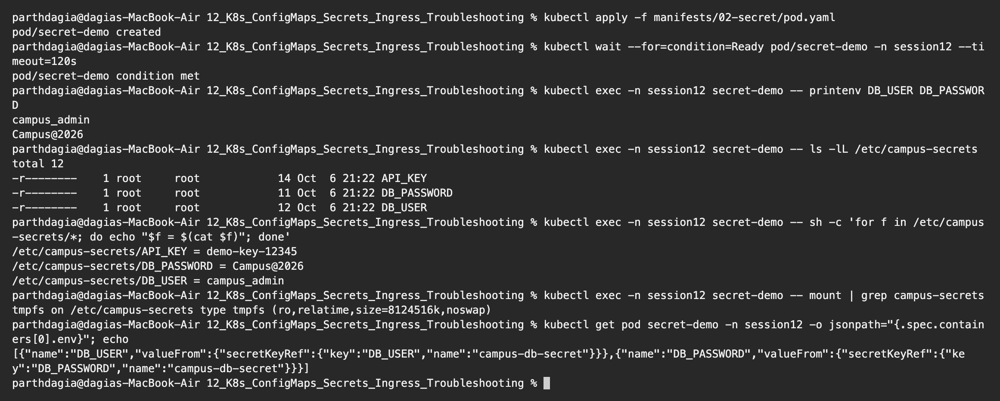

- Inside the container the values are **already decoded**: `DB_PASSWORD=Campus@2026`. The app does not need to know about base64.
- The mounted Secret creates one file per key, readable only by the owner (`-r--------`), on a `tmpfs` (in memory, never written to the node disk).
- The Pod spec itself only has a **reference** (`secretKeyRef`), not the value. So `kubectl get pod -o yaml` does not leak the password.

### Why Secrets should not be committed directly to Git

To prove it, I made a throwaway Git repo, committed `secret.yaml`, then deleted it in the next commit:

```text
$ cp ~/devOps/12_K8s_ConfigMaps_Secrets_Ingress_Troubleshooting/manifests/02-secret/secret.yaml .

$ git add secret.yaml && git commit -qm "add db secret" && git log --oneline
eb8170e add db secret

$ git rm -q secret.yaml && git commit -qm "oops, remove secret" && git log --oneline
ea35765 oops, remove secret
eb8170e add db secret

$ ls

$ git log -p --all -S "DB_PASSWORD" | grep "DB_PASSWORD:"
-  DB_PASSWORD: Q2FtcHVzQDIwMjY=
+  DB_PASSWORD: Q2FtcHVzQDIwMjY=

$ git show HEAD~1:secret.yaml | grep "DB_PASSWORD:" | awk '{print $2}' | base64 --decode; echo
Campus@2026
```

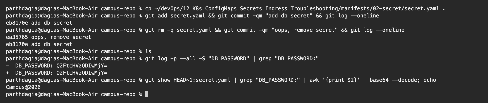

The file is gone from the folder (`ls` shows nothing), but Git history still has it, and one `base64 --decode` gives back the password. So:

- **base64 is not protection.** A Secret YAML in Git is the same as a plain text password in Git.
- **Git never forgets.** Deleting the file in a new commit does not remove it from history. Every clone, fork and CI cache already has a copy. The only real fix after a leak is to **rotate (change) the password**.
- **Too many people get access.** Everyone with read access to the repo gets the production credentials, even people who should not have cluster access.
- Bots scan public GitHub for keys all the time, so a leaked key can be used within minutes.

What to do instead:

- Create the Secret straight in the cluster: `kubectl create secret generic campus-db-secret --from-literal=DB_PASSWORD=...` or `--from-env-file=.env`, and keep `.env` in `.gitignore`.
- Commit only a template with fake values (for example `secret.example.yaml`).
- Use **Sealed Secrets** or **SOPS** (encrypted files that are safe in Git), or an external store like **HashiCorp Vault / AWS Secrets Manager** with the **External Secrets Operator**.
- In the cluster: limit `get secret` with RBAC and turn on encryption at rest for etcd.

> The values in this folder (`Campus@2026`, `demo-key-12345`, `secretpassword`) are fake demo values, kept here only because the homework asks for the Secret YAML.

## Task 3: Ingress

### Deploy the application and create the Services

[manifests/03-ingress/web.yaml](manifests/03-ingress/web.yaml) (Nginx frontend, `index.html` from a ConfigMap) and [manifests/03-ingress/api.yaml](manifests/03-ingress/api.yaml) (Python API that prints the Pod name, the path, a ConfigMap value and a Secret value). Both Services are `ClusterIP`, so they are not reachable from outside on their own.

```text
$ kubectl get pods -n ingress-nginx -o wide --field-selector=status.phase=Running
NAME                                        READY   STATUS    RESTARTS   AGE   IP           NODE                       NOMINATED NODE   READINESS GATES
ingress-nginx-controller-6f4f68c79f-4s4b5   1/1     Running   0          15m   10.244.0.5   devops-lab-control-plane   <none>           <none>

$ kubectl get ingressclass
NAME    CONTROLLER             PARAMETERS   AGE
nginx   k8s.io/ingress-nginx   <none>       16m

$ kubectl apply -f manifests/03-ingress/web.yaml -f manifests/03-ingress/api.yaml
configmap/campus-web-html created
deployment.apps/campus-web created
service/campus-web created
deployment.apps/campus-api created
service/campus-api created

$ kubectl rollout status deployment/campus-web -n session12 --timeout=180s | tail -1
deployment "campus-web" successfully rolled out

$ kubectl rollout status deployment/campus-api -n session12 --timeout=180s | tail -1
deployment "campus-api" successfully rolled out

$ kubectl get deploy,pods,svc -n session12 -l "app in (campus-web,campus-api)" -o wide
NAME                         READY   UP-TO-DATE   AVAILABLE   AGE   CONTAINERS   IMAGES                   SELECTOR
deployment.apps/campus-api   2/2     2            2           1s    api          python:3.11-alpine3.19   app=campus-api
deployment.apps/campus-web   2/2     2            2           1s    nginx        nginx:1.25-alpine        app=campus-web

NAME                              READY   STATUS    RESTARTS   AGE   IP            NODE                NOMINATED NODE   READINESS GATES
pod/campus-api-7776659cd4-hdjwv   1/1     Running   0          1s    10.244.1.66   devops-lab-worker   <none>           <none>
pod/campus-api-7776659cd4-jvxg6   1/1     Running   0          1s    10.244.1.65   devops-lab-worker   <none>           <none>
pod/campus-web-79ffc7d975-kv7rn   1/1     Running   0          1s    10.244.1.63   devops-lab-worker   <none>           <none>
pod/campus-web-79ffc7d975-p6ckz   1/1     Running   0          1s    10.244.1.64   devops-lab-worker   <none>           <none>

$ kubectl get svc -n session12
NAME         TYPE        CLUSTER-IP     EXTERNAL-IP   PORT(S)   AGE
campus-api   ClusterIP   10.96.32.251   <none>        80/TCP    1s
campus-web   ClusterIP   10.96.232.29   <none>        80/TCP    1s

$ kubectl get endpointslices -n session12
NAME               ADDRESSTYPE   PORTS   ENDPOINTS                 AGE
campus-api-mz5gf   IPv4          5000    10.244.1.65,10.244.1.66   1s
campus-web-6lwtk   IPv4          80      10.244.1.64,10.244.1.63   1s
```

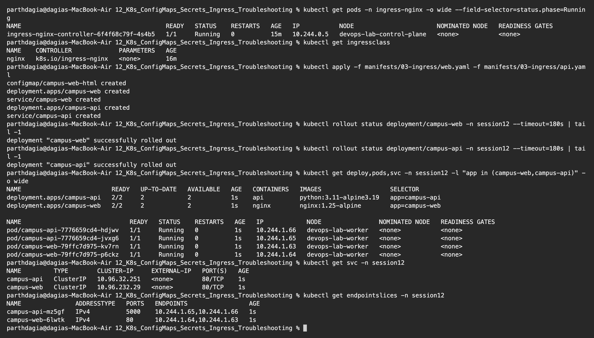

### Configure the Ingress and access the app through it

[manifests/03-ingress/ingress.yaml](manifests/03-ingress/ingress.yaml) has two kinds of routing:

| Host | Path | Goes to |
|---|---|---|
| `campus.local` | `/api` (Prefix) | `campus-api:80` |
| `campus.local` | `/` (Prefix) | `campus-web:80` |
| `api.campus.local` | `/` (Prefix) | `campus-api:80` |

In the terminal I send the `Host` header with `curl` instead of editing `/etc/hosts`. The controller routes by that header, so it is the same thing a browser does.

```text
$ kubectl apply -f manifests/03-ingress/ingress.yaml
ingress.networking.k8s.io/campus-ingress created

$ kubectl get ingress -n session12
NAME             CLASS   HOSTS                           ADDRESS     PORTS   AGE
campus-ingress   nginx   campus.local,api.campus.local   localhost   80      25s

$ kubectl describe ingress campus-ingress -n session12 | sed -n "/^Rules/,/^Events/p"
Rules:
  Host              Path  Backends
  ----              ----  --------
  campus.local
                    /api   campus-api:80 (10.244.1.65:5000,10.244.1.66:5000)
                    /      campus-web:80 (10.244.1.64:80,10.244.1.63:80)
  api.campus.local
                    /   campus-api:80 (10.244.1.65:5000,10.244.1.66:5000)
Annotations:        <none>
Events:

$ curl -s -H "Host: campus.local" http://localhost:8081/
<!doctype html>
<html>
<head><title>Campus Portal</title></head>
<body style="font-family: sans-serif; margin: 40px">
  <h1>Campus Portal</h1>
  <p>Served by the <b>campus-web</b> Service through the NGINX Ingress Controller.</p>
  <p>Try <a href="/api/courses">/api/courses</a> for the backend.</p>
</body>
</html>

$ curl -s -H "Host: campus.local" http://localhost:8081/api/courses
Campus API
pod         : campus-api-7776659cd4-jvxg6
path        : /api/courses
environment : staging
db_user     : campus_admin

$ curl -s -H "Host: api.campus.local" http://localhost:8081/students
Campus API
pod         : campus-api-7776659cd4-jvxg6
path        : /students
environment : staging
db_user     : campus_admin
```

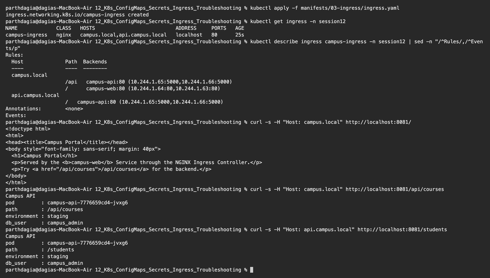

### Verify the routing

```text
$ for i in 1 2 3 4 5 6; do curl -s -H "Host: campus.local" http://localhost:8081/api/ | grep pod; done
pod         : campus-api-7776659cd4-jvxg6
pod         : campus-api-7776659cd4-jvxg6
pod         : campus-api-7776659cd4-hdjwv
pod         : campus-api-7776659cd4-jvxg6
pod         : campus-api-7776659cd4-jvxg6
pod         : campus-api-7776659cd4-jvxg6

$ for h in campus.local api.campus.local unknown.local; do for p in / /api/x; do echo "$h$p -> $(curl -s -o /dev/null -w '%{http_code}' -H "Host: $h" http://localhost:8081$p) $(curl -s -H "Host: $h" http://localhost:8081$p | grep -o -m1 -E 'Campus Portal|Campus API|404 Not Found')"; done; done
campus.local/ -> 200 Campus Portal
campus.local/api/x -> 200 Campus API
api.campus.local/ -> 200 Campus API
api.campus.local/api/x -> 200 Campus API
unknown.local/ -> 404 404 Not Found
unknown.local/api/x -> 404 404 Not Found

$ kubectl logs -n ingress-nginx deploy/ingress-nginx-controller --tail=12 | awk '{print $6, $7, $9, $15, $17}' | tr -d '"' | column -t
GET  /api/   200  [session12-campus-api-80]  10.244.1.66:5000
GET  /api/   200  [session12-campus-api-80]  10.244.1.65:5000
GET  /api/   200  [session12-campus-api-80]  10.244.1.65:5000
GET  /api/   200  [session12-campus-api-80]  10.244.1.65:5000
GET  /       200  [session12-campus-web-80]  10.244.1.64:80
GET  /       200  [session12-campus-web-80]  10.244.1.63:80
GET  /api/x  200  [session12-campus-api-80]  10.244.1.66:5000
GET  /api/x  200  [session12-campus-api-80]  10.244.1.65:5000
GET  /       200  [session12-campus-api-80]  10.244.1.65:5000
GET  /       200  [session12-campus-api-80]  10.244.1.66:5000
GET  /api/x  200  [session12-campus-api-80]  10.244.1.66:5000
GET  /api/x  200  [session12-campus-api-80]  10.244.1.65:5000

$ kubectl get pods -n session12 -l "app in (campus-web,campus-api)" -o custom-columns=POD:.metadata.name,IP:.status.podIP
POD                           IP
campus-api-7776659cd4-hdjwv   10.244.1.66
campus-api-7776659cd4-jvxg6   10.244.1.65
campus-web-79ffc7d975-kv7rn   10.244.1.63
campus-web-79ffc7d975-p6ckz   10.244.1.64
```

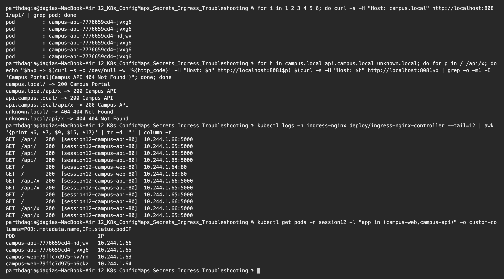

### In the browser

For the browser, `campus.local` and `api.campus.local` point to `127.0.0.1`.

`http://campus.local:8081/` goes to the frontend:

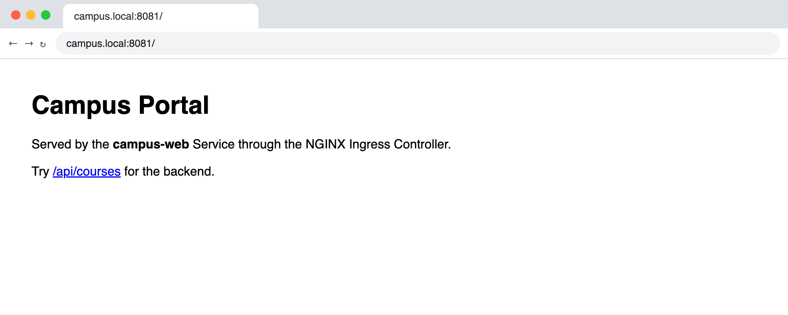

`http://campus.local:8081/api/courses` goes to the API (path based):

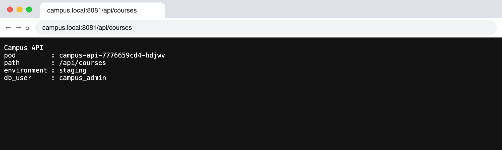

`http://api.campus.local:8081/students` goes to the API (host based):

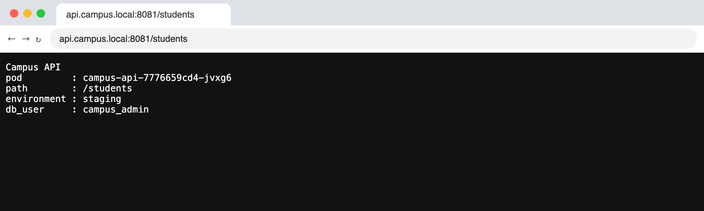

### What I understood

- **Path based routing:** on `campus.local`, `/` went to the web Pods and `/api/...` went to the API Pods. The longest matching prefix wins, so `/api/courses` matches `/api` and not `/`.
- **Host based routing:** `api.campus.local` sends every path to the API. `/api/x` on that host also went to the API.
- **Unknown host:** `unknown.local` got `404` from the controller's default backend because no rule matches it.
- **Load balancing:** six calls to `/api/` were answered by both API Pods (`...hdjwv` and `...jvxg6`). The controller logs show the upstream (`session12-campus-api-80`) and the real Pod IP (`10.244.1.65` / `.66`). So NGINX sends traffic **directly to the Pod IPs** from the EndpointSlice, not through the Service ClusterIP.
- No rewrite was needed. The API got the full path (`/api/courses`), so I did not use `rewrite-target` this time.
- The API reply also shows `environment : staging` (ConfigMap) and `db_user : campus_admin` (Secret), so the whole chain works: Ingress, Service, Pod, config.

## Task 4: Ingress vs Ingress Controller

Full explanation with examples and a live demo: **[ingress-vs-ingress-controller/README.md](ingress-vs-ingress-controller/README.md)**

In short: an **Ingress** is only a set of routing rules (a YAML object stored in the API server). An **Ingress Controller** is the program (a Pod running NGINX here) that reads those rules and actually forwards the traffic. In the demo, an Ingress with `ingressClassName: traefik` (no such controller installed) got no address and returned `404`. As soon as I changed it to `nginx`, the controller picked it up and it returned `200`.

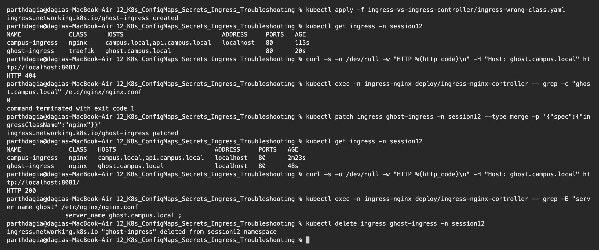

## Task 5: Troubleshooting

Full write up with every command: **[troubleshooting/README.md](troubleshooting/README.md)**

The scenario is the class repo's [secret-base64-gotcha.md](https://github.com/Nency-Ravaliya/devops-heros/blob/main/session-12-ingress-configmaps-secrets/troubleshooting/secret-base64-gotcha.md). I rebuilt it with a real PostgreSQL database and an app that logs in to it.

| | |
|---|---|
| **Problem** | App Pod keeps crashing: `FATAL: password authentication failed for user "yatri_admin"` |
| **Root cause** | The app's Secret was made with `echo "secretpassword" \| base64` (no `-n`), so the password had a hidden `\n` at the end: 15 bytes instead of 14 |
| **Fix** | Re-encode with `echo -n`, apply the Secret, `kubectl rollout restart` the app |

**Before** (app in `Error`, restarting):


**Root cause** (15 bytes, `\n` at the end):


**After** (app `Running`, connected):


## Clean up

```bash
kubectl delete namespace session12
```

Deleting the namespace removes everything from this session (Pods, Deployments, Services, ConfigMaps, Secrets, Ingresses). The Ingress controller in `ingress-nginx` stays.

## Deliverables

| Deliverable | Where |
|---|---|
| ConfigMap YAML | [manifests/01-configmap/configmap.yaml](manifests/01-configmap/configmap.yaml), [pod.yaml](manifests/01-configmap/pod.yaml) |
| Secret YAML | [manifests/02-secret/secret.yaml](manifests/02-secret/secret.yaml), [pod.yaml](manifests/02-secret/pod.yaml) |
| Ingress YAML | [manifests/03-ingress/ingress.yaml](manifests/03-ingress/ingress.yaml), [web.yaml](manifests/03-ingress/web.yaml), [api.yaml](manifests/03-ingress/api.yaml) |
| Ingress vs Ingress Controller | [ingress-vs-ingress-controller/README.md](ingress-vs-ingress-controller/README.md) |
| Troubleshooting documentation | [troubleshooting/README.md](troubleshooting/README.md) and its YAML files |
| Screenshots | [screenshots/](screenshots) |
