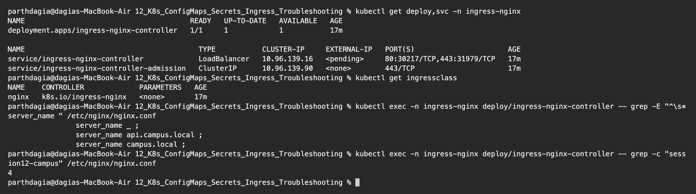

# Ingress vs Ingress Controller

**Name:** Parth Dagia
**Roll No:** 24BCS10414

These two names sound like the same thing, and at first I thought installing one was enough. They are two separate pieces and you need both.

## What is Ingress?

An **Ingress** is a Kubernetes **API object** (`kind: Ingress`, group `networking.k8s.io/v1`). It is just a **set of HTTP routing rules** written in YAML:

- which **host** (`campus.local`, `api.campus.local`)
- which **path** (`/`, `/api`)
- goes to which **Service and port**
- plus optional TLS (certificate Secret) and controller specific settings (annotations)

```yaml
apiVersion: networking.k8s.io/v1
kind: Ingress
metadata:
  name: campus-ingress
spec:
  ingressClassName: nginx          # which controller should handle this
  rules:
    - host: campus.local
      http:
        paths:
          - path: /api
            pathType: Prefix
            backend:
              service:
                name: campus-api
                port:
                  number: 80
```

When I `kubectl apply` it, the API server only **stores** it in etcd. The Ingress object does not listen on any port, does not run any process and does not move a single packet. It is like a config file that nobody has read yet.

## What is an Ingress Controller?

An **Ingress Controller** is a **real program running in the cluster** (normally a Deployment plus a `LoadBalancer` or `NodePort` Service). It does two jobs:

1. **Control loop:** it watches the API server for Ingress objects (and the Services and EndpointSlices they point to), and turns them into its own proxy config. For ingress-nginx that is `/etc/nginx/nginx.conf`.
2. **Data plane:** it is a Layer 7 reverse proxy. It receives the actual HTTP/HTTPS traffic from outside, checks the `Host` header and path, terminates TLS, and forwards the request to the right Pod IPs.

Kubernetes does **not** ship with a controller. The `kube-controller-manager` has controllers for Deployments, ReplicaSets, etc., but not for Ingress. You must install one yourself. Which controller handles an Ingress is chosen by an **IngressClass** (`ingressClassName: nginx` points to the IngressClass `nginx`, whose controller is `k8s.io/ingress-nginx`).

## Difference between them

| | Ingress | Ingress Controller |
|---|---|---|
| What it is | An API object (YAML rules) | A running application (Pods) |
| Where it lives | Stored in etcd by the API server | Runs as a Deployment/DaemonSet, e.g. in namespace `ingress-nginx` |
| Who makes it | The app team, one per app or per host | The cluster admin, installed once per cluster |
| Comes with Kubernetes? | Yes, the resource type is built in | No, you install it (Helm, YAML, cloud addon, `minikube addons enable ingress`) |
| What it does | Describes **what** should be routed **where** | Actually **does** the routing, load balancing and TLS |
| Handles traffic? | No | Yes, every request passes through it |
| How many | Many Ingress objects | Usually one (or a few, one per IngressClass) |
| Analogy | The rules written on a notice board | The security guard at the gate who reads the board and sends visitors to the right room |

Another way to see it: **Ingress = config, Ingress Controller = the server that reads the config.** Same as `nginx.conf` vs the `nginx` process. A `nginx.conf` without nginx running does nothing, and nginx with no config only serves a default page.

## Why both are required

- **Ingress without a controller:** the object is created successfully, but `ADDRESS` stays empty and nothing answers. No error is shown, which is why this is a common beginner mistake.
- **Controller without Ingress objects:** the controller runs, but it has no rules, so every request goes to its default backend and returns `404`.
- **Separation of jobs:** the app team writes simple, portable rules (Ingress) without knowing how the proxy works. The platform team picks and runs the proxy (controller). You can even switch from NGINX to Traefik or a cloud load balancer and keep mostly the same Ingress YAML.
- **One entry point:** one controller (one external IP / load balancer) serves many apps, instead of one `LoadBalancer` Service per app.

## Examples

### Popular Ingress Controllers

| Controller | Notes |
|---|---|
| **ingress-nginx** | The community NGINX controller (IngressClass `nginx`). Used in class and in this homework. The Kubernetes project announced it is being retired in 2026, so new clusters are moving to other controllers or the Gateway API. |
| **NGINX Ingress Controller (F5/NGINX Inc.)** | A different project from ingress-nginx, with its own annotations |
| **Traefik** | Default in k3s, auto discovers services, built in Let's Encrypt |
| **HAProxy Ingress** | Based on HAProxy, high performance |
| **AWS Load Balancer Controller** | Creates a real AWS ALB for each Ingress (IngressClass `alb`) |
| **GKE Ingress** | Creates a Google Cloud HTTP(S) Load Balancer |
| **Azure Application Gateway Ingress Controller** | Uses Azure Application Gateway |
| **Kong, Contour (Envoy), Istio Gateway** | API gateway / service mesh style controllers |

### Example from this homework

- **Ingress:** [../manifests/03-ingress/ingress.yaml](../manifests/03-ingress/ingress.yaml) says `campus.local/` goes to `campus-web` and `campus.local/api` goes to `campus-api`.
- **Ingress Controller:** the `ingress-nginx-controller` Pod in namespace `ingress-nginx`. It turned that YAML into `server_name campus.local` blocks in its `nginx.conf` and forwards the requests to the Pod IPs.

### Live demo: the controller is what makes the Ingress work

First, the controller itself is just a Deployment and a Service, and the rules from my Ingress are inside its generated `nginx.conf`:

```text
$ kubectl get deploy,svc -n ingress-nginx
NAME                                       READY   UP-TO-DATE   AVAILABLE   AGE
deployment.apps/ingress-nginx-controller   1/1     1            1           17m

NAME                                         TYPE           CLUSTER-IP     EXTERNAL-IP   PORT(S)                      AGE
service/ingress-nginx-controller             LoadBalancer   10.96.139.16   <pending>     80:30217/TCP,443:31979/TCP   17m
service/ingress-nginx-controller-admission   ClusterIP      10.96.139.90   <none>        443/TCP                      17m

$ kubectl get ingressclass
NAME    CONTROLLER             PARAMETERS   AGE
nginx   k8s.io/ingress-nginx   <none>       17m

$ kubectl exec -n ingress-nginx deploy/ingress-nginx-controller -- grep -E "^\s*server_name " /etc/nginx/nginx.conf
                server_name _ ;
                server_name api.campus.local ;
                server_name campus.local ;

$ kubectl exec -n ingress-nginx deploy/ingress-nginx-controller -- grep -c "session12-campus" /etc/nginx/nginx.conf
4
```



Then I applied [ingress-wrong-class.yaml](ingress-wrong-class.yaml), an Ingress with `ingressClassName: traefik`. Traefik is not installed, so no controller owns this Ingress:

```text
$ kubectl apply -f ingress-vs-ingress-controller/ingress-wrong-class.yaml
ingress.networking.k8s.io/ghost-ingress created

$ kubectl get ingress -n session12
NAME             CLASS     HOSTS                           ADDRESS     PORTS   AGE
campus-ingress   nginx     campus.local,api.campus.local   localhost   80      115s
ghost-ingress    traefik   ghost.campus.local                          80      20s

$ curl -s -o /dev/null -w "HTTP %{http_code}\n" -H "Host: ghost.campus.local" http://localhost:8081/
HTTP 404

$ kubectl exec -n ingress-nginx deploy/ingress-nginx-controller -- grep -c "ghost.campus.local" /etc/nginx/nginx.conf
0
command terminated with exit code 1

$ kubectl patch ingress ghost-ingress -n session12 --type merge -p '{"spec":{"ingressClassName":"nginx"}}'
ingress.networking.k8s.io/ghost-ingress patched

$ kubectl get ingress -n session12
NAME             CLASS   HOSTS                           ADDRESS     PORTS   AGE
campus-ingress   nginx   campus.local,api.campus.local   localhost   80      2m23s
ghost-ingress    nginx   ghost.campus.local              localhost   80      48s

$ curl -s -o /dev/null -w "HTTP %{http_code}\n" -H "Host: ghost.campus.local" http://localhost:8081/
HTTP 200

$ kubectl exec -n ingress-nginx deploy/ingress-nginx-controller -- grep -E "server_name ghost" /etc/nginx/nginx.conf
                server_name ghost.campus.local ;

$ kubectl delete ingress ghost-ingress -n session12
ingress.networking.k8s.io "ghost-ingress" deleted from session12 namespace
```


What this shows:

- With class `traefik` the Ingress was **created fine** but got **no ADDRESS**, the host returned **404**, and `ghost.campus.local` was **not** in the NGINX config (`grep -c` = 0). The rule existed only on paper.
- After patching the class to `nginx`, the NGINX controller picked it up within seconds: it got the `localhost` address, a `server_name ghost.campus.local` block appeared in `nginx.conf`, and the same request returned **200**.
- So the Ingress object alone does nothing. The controller is what reads it and makes it real.
