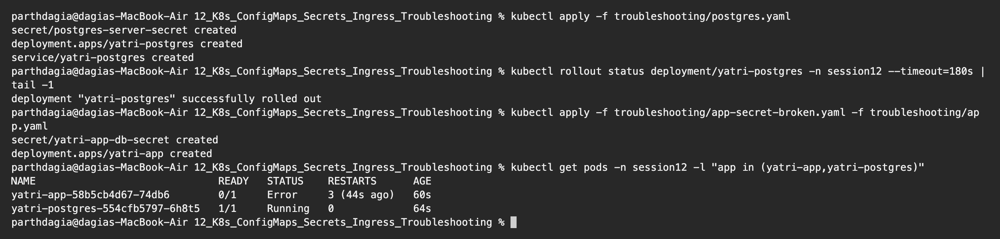
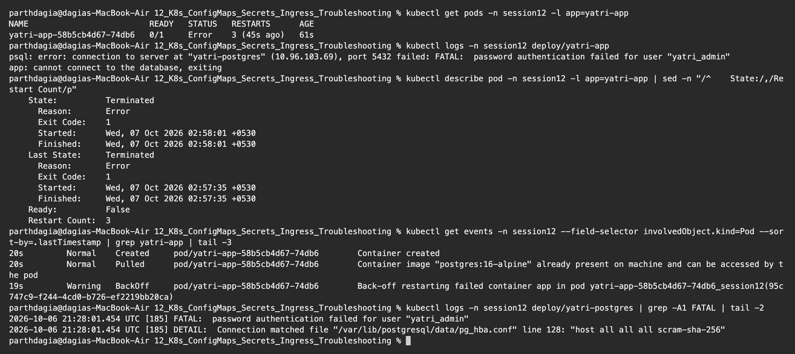
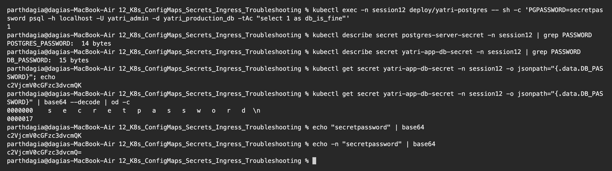
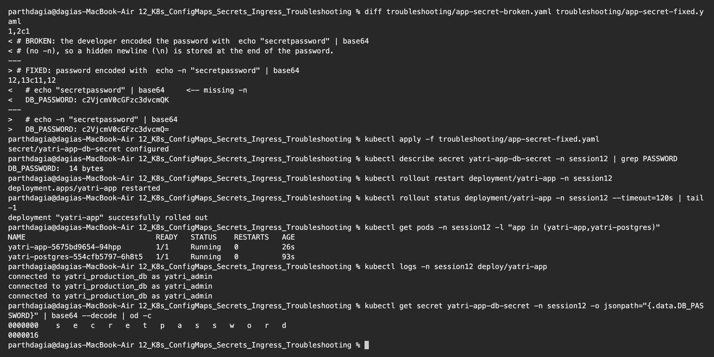

# Troubleshooting: the trailing newline Secret bug

**Name:** Parth Dagia
**Roll No:** 24BCS10414

The class repo's troubleshooting folder has one scenario: [secret-base64-gotcha.md](https://github.com/Nency-Ravaliya/devops-heros/blob/main/session-12-ingress-configmaps-secrets/troubleshooting/secret-base64-gotcha.md). The incident: PostgreSQL rejects the app with `password authentication failed`, and the developer says the password is definitely correct.

Instead of only reading about it, I reproduced it with a real PostgreSQL database in namespace `session12`.

| File | What it is |
|---|---|
| [postgres.yaml](postgres.yaml) | PostgreSQL 16 Deployment + Service. Its own Secret `postgres-server-secret` is correct (`stringData`, password `secretpassword`) |
| [app-secret-broken.yaml](app-secret-broken.yaml) | The app's Secret, made by the developer with `echo "secretpassword" \| base64` (**no `-n`**) |
| [app.yaml](app.yaml) | The app: logs in to Postgres with `psql` every 10 seconds using `DB_USER` and `PGPASSWORD` from its Secret, and exits if login fails |
| [app-secret-fixed.yaml](app-secret-fixed.yaml) | The fixed Secret, made with `echo -n` |

## 1. Identify the problem (before)

```text
$ kubectl apply -f troubleshooting/postgres.yaml
secret/postgres-server-secret created
deployment.apps/yatri-postgres created
service/yatri-postgres created

$ kubectl rollout status deployment/yatri-postgres -n session12 --timeout=180s | tail -1
deployment "yatri-postgres" successfully rolled out

$ kubectl apply -f troubleshooting/app-secret-broken.yaml -f troubleshooting/app.yaml
secret/yatri-app-db-secret created
deployment.apps/yatri-app created

$ kubectl get pods -n session12 -l "app in (yatri-app,yatri-postgres)"
NAME                              READY   STATUS    RESTARTS      AGE
yatri-app-58b5cb4d67-74db6        0/1     Error     3 (44s ago)   60s
yatri-postgres-554cfb5797-6h8t5   1/1     Running   0             64s
```



The database Pod is `Running` and `1/1` ready, but the app Pod is `0/1`, status `Error`, and has already restarted 3 times in one minute.

## 2. Run troubleshooting commands

```text
$ kubectl get pods -n session12 -l app=yatri-app
NAME                         READY   STATUS   RESTARTS      AGE
yatri-app-58b5cb4d67-74db6   0/1     Error    3 (45s ago)   61s

$ kubectl logs -n session12 deploy/yatri-app
psql: error: connection to server at "yatri-postgres" (10.96.103.69), port 5432 failed: FATAL:  password authentication failed for user "yatri_admin"
app: cannot connect to the database, exiting

$ kubectl describe pod -n session12 -l app=yatri-app | sed -n "/^    State:/,/Restart Count/p"
    State:          Terminated
      Reason:       Error
      Exit Code:    1
      Started:      Wed, 07 Oct 2026 02:58:01 +0530
      Finished:     Wed, 07 Oct 2026 02:58:01 +0530
    Last State:     Terminated
      Reason:       Error
      Exit Code:    1
      Started:      Wed, 07 Oct 2026 02:57:35 +0530
      Finished:     Wed, 07 Oct 2026 02:57:35 +0530
    Ready:          False
    Restart Count:  3

$ kubectl get events -n session12 --field-selector involvedObject.kind=Pod --sort-by=.lastTimestamp | grep yatri-app | tail -3
20s         Normal    Created     pod/yatri-app-58b5cb4d67-74db6        Container created
20s         Normal    Pulled      pod/yatri-app-58b5cb4d67-74db6        Container image "postgres:16-alpine" already present on machine and can be accessed by the pod
19s         Warning   BackOff     pod/yatri-app-58b5cb4d67-74db6        Back-off restarting failed container app in pod yatri-app-58b5cb4d67-74db6_session12(95c747c9-f244-4cd0-b726-ef2219bb20ca)

$ kubectl logs -n session12 deploy/yatri-postgres | grep -A1 FATAL | tail -2
2026-10-06 21:28:01.454 UTC [185] FATAL:  password authentication failed for user "yatri_admin"
2026-10-06 21:28:01.454 UTC [185] DETAIL:  Connection matched file "/var/lib/postgresql/data/pg_hba.conf" line 128: "host all all all scram-sha-256"
```



What each command told me:

| Command | What I learned |
|---|---|
| `kubectl get pods` | App is not ready and keeps restarting |
| `kubectl logs` | The real error: `FATAL: password authentication failed for user "yatri_admin"`. So the network and DNS are fine (it reached `yatri-postgres` at its ClusterIP), the **login** is failing |
| `kubectl describe pod` | `Exit Code: 1`, the app exits by itself. Not an OOMKill, not an image problem |
| `kubectl get events` | `BackOff restarting failed container`, so Kubernetes is waiting longer between restarts (CrashLoopBackOff) |
| `kubectl logs` on postgres | The database side confirms it: a wrong password for an existing user, matched by the `scram-sha-256` rule in `pg_hba.conf` |

## 3. Find the root cause

The user name is right and the server is reachable, so the question is: is the database wrong, or is the password the app sends wrong?

```text
$ kubectl exec -n session12 deploy/yatri-postgres -- sh -c 'PGPASSWORD=secretpassword psql -h localhost -U yatri_admin -d yatri_production_db -tAc "select 1 as db_is_fine"'
1

$ kubectl describe secret postgres-server-secret -n session12 | grep PASSWORD
POSTGRES_PASSWORD:  14 bytes

$ kubectl describe secret yatri-app-db-secret -n session12 | grep PASSWORD
DB_PASSWORD:  15 bytes

$ kubectl get secret yatri-app-db-secret -n session12 -o jsonpath="{.data.DB_PASSWORD}"; echo
c2VjcmV0cGFzc3dvcmQK

$ kubectl get secret yatri-app-db-secret -n session12 -o jsonpath="{.data.DB_PASSWORD}" | base64 --decode | od -c
0000000    s   e   c   r   e   t   p   a   s   s   w   o   r   d  \n
0000017

$ echo "secretpassword" | base64
c2VjcmV0cGFzc3dvcmQK

$ echo -n "secretpassword" | base64
c2VjcmV0cGFzc3dvcmQ=
```



1. Logging in **inside the database Pod** with `secretpassword` works (`1`). So the database and its password are fine.
2. `kubectl describe secret` gives the size without showing the value: the server's password is **14 bytes**, the app's password is **15 bytes**. `secretpassword` has 14 characters, so the app has one extra byte.
3. Decoding the app's value with `od -c` shows the extra byte: **`\n`** (newline) at the end.
4. `echo "secretpassword" | base64` produces exactly the broken value `c2VjcmV0cGFzc3dvcmQK`, while `echo -n` gives `c2VjcmV0cGFzc3dvcmQ=`.

**Root cause:** `echo` adds a newline after its text by default. The developer encoded the password without `-n`, so the Secret stored `secretpassword\n`. Kubernetes passes that exact value into `PGPASSWORD`, `psql` sends `secretpassword\n`, and PostgreSQL correctly rejects it. The password "looks" right when printed, because a newline is invisible.

Tip: a base64 value ending in `K`, `o=` or `Cg==` often means the original text ended with a newline.

## 4. Fix the issue (after)

Re-encode with `echo -n` ([app-secret-fixed.yaml](app-secret-fixed.yaml)), apply it, and restart the app. The restart is needed because Secret values given as env variables are only read when the container starts.

```text
$ diff troubleshooting/app-secret-broken.yaml troubleshooting/app-secret-fixed.yaml
1,2c1
< # BROKEN: the developer encoded the password with  echo "secretpassword" | base64
< # (no -n), so a hidden newline (\n) is stored at the end of the password.
---
> # FIXED: password encoded with  echo -n "secretpassword" | base64
12,13c11,12
<   # echo "secretpassword" | base64     <-- missing -n
<   DB_PASSWORD: c2VjcmV0cGFzc3dvcmQK
---
>   # echo -n "secretpassword" | base64
>   DB_PASSWORD: c2VjcmV0cGFzc3dvcmQ=

$ kubectl apply -f troubleshooting/app-secret-fixed.yaml
secret/yatri-app-db-secret configured

$ kubectl describe secret yatri-app-db-secret -n session12 | grep PASSWORD
DB_PASSWORD:  14 bytes

$ kubectl rollout restart deployment/yatri-app -n session12
deployment.apps/yatri-app restarted

$ kubectl rollout status deployment/yatri-app -n session12 --timeout=120s | tail -1
deployment "yatri-app" successfully rolled out

$ kubectl get pods -n session12 -l "app in (yatri-app,yatri-postgres)"
NAME                              READY   STATUS    RESTARTS   AGE
yatri-app-5675bd9654-94hpp        1/1     Running   0          26s
yatri-postgres-554cfb5797-6h8t5   1/1     Running   0          93s

$ kubectl logs -n session12 deploy/yatri-app
connected to yatri_production_db as yatri_admin
connected to yatri_production_db as yatri_admin
connected to yatri_production_db as yatri_admin

$ kubectl get secret yatri-app-db-secret -n session12 -o jsonpath="{.data.DB_PASSWORD}" | base64 --decode | od -c
0000000    s   e   c   r   e   t   p   a   s   s   w   o   r   d
0000016
```



After the fix the Secret is 14 bytes, there is no `\n` in `od -c`, the app Pod is `1/1 Running` with 0 restarts, and the logs show `connected to yatri_production_db as yatri_admin` every 10 seconds.

## Before / after

| | Before | After |
|---|---|---|
| Secret value | `c2VjcmV0cGFzc3dvcmQK` | `c2VjcmV0cGFzc3dvcmQ=` |
| Decoded | `secretpassword\n` (15 bytes) | `secretpassword` (14 bytes) |
| App Pod | `0/1 Error`, 3 restarts, CrashLoopBackOff | `1/1 Running`, 0 restarts |
| App log | `FATAL: password authentication failed` | `connected to yatri_production_db as yatri_admin` |

## How to avoid it

- Always use `echo -n "value" | base64` (or `printf '%s' "value" | base64`).
- Better: do not base64 by hand. Use `stringData:` in the YAML, or `kubectl create secret generic ... --from-literal=KEY=value`.
- Be careful with `--from-file`: if the file ends with a newline (most editors add one), the Secret value will too.
- Quick check: compare the byte count in `kubectl describe secret` with the length you expect.
- After changing a Secret that is used as env variables, run `kubectl rollout restart deployment/<name>`.
