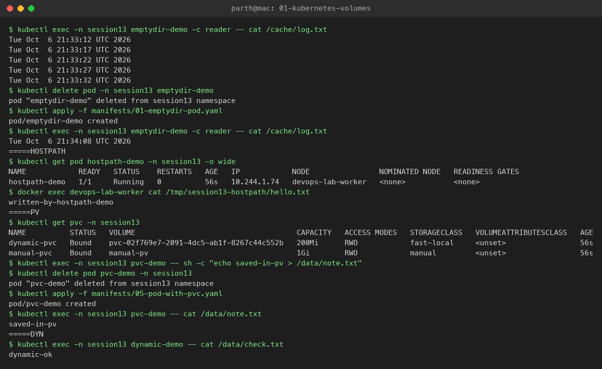

# Task 1: Kubernetes Volumes

**Name:** Parth Dagia
**Roll No:** 24BCS10414

A container's filesystem is thrown away every time the container restarts. Volumes are how Kubernetes gives a Pod storage that lives longer than one container, or longer than the Pod itself.

All manifests are in [manifests/](manifests). I ran them in a namespace `session13` on my kind cluster (1 control plane + 1 worker).

```bash
kubectl apply -f manifests/
```

## Quick comparison

| Type | Lives as long as | Shared between | Good for |
|---|---|---|---|
| `emptyDir` | the Pod | containers in the same Pod | cache, scratch space, sidecar log sharing |
| `hostPath` | the node | Pods on the same node | node agents (log collectors, monitoring); avoid for apps |
| PV + PVC | until deleted (reclaim policy) | Pods that mount the claim | databases, uploads, any real data |
| StorageClass | – | – | template that creates PVs on demand (dynamic provisioning) |

---

## 1. emptyDir

- Created empty when the Pod is scheduled on a node, deleted when the Pod is removed.
- Survives a **container** restart (crash), but not a **Pod** deletion.
- `medium: Memory` puts it in RAM (tmpfs); `sizeLimit` caps it.

[manifests/01-emptydir-pod.yaml](manifests/01-emptydir-pod.yaml): container `writer` appends the date to `/cache/log.txt` every 5s, container `reader` reads the same file.

```text
$ kubectl exec -n session13 emptydir-demo -c reader -- cat /cache/log.txt
Tue Oct  6 21:33:12 UTC 2026
Tue Oct  6 21:33:17 UTC 2026
Tue Oct  6 21:33:22 UTC 2026
Tue Oct  6 21:33:27 UTC 2026
Tue Oct  6 21:33:32 UTC 2026

$ kubectl delete pod -n session13 emptydir-demo
pod "emptydir-demo" deleted from session13 namespace

$ kubectl apply -f manifests/01-emptydir-pod.yaml
pod/emptydir-demo created

$ kubectl exec -n session13 emptydir-demo -c reader -- cat /cache/log.txt
Tue Oct  6 21:34:08 UTC 2026
```

**Learned:** the reader sees what the writer wrote, so the two containers share the volume. After I deleted the Pod, the old lines were gone because the volume is new.

## 2. hostPath

- Mounts a file or folder from the **node's** filesystem into the Pod.
- Data stays on that node. If the Pod moves to another node it sees a different (empty) folder.
- Security risk: a Pod can read/write the node (e.g. `/var/run/docker.sock`). Most clusters block it with Pod Security Standards.

[manifests/02-hostpath-pod.yaml](manifests/02-hostpath-pod.yaml) mounts `/tmp/session13-hostpath` from the node (`type: DirectoryOrCreate`).

```text
$ kubectl get pod hostpath-demo -n session13 -o wide
NAME            READY   STATUS    RESTARTS   AGE   IP            NODE                NOMINATED NODE   READINESS GATES
hostpath-demo   1/1     Running   0          56s   10.244.1.74   devops-lab-worker   <none>           <none>

# kind nodes are Docker containers, so I can look inside the node directly
$ docker exec devops-lab-worker cat /tmp/session13-hostpath/hello.txt
written-by-hostpath-demo
```

**Learned:** the file really is on the node (`devops-lab-worker`), not inside the Pod.

## 3. PersistentVolume (PV)

- A piece of storage in the cluster, a **cluster-level** object (no namespace).
- Created by an admin by hand (static) or by a StorageClass (dynamic).
- Main fields:
  - `capacity.storage`: size
  - `accessModes`: `ReadWriteOnce` (RWO, one node), `ReadOnlyMany` (ROX), `ReadWriteMany` (RWX), `ReadWriteOncePod` (RWOP)
  - `persistentVolumeReclaimPolicy`: `Retain` (keep data after the claim is deleted), `Delete` (delete the disk)
  - `storageClassName`: used to match claims

[manifests/03-pv.yaml](manifests/03-pv.yaml): 1Gi static PV, `storageClassName: manual`, `Retain`.

## 4. PersistentVolumeClaim (PVC)

- A **request** for storage made by a user, inside a namespace ("I need 500Mi, RWO, class `manual`").
- Kubernetes binds it to a PV that matches. The Pod only refers to the PVC, never to the PV, so the app doesn't need to know where the disk is.
- PV : PVC binding is 1:1. Here the PVC asked for 500Mi and got the whole 1Gi PV.

[manifests/04-pvc.yaml](manifests/04-pvc.yaml) + [manifests/05-pod-with-pvc.yaml](manifests/05-pod-with-pvc.yaml)

```text
$ kubectl get pv manual-pv
NAME        CAPACITY   ACCESS MODES   RECLAIM POLICY   STATUS   CLAIM                  STORAGECLASS   AGE
manual-pv   1Gi        RWO            Retain           Bound    session13/manual-pvc   manual         14s

$ kubectl get pvc -n session13
NAME          STATUS   VOLUME                                     CAPACITY   ACCESS MODES   STORAGECLASS   AGE
dynamic-pvc   Bound    pvc-02f769e7-2091-4dc5-ab1f-8267c44c552b   200Mi      RWO            fast-local     56s
manual-pvc    Bound    manual-pv                                  1Gi        RWO            manual         56s

$ kubectl exec -n session13 pvc-demo -- sh -c "echo saved-in-pv > /data/note.txt"

$ kubectl delete pod pvc-demo -n session13
pod "pvc-demo" deleted from session13 namespace

$ kubectl apply -f manifests/05-pod-with-pvc.yaml
pod/pvc-demo created

$ kubectl exec -n session13 pvc-demo -- cat /data/note.txt
saved-in-pv
```

**Learned:** unlike emptyDir, the file survived the Pod being deleted and created again.

PV/PVC lifecycle: `Available` → `Bound` → (PVC deleted) → `Released` → reclaimed (`Retain` = admin cleans up, `Delete` = disk removed).

## 5. StorageClass

- Describes a "type" of storage: which **provisioner** creates the disk (`ebs.csi.aws.com`, `pd.csi.storage.gke.io`, `rancher.io/local-path`, ...) and with what settings.
- `reclaimPolicy`: applied to PVs it creates (default `Delete`).
- `volumeBindingMode`:
  - `Immediate`: create the PV as soon as the PVC is made
  - `WaitForFirstConsumer`: wait until a Pod uses the PVC, so the disk is made in the same zone/node as the Pod
- `allowVolumeExpansion`: lets you increase the PVC size later.
- One class can be marked default; a PVC without `storageClassName` uses it.

kind ships with a default class `standard`. I added my own class `fast-local` ([manifests/06-storageclass.yaml](manifests/06-storageclass.yaml)):

```text
$ kubectl get storageclass
NAME                 PROVISIONER             RECLAIMPOLICY   VOLUMEBINDINGMODE      ALLOWVOLUMEEXPANSION   AGE
fast-local           rancher.io/local-path   Delete          WaitForFirstConsumer   false                  15s
standard (default)   rancher.io/local-path   Delete          WaitForFirstConsumer   false                  43m
```

## 6. Dynamic provisioning

With static provisioning an admin has to create PVs in advance. With dynamic provisioning the user only creates a PVC with a `storageClassName`, and the class's provisioner creates the PV automatically.

```text
PVC (storageClassName: fast-local) ──► StorageClass fast-local ──► provisioner rancher.io/local-path
                                                                       │ creates
                                                                       ▼
                                                     PV pvc-02f769e7-...  (Bound to the PVC)
```

[manifests/07-dynamic-pvc.yaml](manifests/07-dynamic-pvc.yaml) creates only a PVC + Pod; I never wrote a PV for it:

```text
$ kubectl get pv
NAME                                       CAPACITY   ACCESS MODES   RECLAIM POLICY   STATUS   CLAIM                   STORAGECLASS   AGE
manual-pv                                  1Gi        RWO            Retain           Bound    session13/manual-pvc    manual         15s
pvc-02f769e7-2091-4dc5-ab1f-8267c44c552b   200Mi      RWO            Delete           Bound    session13/dynamic-pvc   fast-local     13s

$ kubectl exec -n session13 dynamic-demo -- cat /data/check.txt
dynamic-ok
```

**Learned:** `manual-pv` is the one I made by hand. `pvc-02f769e7-...` was made by the provisioner, with exactly the 200Mi requested and the class's `Delete` reclaim policy. Deleting `dynamic-pvc` will delete that PV too.

Screenshot of the whole run:



## Clean up

```bash
kubectl delete ns session13
kubectl delete pv manual-pv
kubectl delete sc fast-local
```
