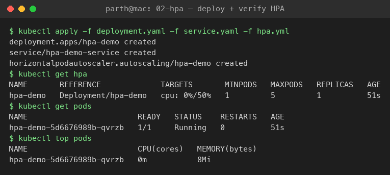
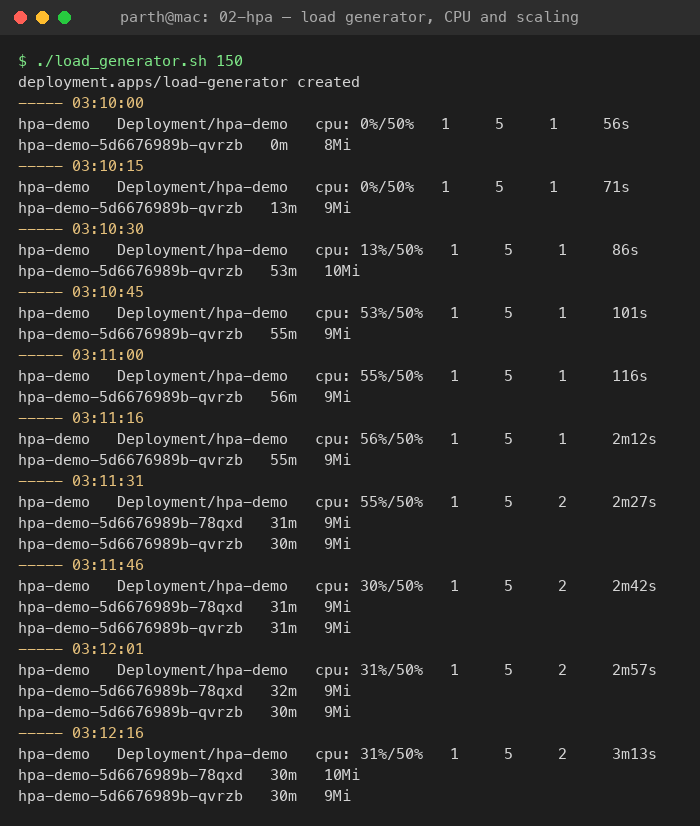
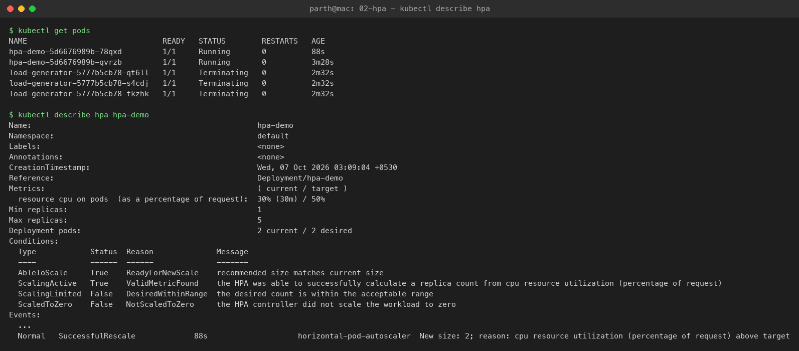
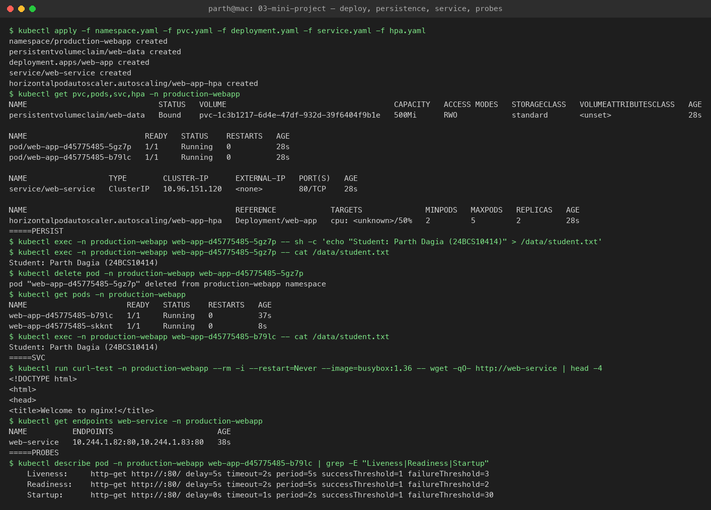
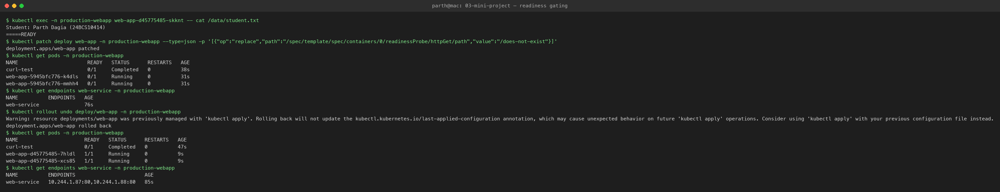
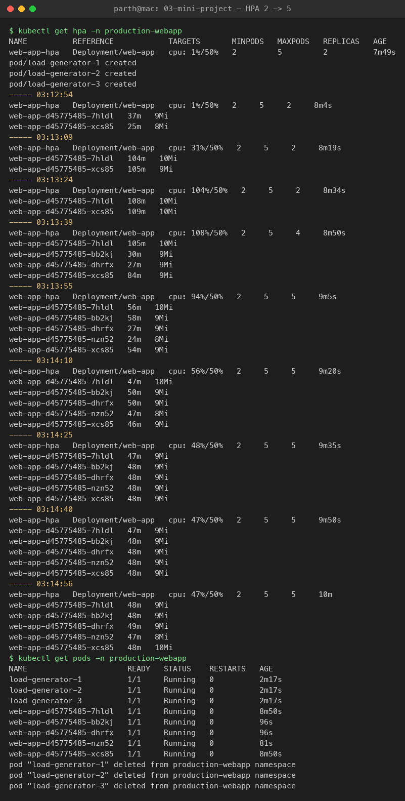

# Session 13: Kubernetes Storage, HPA and Probes

**Name:** Parth Dagia
**Roll No:** 24BCS10414

Everything was run on my local kind cluster (`devops-lab`: 1 control plane + 1 worker). Class material: [session-13-storage-hpa-probes](https://github.com/Nency-Ravaliya/devops-heros/tree/main/session-13-storage-hpa-probes).

| Task | What | Files |
|---|---|---|
| 1 | Kubernetes Volumes (emptyDir, hostPath, PV, PVC, StorageClass, dynamic provisioning) | [01-kubernetes-volumes/README.md](01-kubernetes-volumes/README.md) |
| 2 | HPA hands-on | [02-hpa/](02-hpa) |
| 3 | Mini project: PVC + HPA + probes | [03-mini-project/](03-mini-project) |

---

## Task 1: Kubernetes Volumes

See [01-kubernetes-volumes/README.md](01-kubernetes-volumes/README.md). Every volume type was tried on the cluster, and the real output is in that file.

---

## Task 2: HPA hands-on

The Horizontal Pod Autoscaler checks the Pods' CPU every 15s (via **metrics-server**) and changes `replicas` on the Deployment:

```text
desiredReplicas = ceil( currentReplicas × currentCPU% / targetCPU% )
```

CPU % is measured against the container's `resources.requests.cpu`, so **without a CPU request the HPA shows `<unknown>`**. Scale up happens right away; scale down waits 5 minutes (stabilization window) so it doesn't flap.

| File | What |
|---|---|
| [02-hpa/deployment.yaml](02-hpa/deployment.yaml) | `hpa-demo` nginx, `requests.cpu: 100m`, `limits.cpu: 200m` |
| [02-hpa/service.yaml](02-hpa/service.yaml) | ClusterIP `hpa-demo-service` |
| [02-hpa/hpa.yml](02-hpa/hpa.yml) | min 1, max 5, target 50% CPU |
| [02-hpa/load-generator.yaml](02-hpa/load-generator.yaml) | 3 busybox Pods running `wget` against the service in a loop |
| [02-hpa/load_generator.sh](02-hpa/load_generator.sh) | starts the load, prints HPA + `kubectl top` every 15s, removes the load at the end |

### Steps

```bash
# 0. metrics-server (kind needs --kubelet-insecure-tls because kubelet certs are self-signed)
kubectl apply -f https://github.com/kubernetes-sigs/metrics-server/releases/latest/download/components.yaml
kubectl -n kube-system patch deploy metrics-server --type=json \
  -p='[{"op":"add","path":"/spec/template/spec/containers/0/args/-","value":"--kubelet-insecure-tls"}]'

# 1. Deploy the application
kubectl apply -f 02-hpa/deployment.yaml -f 02-hpa/service.yaml

# 2. Configure HPA
kubectl apply -f 02-hpa/hpa.yml

# 3. Verify HPA
kubectl get hpa
kubectl describe hpa hpa-demo

# 4-7. Load generator, raise the load, watch CPU and Pods
./02-hpa/load_generator.sh 180
kubectl get hpa -w            # second terminal
kubectl get pods -w           # third terminal
kubectl top pods

# Clean up
kubectl delete -f 02-hpa/
```

### Output

#### 1-3. Deploy, configure and verify

```text
$ kubectl apply -f deployment.yaml -f service.yaml -f hpa.yml
deployment.apps/hpa-demo created
service/hpa-demo-service created
horizontalpodautoscaler.autoscaling/hpa-demo created

$ kubectl get hpa
NAME       REFERENCE             TARGETS       MINPODS   MAXPODS   REPLICAS   AGE
hpa-demo   Deployment/hpa-demo   cpu: 0%/50%   1         5         1          51s

$ kubectl get pods
NAME                        READY   STATUS    RESTARTS   AGE
hpa-demo-5d6676989b-qvrzb   1/1     Running   0          51s

$ kubectl top pods
NAME                        CPU(cores)   MEMORY(bytes)
hpa-demo-5d6676989b-qvrzb   0m           8Mi
```



#### 4-7. Load generator, CPU and Pod scaling

Each block is `kubectl get hpa` followed by `kubectl top pods`, printed every 15s:

```text
$ ./load_generator.sh 150
deployment.apps/load-generator created
----- 03:10:00
hpa-demo   Deployment/hpa-demo   cpu: 0%/50%    1   5   1   56s
hpa-demo-5d6676989b-qvrzb   0m    8Mi
----- 03:10:30
hpa-demo   Deployment/hpa-demo   cpu: 13%/50%   1   5   1   86s
hpa-demo-5d6676989b-qvrzb   53m   10Mi
----- 03:10:45
hpa-demo   Deployment/hpa-demo   cpu: 53%/50%   1   5   1   101s
hpa-demo-5d6676989b-qvrzb   55m   9Mi
----- 03:11:16
hpa-demo   Deployment/hpa-demo   cpu: 56%/50%   1   5   1   2m12s
hpa-demo-5d6676989b-qvrzb   55m   9Mi
----- 03:11:31
hpa-demo   Deployment/hpa-demo   cpu: 55%/50%   1   5   2   2m27s
hpa-demo-5d6676989b-78qxd   31m   9Mi
hpa-demo-5d6676989b-qvrzb   30m   9Mi
----- 03:12:16
hpa-demo   Deployment/hpa-demo   cpu: 31%/50%   1   5   2   3m13s
hpa-demo-5d6676989b-78qxd   30m   10Mi
hpa-demo-5d6676989b-qvrzb   30m   9Mi
deployment.apps "load-generator" deleted
```



What happened:

- With the load on, the single Pod used about 55m of its 100m request, so **55% > 50%**.
- HPA formula: `ceil(1 × 55 / 50) = 2`, so it **scaled 1 → 2**.
- The same traffic was now split over 2 Pods (~30m each, 31%), below target, so it stayed at 2.
- nginx serving a static page is cheap. The HPA only reaches 5 if the load pushes CPU much higher (see the mini project below).

```text
$ kubectl describe hpa hpa-demo
Metrics:                                               ( current / target )
  resource cpu on pods  (as a percentage of request):  30% (30m) / 50%
Min replicas:                                          1
Max replicas:                                          5
Deployment pods:                                       2 current / 2 desired
Conditions:
  Type            Status  Reason              Message
  AbleToScale     True    ReadyForNewScale    recommended size matches current size
  ScalingActive   True    ValidMetricFound    the HPA was able to successfully calculate a replica count from cpu resource utilization (percentage of request)
  ScalingLimited  False   DesiredWithinRange  the desired count is within the acceptable range
Events:
  Warning  FailedGetResourceMetric  3m13s (x2 over 3m28s)  horizontal-pod-autoscaler  failed to get cpu utilization: unable to get metrics for resource cpu: no metrics returned from resource metrics API
  Normal   SuccessfulRescale        88s                    horizontal-pod-autoscaler  New size: 2; reason: cpu resource utilization (percentage of request) above target
```



The first `FailedGetResourceMetric` warnings come from the first ~30s after the Pod started, before metrics-server had collected any data. After that, `ScalingActive=True` and the `SuccessfulRescale` event show the scale-up.

---

## Task 3: Mini project: production-ready web app

Manifests from the class repo, in [03-mini-project/](03-mini-project), namespace `production-webapp`:

```text
                 Service web-service (ClusterIP :80)
                        │
          ┌─────────────┴─────────────┐
          ▼                           ▼
   Pod web-app (nginx)         Pod web-app (nginx)   ... up to 5 (HPA, 50% CPU)
   startup / readiness / liveness probes, requests cpu 100m
          │                           │
          └──────── /data ────────────┘
                     │
            PVC web-data (500Mi, RWO)
                     │
       StorageClass standard (rancher.io/local-path, kind's default)
```

| File | What |
|---|---|
| [namespace.yaml](03-mini-project/namespace.yaml) | `production-webapp` |
| [pvc.yaml](03-mini-project/pvc.yaml) | 500Mi RWO claim, dynamically provisioned by the default StorageClass |
| [deployment.yaml](03-mini-project/deployment.yaml) | 2 replicas, `Recreate` strategy, CPU/memory requests and limits, 3 probes, `/data` mount |
| [service.yaml](03-mini-project/service.yaml) | ClusterIP port 80 |
| [hpa.yaml](03-mini-project/hpa.yaml) | min 2, max 5, 50% CPU |

The original README says `StorageClass: standard (k8s.io/minikube-hostpath)`. On kind, `standard` uses `rancher.io/local-path` instead, so nothing in the YAML needed to change.

Both replicas mount one RWO volume. That works here because local-path volumes are tied to one node and both Pods get scheduled on that node. On a cloud disk in a multi-node cluster, the second Pod could get stuck in `ContainerCreating` (RWO = one node).

### Deploy

```text
$ kubectl apply -f namespace.yaml -f pvc.yaml -f deployment.yaml -f service.yaml -f hpa.yaml
namespace/production-webapp created
persistentvolumeclaim/web-data created
deployment.apps/web-app created
service/web-service created
horizontalpodautoscaler.autoscaling/web-app-hpa created

$ kubectl get pvc,pods,svc,hpa -n production-webapp
NAME                             STATUS   VOLUME                                     CAPACITY   ACCESS MODES   STORAGECLASS   AGE
persistentvolumeclaim/web-data   Bound    pvc-1c3b1217-6d4e-47df-932d-39f6404f9b1e   500Mi      RWO            standard       28s

NAME                          READY   STATUS    RESTARTS   AGE
pod/web-app-d45775485-5gz7p   1/1     Running   0          28s
pod/web-app-d45775485-b79lc   1/1     Running   0          28s

NAME                  TYPE        CLUSTER-IP      EXTERNAL-IP   PORT(S)   AGE
service/web-service   ClusterIP   10.96.151.120   <none>        80/TCP    28s

NAME                                              REFERENCE            TARGETS              MINPODS   MAXPODS   REPLICAS   AGE
horizontalpodautoscaler.autoscaling/web-app-hpa   Deployment/web-app   cpu: <unknown>/50%   2         5         2          28s
```

`cpu: <unknown>/50%` is troubleshooting issue 2 from the class README: metrics-server wasn't installed yet. Once I installed it (Task 2, step 0) it showed `cpu: 1%/50%`.



### Verification 1: storage persistence

```text
$ kubectl exec -n production-webapp web-app-d45775485-5gz7p -- sh -c 'echo "Student: Parth Dagia (24BCS10414)" > /data/student.txt'
$ kubectl exec -n production-webapp web-app-d45775485-5gz7p -- cat /data/student.txt
Student: Parth Dagia (24BCS10414)

$ kubectl delete pod -n production-webapp web-app-d45775485-5gz7p
pod "web-app-d45775485-5gz7p" deleted from production-webapp namespace

$ kubectl get pods -n production-webapp
NAME                      READY   STATUS    RESTARTS   AGE
web-app-d45775485-b79lc   1/1     Running   0          37s
web-app-d45775485-skknt   1/1     Running   0          8s

# the brand new Pod (skknt) sees the file
$ kubectl exec -n production-webapp web-app-d45775485-skknt -- cat /data/student.txt
Student: Parth Dagia (24BCS10414)
```

### Verification 2: Service

```text
$ kubectl run curl-test -n production-webapp --rm -i --restart=Never --image=busybox:1.36 -- wget -qO- http://web-service | head -4
<!DOCTYPE html>
<html>
<head>
<title>Welcome to nginx!</title>

$ kubectl get endpoints web-service -n production-webapp
NAME          ENDPOINTS                       AGE
web-service   10.244.1.82:80,10.244.1.83:80   38s
```

### Verification 3: probes

```text
$ kubectl describe pod -n production-webapp web-app-d45775485-b79lc | grep -E "Liveness|Readiness|Startup"
    Liveness:     http-get http://:80/ delay=5s timeout=2s period=5s successThreshold=1 failureThreshold=3
    Readiness:    http-get http://:80/ delay=5s timeout=2s period=5s successThreshold=1 failureThreshold=2
    Startup:      http-get http://:80/ delay=0s timeout=1s period=2s successThreshold=1 failureThreshold=30
```

| Probe | Question | On failure |
|---|---|---|
| Startup | Has the app finished starting? (up to 30 × 2s = 60s here) | container restarted; liveness/readiness wait until it passes |
| Readiness | Can it take traffic right now? | Pod removed from Service endpoints, **not** restarted |
| Liveness | Is it still alive? | container restarted by kubelet |

**Bonus challenge 2: readiness gating.** I pointed the readiness probe at a path that doesn't exist:

```text
$ kubectl patch deploy web-app -n production-webapp --type=json -p '[{"op":"replace","path":"/spec/template/spec/containers/0/readinessProbe/httpGet/path","value":"/does-not-exist"}]'
deployment.apps/web-app patched

$ kubectl get pods -n production-webapp
NAME                       READY   STATUS      RESTARTS   AGE
web-app-5945bfc776-k4dls   0/1     Running     0          31s
web-app-5945bfc776-mmhh4   0/1     Running     0          31s

$ kubectl get endpoints web-service -n production-webapp
NAME          ENDPOINTS   AGE
web-service               76s

$ kubectl rollout undo deploy/web-app -n production-webapp
deployment.apps/web-app rolled back

$ kubectl get endpoints web-service -n production-webapp
NAME          ENDPOINTS                       AGE
web-service   10.244.1.87:80,10.244.1.88:80   85s
```

Pods stay `Running` with `0` restarts but `READY 0/1`, and the Service has **no endpoints**, so the Service sends them no traffic. After the rollback, both Pods are back in the endpoints. (Because the strategy is `Recreate`, a bad readiness probe takes the whole app offline. With `RollingUpdate` the old Pods would keep serving.)



### Verification 4: HPA scaling

```bash
kubectl run load-generator -n production-webapp --image=busybox:1.36 --restart=Never \
  -- /bin/sh -c "while true; do wget -q -O- http://web-service; done"
kubectl get hpa -n production-webapp -w
kubectl delete pod load-generator -n production-webapp
```

Load: 3 busybox Pods (same `wget` loop as the class command, ×3 so it scales faster).

```text
$ kubectl get hpa -n production-webapp
NAME          REFERENCE            TARGETS       MINPODS   MAXPODS   REPLICAS   AGE
web-app-hpa   Deployment/web-app   cpu: 1%/50%   2         5         2          7m49s
----- 03:13:09
web-app-hpa   Deployment/web-app   cpu: 31%/50%    2   5   2   8m19s
----- 03:13:24
web-app-hpa   Deployment/web-app   cpu: 104%/50%   2   5   2   8m34s
web-app-d45775485-7hldl   108m   10Mi
web-app-d45775485-xcs85   109m   10Mi
----- 03:13:39
web-app-hpa   Deployment/web-app   cpu: 108%/50%   2   5   4   8m50s
----- 03:13:55
web-app-hpa   Deployment/web-app   cpu: 94%/50%    2   5   5   9m5s
----- 03:14:25
web-app-hpa   Deployment/web-app   cpu: 48%/50%    2   5   5   9m35s
web-app-d45775485-7hldl   47m   9Mi
web-app-d45775485-bb2kj   48m   9Mi
web-app-d45775485-dhrfx   48m   9Mi
web-app-d45775485-nzn52   48m   9Mi
web-app-d45775485-xcs85   48m   9Mi

$ kubectl get pods -n production-webapp
NAME                      READY   STATUS    RESTARTS   AGE
load-generator-1          1/1     Running   0          2m17s
load-generator-2          1/1     Running   0          2m17s
load-generator-3          1/1     Running   0          2m17s
web-app-d45775485-7hldl   1/1     Running   0          8m50s
web-app-d45775485-bb2kj   1/1     Running   0          96s
web-app-d45775485-dhrfx   1/1     Running   0          96s
web-app-d45775485-nzn52   1/1     Running   0          81s
web-app-d45775485-xcs85   1/1     Running   0          8m50s
```



What happened:

- CPU jumped to 108% (each Pod was above its 100m request, close to the 200m limit).
- `ceil(2 × 108 / 50) = 5`, but the HPA adds Pods in steps by default, so it went **2 → 4 → 5**, which is `maxReplicas`.
- With 5 Pods sharing the load, each sits at ~48m (47-48%), just under target, so it stays at 5.
- All new Pods mounted the same `web-data` PVC.
- After I deleted the load generator, it scales back to 2 after the 5-minute stabilization window.

### Clean up

```bash
kubectl delete ns production-webapp
```

---

## Deliverables

| Deliverable | Where |
|---|---|
| Volume documentation | [01-kubernetes-volumes/README.md](01-kubernetes-volumes/README.md) |
| HPA YAML | [02-hpa/hpa.yml](02-hpa/hpa.yml), [03-mini-project/hpa.yaml](03-mini-project/hpa.yaml) |
| Load generator | [02-hpa/load-generator.yaml](02-hpa/load-generator.yaml), [02-hpa/load_generator.sh](02-hpa/load_generator.sh) |
| HPA output | [Task 2 output](#output), [mini project HPA](#verification-4-hpa-scaling) |
| Screenshots | [screenshots/](screenshots) |
| Mini project | [03-mini-project/](03-mini-project) |
