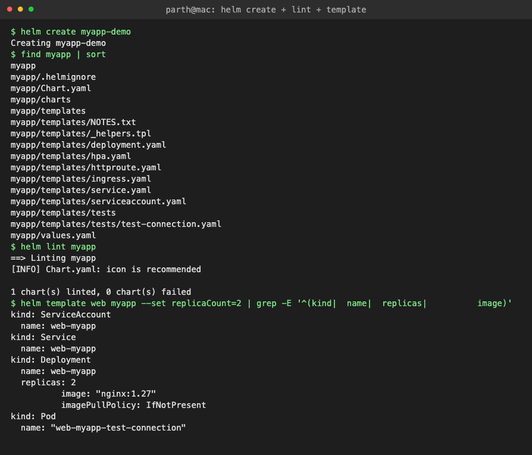
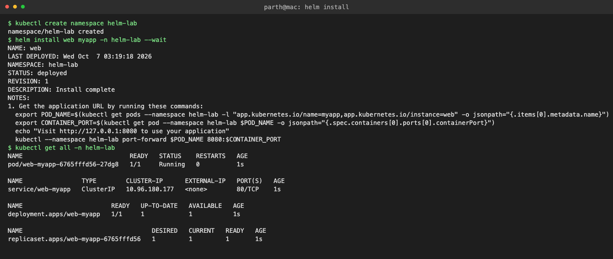
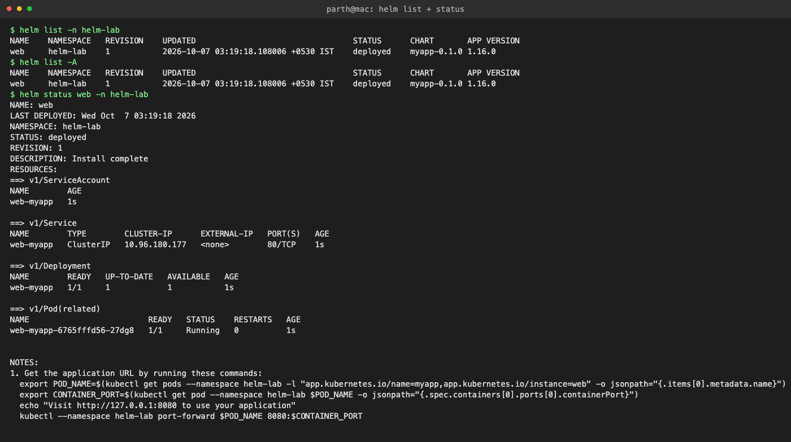
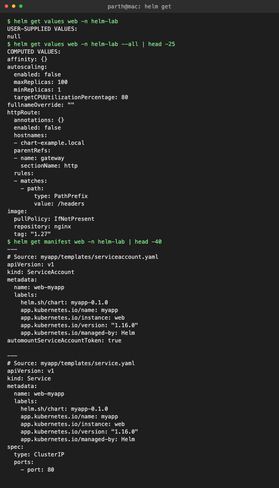
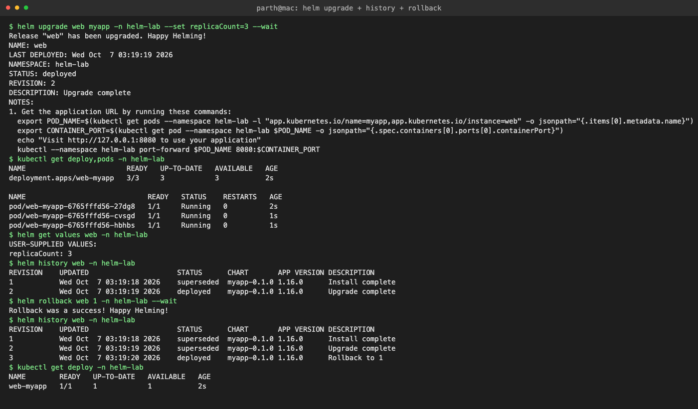
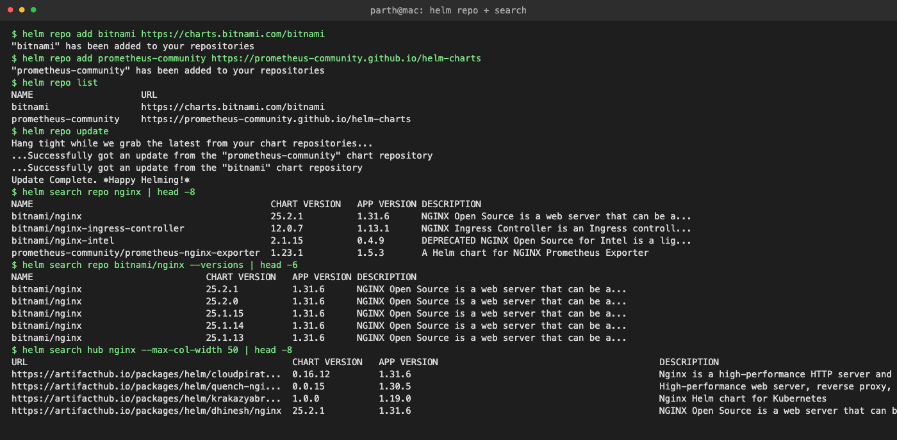
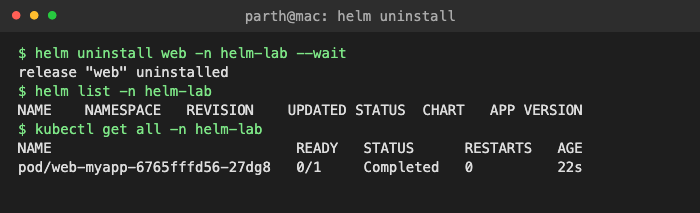

# Task 1: Helm Commands

All commands were run on my kind cluster (`devops-lab`) with **Helm v4.3.0**. The chart used is [myapp/](myapp), made with `helm create` (only change: `image.tag: "1.27"` in `values.yaml`). The release is called `web` in namespace `helm-lab`.

Every output block below is the real output, captured with `tee` into [../logs/](../logs).

| # | Command | What it does |
|---|---|---|
| 1 | `helm create` | Generates a new chart skeleton |
| 2 | `helm lint` / `helm template` | Checks the chart / renders YAML locally (nothing sent to the cluster) |
| 3 | `helm install` | Installs a chart as a new *release* (revision 1) |
| 4 | `helm list` | Lists releases in a namespace (`-A` for all) |
| 5 | `helm status` | Shows state, revision, resources and NOTES of a release |
| 6 | `helm get` | Reads stored release data: `values`, `manifest`, `notes`, `metadata`, `all` |
| 7 | `helm upgrade` | Applies new values / chart version, creates a new revision |
| 8 | `helm history` | Lists every revision of a release |
| 9 | `helm rollback` | Re-deploys an old revision as a **new** revision |
| 10 | `helm repo` | Add / list / update / remove chart repositories |
| 11 | `helm search` | Search added repos (`search repo`) or Artifact Hub (`search hub`) |
| 12 | `helm uninstall` | Deletes the release and all its Kubernetes objects |

---

## 1. helm create

Creates a ready-to-use chart: `Chart.yaml` (metadata), `values.yaml` (defaults), `templates/` (Go-templated manifests), `_helpers.tpl` (named templates), `NOTES.txt` (printed after install), `charts/` (dependencies), `.helmignore`.

```text
$ helm create myapp-demo
Creating myapp-demo
$ find myapp | sort
myapp
myapp/.helmignore
myapp/Chart.yaml
myapp/charts
myapp/templates
myapp/templates/NOTES.txt
myapp/templates/_helpers.tpl
myapp/templates/deployment.yaml
myapp/templates/hpa.yaml
myapp/templates/httproute.yaml
myapp/templates/ingress.yaml
myapp/templates/service.yaml
myapp/templates/serviceaccount.yaml
myapp/templates/tests
myapp/templates/tests/test-connection.yaml
myapp/values.yaml
```

## 2. helm lint and helm template

`lint` finds syntax / best-practice problems. `template` renders the chart offline so you can see the final YAML (here filtered with grep, with `--set replicaCount=2` overriding a value).

```text
$ helm lint myapp
==> Linting myapp
[INFO] Chart.yaml: icon is recommended

1 chart(s) linted, 0 chart(s) failed
$ helm template web myapp --set replicaCount=2 | grep -E '^(kind|  name|  replicas|          image)'
kind: ServiceAccount
  name: web-myapp
kind: Service
  name: web-myapp
kind: Deployment
  name: web-myapp
  replicas: 2
          image: "nginx:1.27"
          imagePullPolicy: IfNotPresent
kind: Pod
  name: "web-myapp-test-connection"
```



## 3. helm install

`helm install <release> <chart>`. `-n` sets the namespace, `--wait` waits until the Pods are Ready. Helm stores the release as a Secret (`sh.helm.release.v1.web.v1`) in the namespace.

```text
$ kubectl create namespace helm-lab
namespace/helm-lab created
$ helm install web myapp -n helm-lab --wait
NAME: web
LAST DEPLOYED: Wed Oct  7 03:19:18 2026
NAMESPACE: helm-lab
STATUS: deployed
REVISION: 1
DESCRIPTION: Install complete
NOTES:
1. Get the application URL by running these commands:
  export POD_NAME=$(kubectl get pods --namespace helm-lab -l "app.kubernetes.io/name=myapp,app.kubernetes.io/instance=web" -o jsonpath="{.items[0].metadata.name}")
  export CONTAINER_PORT=$(kubectl get pod --namespace helm-lab $POD_NAME -o jsonpath="{.spec.containers[0].ports[0].containerPort}")
  echo "Visit http://127.0.0.1:8080 to use your application"
  kubectl --namespace helm-lab port-forward $POD_NAME 8080:$CONTAINER_PORT
$ kubectl get all -n helm-lab
NAME                             READY   STATUS    RESTARTS   AGE
pod/web-myapp-6765fffd56-27dg8   1/1     Running   0          1s

NAME                TYPE        CLUSTER-IP      EXTERNAL-IP   PORT(S)   AGE
service/web-myapp   ClusterIP   10.96.180.177   <none>        80/TCP    1s

NAME                        READY   UP-TO-DATE   AVAILABLE   AGE
deployment.apps/web-myapp   1/1     1            1           1s

NAME                                   DESIRED   CURRENT   READY   AGE
replicaset.apps/web-myapp-6765fffd56   1         1         1       1s
```



## 4. helm list

```text
$ helm list -n helm-lab
NAME    NAMESPACE   REVISION    UPDATED                                 STATUS      CHART       APP VERSION
web     helm-lab    1           2026-10-07 03:19:18.108006 +0530 IST    deployed    myapp-0.1.0 1.16.0     
$ helm list -A
NAME    NAMESPACE   REVISION    UPDATED                                 STATUS      CHART       APP VERSION
web     helm-lab    1           2026-10-07 03:19:18.108006 +0530 IST    deployed    myapp-0.1.0 1.16.0
```

## 5. helm status

```text
$ helm status web -n helm-lab
NAME: web
LAST DEPLOYED: Wed Oct  7 03:19:18 2026
NAMESPACE: helm-lab
STATUS: deployed
REVISION: 1
DESCRIPTION: Install complete
RESOURCES:
==> v1/ServiceAccount
NAME        AGE
web-myapp   1s

==> v1/Service
NAME        TYPE        CLUSTER-IP      EXTERNAL-IP   PORT(S)   AGE
web-myapp   ClusterIP   10.96.180.177   <none>        80/TCP    1s

==> v1/Deployment
NAME        READY   UP-TO-DATE   AVAILABLE   AGE
web-myapp   1/1     1            1           1s

==> v1/Pod(related)
NAME                         READY   STATUS    RESTARTS   AGE
web-myapp-6765fffd56-27dg8   1/1     Running   0          1s


NOTES:
1. Get the application URL by running these commands:
  export POD_NAME=$(kubectl get pods --namespace helm-lab -l "app.kubernetes.io/name=myapp,app.kubernetes.io/instance=web" -o jsonpath="{.items[0].metadata.name}")
  export CONTAINER_PORT=$(kubectl get pod --namespace helm-lab $POD_NAME -o jsonpath="{.spec.containers[0].ports[0].containerPort}")
  echo "Visit http://127.0.0.1:8080 to use your application"
  kubectl --namespace helm-lab port-forward $POD_NAME 8080:$CONTAINER_PORT
```



## 6. helm get

- `get values` → only the values *I* passed (`null` = nothing overridden). `--all` → final merged values.
- `get manifest` → exact YAML Helm applied.
- `get notes` → rendered NOTES.txt.
- `get metadata` → chart, version, revision, status.

```text
$ helm get values web -n helm-lab
USER-SUPPLIED VALUES:
null
$ helm get values web -n helm-lab --all | head -25
COMPUTED VALUES:
affinity: {}
autoscaling:
  enabled: false
  maxReplicas: 100
  minReplicas: 1
  targetCPUUtilizationPercentage: 80
fullnameOverride: ""
httpRoute:
  annotations: {}
  enabled: false
  hostnames:
  - chart-example.local
  parentRefs:
  - name: gateway
    sectionName: http
  rules:
  - matches:
    - path:
        type: PathPrefix
        value: /headers
image:
  pullPolicy: IfNotPresent
  repository: nginx
  tag: "1.27"
$ helm get manifest web -n helm-lab | head -40
---
# Source: myapp/templates/serviceaccount.yaml
apiVersion: v1
kind: ServiceAccount
metadata:
  name: web-myapp
  labels:
    helm.sh/chart: myapp-0.1.0
    app.kubernetes.io/name: myapp
    app.kubernetes.io/instance: web
    app.kubernetes.io/version: "1.16.0"
    app.kubernetes.io/managed-by: Helm
automountServiceAccountToken: true

---
# Source: myapp/templates/service.yaml
apiVersion: v1
kind: Service
metadata:
  name: web-myapp
  labels:
    helm.sh/chart: myapp-0.1.0
    app.kubernetes.io/name: myapp
    app.kubernetes.io/instance: web
    app.kubernetes.io/version: "1.16.0"
    app.kubernetes.io/managed-by: Helm
spec:
  type: ClusterIP
  ports:
    - port: 80
      targetPort: http
      protocol: TCP
      name: http
  selector:
    app.kubernetes.io/name: myapp
    app.kubernetes.io/instance: web

---
# Source: myapp/templates/deployment.yaml
apiVersion: apps/v1
$ helm get notes web -n helm-lab
NOTES:
1. Get the application URL by running these commands:
  export POD_NAME=$(kubectl get pods --namespace helm-lab -l "app.kubernetes.io/name=myapp,app.kubernetes.io/instance=web" -o jsonpath="{.items[0].metadata.name}")
  export CONTAINER_PORT=$(kubectl get pod --namespace helm-lab $POD_NAME -o jsonpath="{.spec.containers[0].ports[0].containerPort}")
  echo "Visit http://127.0.0.1:8080 to use your application"
  kubectl --namespace helm-lab port-forward $POD_NAME 8080:$CONTAINER_PORT

$ helm get metadata web -n helm-lab
NAME: web
CHART: myapp
VERSION: 0.1.0
APP_VERSION: 1.16.0
ANNOTATIONS: 
LABELS: modifiedAt=1791323359,name=web,owner=helm,status=deployed,version=1
DEPENDENCIES: 
NAMESPACE: helm-lab
REVISION: 1
STATUS: deployed
DEPLOYED_AT: 2026-10-07T03:19:18+05:30
APPLY_METHOD: server-side apply
```



## 7. helm upgrade

Changes the release; here `--set replicaCount=3`. Revision goes 1 → 2.

```text
$ helm upgrade web myapp -n helm-lab --set replicaCount=3 --wait
Release "web" has been upgraded. Happy Helming!
NAME: web
LAST DEPLOYED: Wed Oct  7 03:19:19 2026
NAMESPACE: helm-lab
STATUS: deployed
REVISION: 2
DESCRIPTION: Upgrade complete
NOTES:
1. Get the application URL by running these commands:
  export POD_NAME=$(kubectl get pods --namespace helm-lab -l "app.kubernetes.io/name=myapp,app.kubernetes.io/instance=web" -o jsonpath="{.items[0].metadata.name}")
  export CONTAINER_PORT=$(kubectl get pod --namespace helm-lab $POD_NAME -o jsonpath="{.spec.containers[0].ports[0].containerPort}")
  echo "Visit http://127.0.0.1:8080 to use your application"
  kubectl --namespace helm-lab port-forward $POD_NAME 8080:$CONTAINER_PORT
$ kubectl get deploy,pods -n helm-lab
NAME                        READY   UP-TO-DATE   AVAILABLE   AGE
deployment.apps/web-myapp   3/3     3            3           2s

NAME                             READY   STATUS    RESTARTS   AGE
pod/web-myapp-6765fffd56-27dg8   1/1     Running   0          2s
pod/web-myapp-6765fffd56-cvsgd   1/1     Running   0          1s
pod/web-myapp-6765fffd56-hbhbs   1/1     Running   0          1s
$ helm get values web -n helm-lab
USER-SUPPLIED VALUES:
replicaCount: 3
```

## 8. helm history

```text
$ helm history web -n helm-lab
REVISION    UPDATED                     STATUS      CHART       APP VERSION DESCRIPTION     
1           Wed Oct  7 03:19:18 2026    superseded  myapp-0.1.0 1.16.0      Install complete
2           Wed Oct  7 03:19:19 2026    deployed    myapp-0.1.0 1.16.0      Upgrade complete
```

## 9. helm rollback

`helm rollback web 1` puts revision 1's config back. Note it does **not** delete revision 2, it adds revision 3 ("Rollback to 1"). Replicas went 3 → 1.

```text
$ helm rollback web 1 -n helm-lab --wait
Rollback was a success! Happy Helming!
$ helm history web -n helm-lab
REVISION    UPDATED                     STATUS      CHART       APP VERSION DESCRIPTION     
1           Wed Oct  7 03:19:18 2026    superseded  myapp-0.1.0 1.16.0      Install complete
2           Wed Oct  7 03:19:19 2026    superseded  myapp-0.1.0 1.16.0      Upgrade complete
3           Wed Oct  7 03:19:20 2026    deployed    myapp-0.1.0 1.16.0      Rollback to 1   
$ kubectl get deploy -n helm-lab
NAME        READY   UP-TO-DATE   AVAILABLE   AGE
web-myapp   1/1     1            1           2s
```



## 10. helm repo

`repo add` registers a chart repository, `repo list` shows them, `repo update` downloads the latest index (like `apt update`). `helm repo remove <name>` deletes one.

```text
$ helm repo add bitnami https://charts.bitnami.com/bitnami
"bitnami" has been added to your repositories
$ helm repo add prometheus-community https://prometheus-community.github.io/helm-charts
"prometheus-community" has been added to your repositories
$ helm repo list
NAME                    URL                                               
bitnami                 https://charts.bitnami.com/bitnami                
prometheus-community    https://prometheus-community.github.io/helm-charts
$ helm repo update
Hang tight while we grab the latest from your chart repositories...
...Successfully got an update from the "prometheus-community" chart repository
...Successfully got an update from the "bitnami" chart repository
Update Complete. ⎈Happy Helming!⎈
```

## 11. helm search

`search repo` searches repos added locally; `--versions` shows all chart versions. `search hub` searches Artifact Hub online. `helm show chart|values` inspects a chart before installing it.

```text
$ helm search repo nginx | head -8
NAME                                            CHART VERSION   APP VERSION DESCRIPTION                                       
bitnami/nginx                                   25.2.1          1.31.6      NGINX Open Source is a web server that can be a...
bitnami/nginx-ingress-controller                12.0.7          1.13.1      NGINX Ingress Controller is an Ingress controll...
bitnami/nginx-intel                             2.1.15          0.4.9       DEPRECATED NGINX Open Source for Intel is a lig...
prometheus-community/prometheus-nginx-exporter  1.23.1          1.5.3       A Helm chart for NGINX Prometheus Exporter        
$ helm search repo bitnami/nginx --versions | head -6
NAME                                CHART VERSION   APP VERSION DESCRIPTION                                       
bitnami/nginx                       25.2.1          1.31.6      NGINX Open Source is a web server that can be a...
bitnami/nginx                       25.2.0          1.31.6      NGINX Open Source is a web server that can be a...
bitnami/nginx                       25.1.15         1.31.6      NGINX Open Source is a web server that can be a...
bitnami/nginx                       25.1.14         1.31.6      NGINX Open Source is a web server that can be a...
bitnami/nginx                       25.1.13         1.31.6      NGINX Open Source is a web server that can be a...
$ helm search hub nginx --max-col-width 50 | head -8
URL                                                 CHART VERSION   APP VERSION                                         DESCRIPTION                                       
https://artifacthub.io/packages/helm/cloudpirat...  0.16.12         1.31.6                                              Nginx is a high-performance HTTP server and rev...
https://artifacthub.io/packages/helm/quench-ngi...  0.0.15          1.30.5                                              High-performance web server, reverse proxy, and...
https://artifacthub.io/packages/helm/krakazyabr...  1.0.0           1.19.0                                              Nginx Helm chart for Kubernetes                   
https://artifacthub.io/packages/helm/dhinesh/nginx  25.2.1          1.31.6                                              NGINX Open Source is a web server that can be a...
https://artifacthub.io/packages/helm/bitnami/nginx  25.2.1          1.31.6                                              NGINX Open Source is a web server that can be a...
https://artifacthub.io/packages/helm/niceos/nginx   1.31.1+niceos.2 1.31.1                                              Bitnami-compatible NGINX Helm chart for NiceOS    
https://artifacthub.io/packages/helm/bitnami-ak...  13.2.12         1.23.2                                              NGINX Open Source is a web server that can be a...
$ helm show chart bitnami/nginx | head -15
annotations:
  fips: "true"
  images: |
    - name: git
      version: 2.56.0
      image: registry-1.docker.io/bitnami/git:latest
    - name: nginx
      version: 1.31.6
      image: registry-1.docker.io/bitnami/nginx:latest
    - name: nginx-exporter
      version: 1.5.3
      image: registry-1.docker.io/bitnami/nginx-exporter:latest
  licenses: Apache-2.0
  tanzuCategory: clusterUtility
apiVersion: v2
```



## 12. helm uninstall

Removes all objects of the release plus its history. The single `Completed` Pod was still terminating when `kubectl get` ran.

```text
$ helm uninstall web -n helm-lab --wait
release "web" uninstalled
$ helm list -n helm-lab
NAME    NAMESPACE   REVISION    UPDATED STATUS  CHART   APP VERSION
$ kubectl get all -n helm-lab
NAME                             READY   STATUS      RESTARTS   AGE
pod/web-myapp-6765fffd56-27dg8   0/1     Completed   0          22s
```


