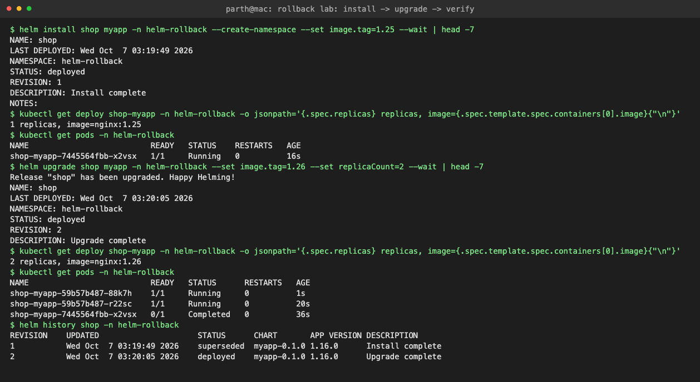
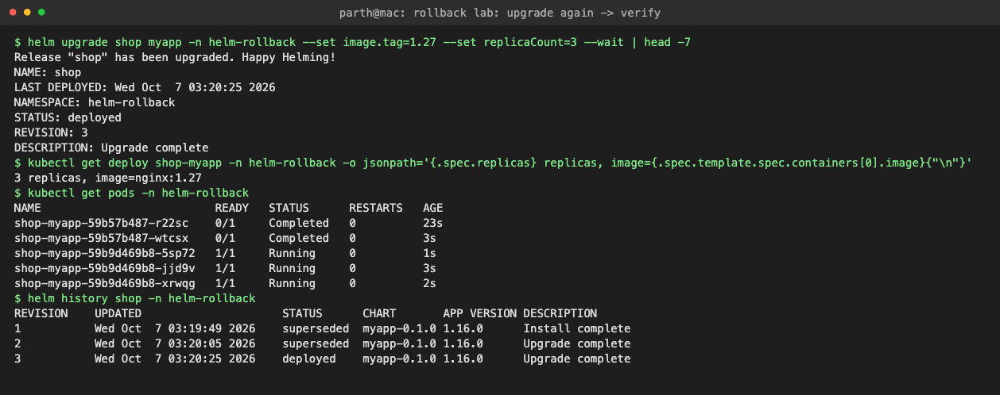
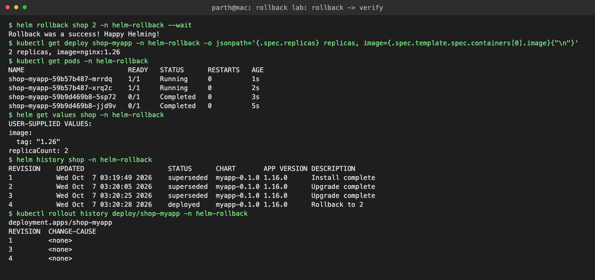

# Task 2: Helm Rollback

Full workflow on the [myapp](../01-helm-commands/myapp) chart, release `shop`, namespace `helm-rollback`. Each step changes the nginx image tag and replica count so the change is easy to verify.

```text
Install (rev 1)        nginx:1.25  x1
   ↓
Upgrade (rev 2)        nginx:1.26  x2
   ↓  verify
Upgrade again (rev 3)  nginx:1.27  x3
   ↓  verify
Rollback to 2 (rev 4)  nginx:1.26  x2
   ↓  verify
```

Verification command used at every step (prints replicas + image of the Deployment):

```bash
kubectl get deploy shop-myapp -n helm-rollback -o jsonpath='{.spec.replicas} replicas, image={.spec.template.spec.containers[0].image}{"\n"}'
```

---

## Step 1: Install

```text
$ helm install shop myapp -n helm-rollback --create-namespace --set image.tag=1.25 --wait | head -7
NAME: shop
LAST DEPLOYED: Wed Oct  7 03:19:49 2026
NAMESPACE: helm-rollback
STATUS: deployed
REVISION: 1
DESCRIPTION: Install complete
NOTES:
$ kubectl get deploy shop-myapp -n helm-rollback -o jsonpath='{.spec.replicas} replicas, image={.spec.template.spec.containers[0].image}{"\n"}'
1 replicas, image=nginx:1.25
$ kubectl get pods -n helm-rollback
NAME                          READY   STATUS    RESTARTS   AGE
shop-myapp-7445564fbb-x2vsx   1/1     Running   0          16s
```

## Step 2: Upgrade

```text
$ helm upgrade shop myapp -n helm-rollback --set image.tag=1.26 --set replicaCount=2 --wait | head -7
Release "shop" has been upgraded. Happy Helming!
NAME: shop
LAST DEPLOYED: Wed Oct  7 03:20:05 2026
NAMESPACE: helm-rollback
STATUS: deployed
REVISION: 2
DESCRIPTION: Upgrade complete
```

## Step 3: Verify

```text
$ kubectl get deploy shop-myapp -n helm-rollback -o jsonpath='{.spec.replicas} replicas, image={.spec.template.spec.containers[0].image}{"\n"}'
2 replicas, image=nginx:1.26
$ kubectl get pods -n helm-rollback
NAME                          READY   STATUS      RESTARTS   AGE
shop-myapp-59b57b487-88k7h    1/1     Running     0          1s
shop-myapp-59b57b487-r22sc    1/1     Running     0          20s
shop-myapp-7445564fbb-x2vsx   0/1     Completed   0          36s
$ helm history shop -n helm-rollback
REVISION    UPDATED                     STATUS      CHART       APP VERSION DESCRIPTION     
1           Wed Oct  7 03:19:49 2026    superseded  myapp-0.1.0 1.16.0      Install complete
2           Wed Oct  7 03:20:05 2026    deployed    myapp-0.1.0 1.16.0      Upgrade complete
```



## Step 4: Upgrade again

```text
$ helm upgrade shop myapp -n helm-rollback --set image.tag=1.27 --set replicaCount=3 --wait | head -7
Release "shop" has been upgraded. Happy Helming!
NAME: shop
LAST DEPLOYED: Wed Oct  7 03:20:25 2026
NAMESPACE: helm-rollback
STATUS: deployed
REVISION: 3
DESCRIPTION: Upgrade complete
```

## Step 5: Verify

```text
$ kubectl get deploy shop-myapp -n helm-rollback -o jsonpath='{.spec.replicas} replicas, image={.spec.template.spec.containers[0].image}{"\n"}'
3 replicas, image=nginx:1.27
$ kubectl get pods -n helm-rollback
NAME                          READY   STATUS      RESTARTS   AGE
shop-myapp-59b57b487-r22sc    0/1     Completed   0          23s
shop-myapp-59b57b487-wtcsx    0/1     Completed   0          3s
shop-myapp-59b9d469b8-5sp72   1/1     Running     0          1s
shop-myapp-59b9d469b8-jjd9v   1/1     Running     0          3s
shop-myapp-59b9d469b8-xrwqg   1/1     Running     0          2s
$ helm history shop -n helm-rollback
REVISION    UPDATED                     STATUS      CHART       APP VERSION DESCRIPTION     
1           Wed Oct  7 03:19:49 2026    superseded  myapp-0.1.0 1.16.0      Install complete
2           Wed Oct  7 03:20:05 2026    superseded  myapp-0.1.0 1.16.0      Upgrade complete
3           Wed Oct  7 03:20:25 2026    deployed    myapp-0.1.0 1.16.0      Upgrade complete
```



## Step 6: Rollback to revision 2

```text
$ helm rollback shop 2 -n helm-rollback --wait
Rollback was a success! Happy Helming!
```

## Step 7: Verify

Image is back to `nginx:1.26` with 2 replicas, `helm get values` shows the revision 2 values, and history has a new revision 4 "Rollback to 2". On the Kubernetes side the Deployment reused its old ReplicaSet (`59b57b487`), which is why `kubectl rollout history` shows revision 2 renumbered as 4.

```text
$ kubectl get deploy shop-myapp -n helm-rollback -o jsonpath='{.spec.replicas} replicas, image={.spec.template.spec.containers[0].image}{"\n"}'
2 replicas, image=nginx:1.26
$ kubectl get pods -n helm-rollback
NAME                          READY   STATUS      RESTARTS   AGE
shop-myapp-59b57b487-mrrdq    1/1     Running     0          1s
shop-myapp-59b57b487-xrq2c    1/1     Running     0          2s
shop-myapp-59b9d469b8-5sp72   0/1     Completed   0          3s
shop-myapp-59b9d469b8-jjd9v   0/1     Completed   0          5s
$ helm get values shop -n helm-rollback
USER-SUPPLIED VALUES:
image:
  tag: "1.26"
replicaCount: 2
$ helm history shop -n helm-rollback
REVISION    UPDATED                     STATUS      CHART       APP VERSION DESCRIPTION     
1           Wed Oct  7 03:19:49 2026    superseded  myapp-0.1.0 1.16.0      Install complete
2           Wed Oct  7 03:20:05 2026    superseded  myapp-0.1.0 1.16.0      Upgrade complete
3           Wed Oct  7 03:20:25 2026    superseded  myapp-0.1.0 1.16.0      Upgrade complete
4           Wed Oct  7 03:20:28 2026    deployed    myapp-0.1.0 1.16.0      Rollback to 2   
$ kubectl rollout history deploy/shop-myapp -n helm-rollback
deployment.apps/shop-myapp 
REVISION  CHANGE-CAUSE
1         <none>
3         <none>
4         <none>
```



## Cleanup

```text
$ helm uninstall shop -n helm-rollback --wait && kubectl delete ns helm-rollback helm-lab
release "shop" uninstalled
namespace "helm-rollback" deleted
namespace "helm-lab" deleted
```

## Notes

- `helm rollback <release>` with no number goes to the previous revision.
- A rollback is itself a new revision, so you can "roll back the rollback".
- `--history-max` on upgrade limits how many revisions Helm keeps (default 10).
- `helm rollback` vs `kubectl rollout undo`: Helm restores **all** objects of the release (ConfigMaps, Services, values), kubectl only the Deployment's Pod template.
