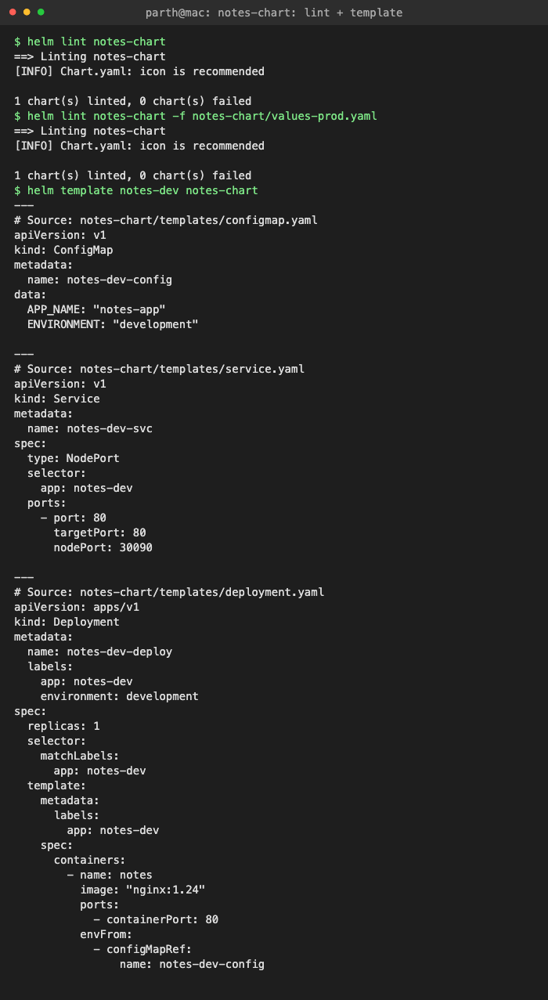
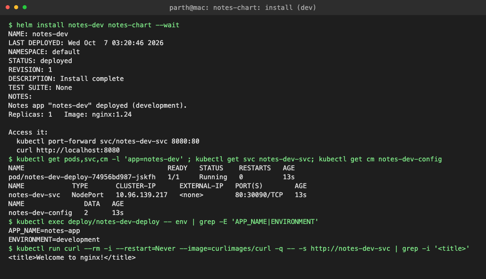
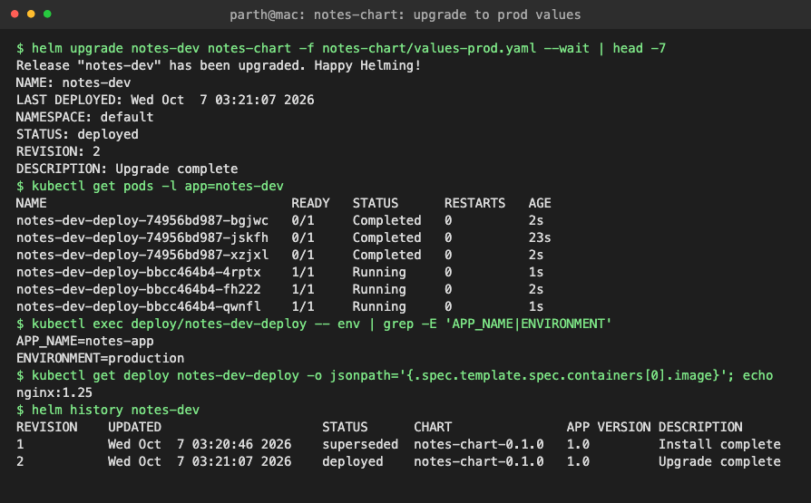
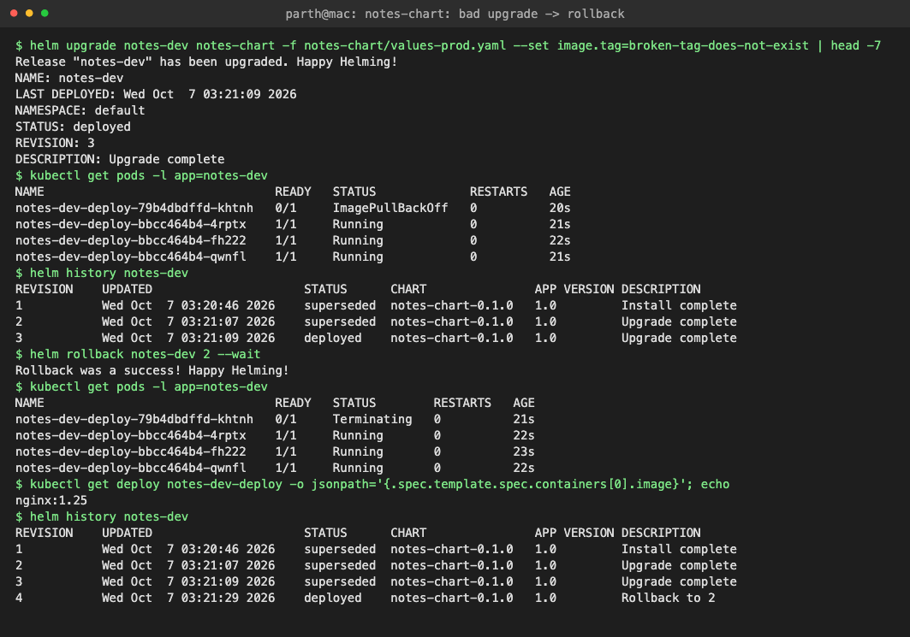
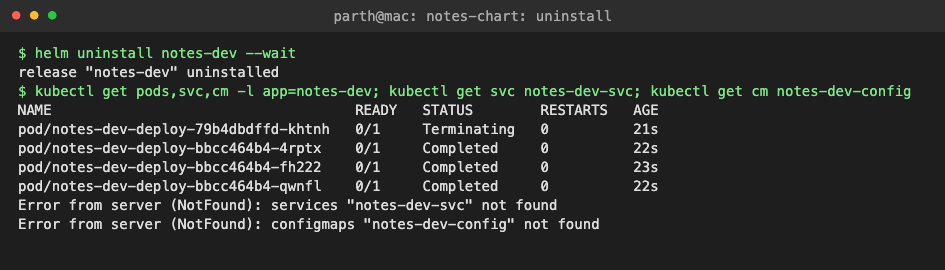

# Task 3: Mini Project: Notes App Helm Chart

Packaged a "Notes" web app (nginx) as a Helm chart, deployed it with dev values, upgraded to prod values, broke it with a bad image tag and rolled it back. Spec: [class mini project](https://github.com/Nency-Ravaliya/devops-heros/tree/main/session-15-helm/mini-project).

## Chart

```text
notes-chart/
  Chart.yaml            chart name, version 0.1.0, appVersion 1.0
  values.yaml           dev defaults: 1 replica, nginx:1.24, environment=development
  values-prod.yaml      prod overrides: 3 replicas, nginx:1.25, environment=production
  templates/
    configmap.yaml      {{ .Release.Name }}-config  -> APP_NAME, ENVIRONMENT
    deployment.yaml     {{ .Release.Name }}-deploy  -> envFrom the ConfigMap
    service.yaml        {{ .Release.Name }}-svc     -> NodePort 30090
    NOTES.txt           (my addition) prints env, replicas, image and how to access
```

| File | Link |
|---|---|
| Chart.yaml | [notes-chart/Chart.yaml](notes-chart/Chart.yaml) |
| values.yaml | [notes-chart/values.yaml](notes-chart/values.yaml) |
| values-prod.yaml | [notes-chart/values-prod.yaml](notes-chart/values-prod.yaml) |
| Templates | [notes-chart/templates/](notes-chart/templates) |

---

## Step 1: Lint

```text
$ helm lint notes-chart
==> Linting notes-chart
[INFO] Chart.yaml: icon is recommended

1 chart(s) linted, 0 chart(s) failed
$ helm lint notes-chart -f notes-chart/values-prod.yaml
==> Linting notes-chart
[INFO] Chart.yaml: icon is recommended

1 chart(s) linted, 0 chart(s) failed
```

## Step 2: Render locally

All `{{ }}` were replaced with values from `values.yaml` and the release name.

```text
$ helm template notes-dev notes-chart
---
# Source: notes-chart/templates/configmap.yaml
apiVersion: v1
kind: ConfigMap
metadata:
  name: notes-dev-config
data:
  APP_NAME: "notes-app"
  ENVIRONMENT: "development"

---
# Source: notes-chart/templates/service.yaml
apiVersion: v1
kind: Service
metadata:
  name: notes-dev-svc
spec:
  type: NodePort
  selector:
    app: notes-dev
  ports:
    - port: 80
      targetPort: 80
      nodePort: 30090

---
# Source: notes-chart/templates/deployment.yaml
apiVersion: apps/v1
kind: Deployment
metadata:
  name: notes-dev-deploy
  labels:
    app: notes-dev
    environment: development
spec:
  replicas: 1
  selector:
    matchLabels:
      app: notes-dev
  template:
    metadata:
      labels:
        app: notes-dev
    spec:
      containers:
        - name: notes
          image: "nginx:1.24"
          ports:
            - containerPort: 80
          envFrom:
            - configMapRef:
                name: notes-dev-config
```



## Step 3: Install (development)

The ConfigMap values reach the container as env vars, and the app answers through the Service.

```text
$ helm install notes-dev notes-chart --wait
NAME: notes-dev
LAST DEPLOYED: Wed Oct  7 03:20:46 2026
NAMESPACE: default
STATUS: deployed
REVISION: 1
DESCRIPTION: Install complete
TEST SUITE: None
NOTES:
Notes app "notes-dev" deployed (development).
Replicas: 1   Image: nginx:1.24

Access it:
  kubectl port-forward svc/notes-dev-svc 8080:80
  curl http://localhost:8080
$ kubectl get pods,svc,cm -l 'app=notes-dev' ; kubectl get svc notes-dev-svc; kubectl get cm notes-dev-config
NAME                                    READY   STATUS    RESTARTS   AGE
pod/notes-dev-deploy-74956bd987-jskfh   1/1     Running   0          13s
NAME            TYPE       CLUSTER-IP      EXTERNAL-IP   PORT(S)        AGE
notes-dev-svc   NodePort   10.96.139.217   <none>        80:30090/TCP   13s
NAME               DATA   AGE
notes-dev-config   2      13s
$ kubectl exec deploy/notes-dev-deploy -- env | grep -E 'APP_NAME|ENVIRONMENT'
APP_NAME=notes-app
ENVIRONMENT=development
$ kubectl run curl --rm -i --restart=Never --image=curlimages/curl -q -- -s http://notes-dev-svc | grep -i '<title>'
<title>Welcome to nginx!</title>
```



## Step 4: Upgrade to production values

`-f values-prod.yaml` overrides `values.yaml`: 3 replicas, nginx 1.25, `ENVIRONMENT=production`. (The `Completed` Pods are the old dev ReplicaSet shutting down.)

```text
$ helm upgrade notes-dev notes-chart -f notes-chart/values-prod.yaml --wait | head -7
Release "notes-dev" has been upgraded. Happy Helming!
NAME: notes-dev
LAST DEPLOYED: Wed Oct  7 03:21:07 2026
NAMESPACE: default
STATUS: deployed
REVISION: 2
DESCRIPTION: Upgrade complete
$ kubectl get pods -l app=notes-dev
NAME                                READY   STATUS      RESTARTS   AGE
notes-dev-deploy-74956bd987-bgjwc   0/1     Completed   0          2s
notes-dev-deploy-74956bd987-jskfh   0/1     Completed   0          23s
notes-dev-deploy-74956bd987-xzjxl   0/1     Completed   0          2s
notes-dev-deploy-bbcc464b4-4rptx    1/1     Running     0          1s
notes-dev-deploy-bbcc464b4-fh222    1/1     Running     0          2s
notes-dev-deploy-bbcc464b4-qwnfl    1/1     Running     0          1s
$ kubectl exec deploy/notes-dev-deploy -- env | grep -E 'APP_NAME|ENVIRONMENT'
APP_NAME=notes-app
ENVIRONMENT=production
$ kubectl get deploy notes-dev-deploy -o jsonpath='{.spec.template.spec.containers[0].image}'; echo
nginx:1.25
```

## Step 5: History

```text
$ helm history notes-dev
REVISION    UPDATED                     STATUS      CHART               APP VERSION DESCRIPTION     
1           Wed Oct  7 03:20:46 2026    superseded  notes-chart-0.1.0   1.0         Install complete
2           Wed Oct  7 03:21:07 2026    deployed    notes-chart-0.1.0   1.0         Upgrade complete
```



## Step 6: Bad upgrade, then rollback

`--set image.tag=broken-tag-does-not-exist` → new Pod is stuck in `ImagePullBackOff`. The 3 old Pods keep serving because of the RollingUpdate strategy (maxUnavailable 25%).

**Important:** Helm still says `STATUS: deployed` / `Upgrade complete` because I did not use `--wait`. Helm only checks that the API accepted the objects. With `--wait` the release would be marked `failed`; with `--rollback-on-failure` (Helm v4; `--atomic` in v3) it would roll back automatically.

```text
$ helm upgrade notes-dev notes-chart -f notes-chart/values-prod.yaml --set image.tag=broken-tag-does-not-exist | head -7
Release "notes-dev" has been upgraded. Happy Helming!
NAME: notes-dev
LAST DEPLOYED: Wed Oct  7 03:21:09 2026
NAMESPACE: default
STATUS: deployed
REVISION: 3
DESCRIPTION: Upgrade complete
$ kubectl get pods -l app=notes-dev
NAME                                READY   STATUS             RESTARTS   AGE
notes-dev-deploy-79b4dbdffd-khtnh   0/1     ImagePullBackOff   0          20s
notes-dev-deploy-bbcc464b4-4rptx    1/1     Running            0          21s
notes-dev-deploy-bbcc464b4-fh222    1/1     Running            0          22s
notes-dev-deploy-bbcc464b4-qwnfl    1/1     Running            0          21s
$ helm history notes-dev
REVISION    UPDATED                     STATUS      CHART               APP VERSION DESCRIPTION     
1           Wed Oct  7 03:20:46 2026    superseded  notes-chart-0.1.0   1.0         Install complete
2           Wed Oct  7 03:21:07 2026    superseded  notes-chart-0.1.0   1.0         Upgrade complete
3           Wed Oct  7 03:21:09 2026    deployed    notes-chart-0.1.0   1.0         Upgrade complete
```

`helm rollback notes-dev 2` → broken Pod is terminated, image is back to `nginx:1.25`, revision 4 = "Rollback to 2".

```text
$ helm rollback notes-dev 2 --wait
Rollback was a success! Happy Helming!
$ kubectl get pods -l app=notes-dev
NAME                                READY   STATUS        RESTARTS   AGE
notes-dev-deploy-79b4dbdffd-khtnh   0/1     Terminating   0          21s
notes-dev-deploy-bbcc464b4-4rptx    1/1     Running       0          22s
notes-dev-deploy-bbcc464b4-fh222    1/1     Running       0          23s
notes-dev-deploy-bbcc464b4-qwnfl    1/1     Running       0          22s
$ kubectl get deploy notes-dev-deploy -o jsonpath='{.spec.template.spec.containers[0].image}'; echo
nginx:1.25
$ helm history notes-dev
REVISION    UPDATED                     STATUS      CHART               APP VERSION DESCRIPTION     
1           Wed Oct  7 03:20:46 2026    superseded  notes-chart-0.1.0   1.0         Install complete
2           Wed Oct  7 03:21:07 2026    superseded  notes-chart-0.1.0   1.0         Upgrade complete
3           Wed Oct  7 03:21:09 2026    superseded  notes-chart-0.1.0   1.0         Upgrade complete
4           Wed Oct  7 03:21:29 2026    deployed    notes-chart-0.1.0   1.0         Rollback to 2
```



## Step 7: Clean up

Service and ConfigMap are gone; the last Pods were in the middle of terminating.

```text
$ helm uninstall notes-dev --wait
release "notes-dev" uninstalled
$ kubectl get pods,svc,cm -l app=notes-dev; kubectl get svc notes-dev-svc; kubectl get cm notes-dev-config
NAME                                    READY   STATUS        RESTARTS   AGE
pod/notes-dev-deploy-79b4dbdffd-khtnh   0/1     Terminating   0          21s
pod/notes-dev-deploy-bbcc464b4-4rptx    0/1     Completed     0          22s
pod/notes-dev-deploy-bbcc464b4-fh222    0/1     Completed     0          23s
pod/notes-dev-deploy-bbcc464b4-qwnfl    0/1     Completed     0          22s
Error from server (NotFound): services "notes-dev-svc" not found
Error from server (NotFound): configmaps "notes-dev-config" not found
```



## What I practiced

```text
[PASS] Created a Helm chart from scratch
[PASS] Used values.yaml and values-prod.yaml
[PASS] Deployed to Kubernetes with helm install
[PASS] Upgraded the release with different values
[PASS] Simulated a bad upgrade (broken image tag)
[PASS] Rolled back to a healthy revision
[PASS] Cleaned up with helm uninstall
```
