# Session 17: Complete CI/CD and DevSecOps

**Name:** Parth Dagia
**Roll No:** 24BCS10414

A DevSecOps demo: a small Flask "Notes" API goes through a GitHub Actions pipeline that builds it, tests it, scans the code, the dependencies, the git history and the Docker image, then decides at a **security gate** whether the image may be pushed to a registry and deployed to Kubernetes.

```text
Code → Build → Unit Test → SAST → SCA → Secret Scan → Docker Build → Container Image Scan → Security Gate → Push Image → Deploy to Kubernetes
```

- **Workflow:** [.github/workflows/session17-devsecops.yml](../.github/workflows/session17-devsecops.yml) (at the root of the course repo)
- **Docker image:** `ghcr.io/<owner>/<repo>/notes-api:<sha>`

This project lives in the course repo, not in its own repository. GitHub only runs workflows from `.github/workflows/` at the **repo root**, so the workflow file sits there and:

- sets `defaults.run.working-directory: 16_DevSecOps_Pipeline`, so every `run:` step works inside this folder,
- has `paths:` filters, so it runs only when something in `16_DevSecOps_Pipeline/` (or the workflow itself) changes, not on pushes for other sessions,
- prefixes `16_DevSecOps_Pipeline/` on paths given to actions (`upload-artifact`, `upload-sarif`, ...), because `working-directory` only applies to `run:` steps,
- limits Gitleaks to this folder's history (`--log-opts="-- 16_DevSecOps_Pipeline"`).

---

## Deliverables

| Deliverable | Where |
|---|---|
| Application | [app/main.py](app/main.py) (Flask API), [app/notes.py](app/notes.py) (note store) |
| Unit tests | [tests/test_notes.py](tests/test_notes.py), [tests/test_api.py](tests/test_api.py) (11 tests, 97% coverage) |
| Dockerfile | [Dockerfile](Dockerfile) (multi-stage, non-root, no pip), [.dockerignore](.dockerignore) |
| GitHub Actions workflow | [../.github/workflows/session17-devsecops.yml](../.github/workflows/session17-devsecops.yml) (10 jobs) |
| Security tools configuration | [security/bandit.yaml](security/bandit.yaml), [security/semgrep.yml](security/semgrep.yml), [.gitleaks.toml](.gitleaks.toml), [trivy.yaml](trivy.yaml), [.trivyignore](.trivyignore), [../.github/dependabot.yml](../.github/dependabot.yml) |
| Security gate | [security/gate.py](security/gate.py) + [security/policy.json](security/policy.json) |
| Kubernetes manifests | [k8s/](k8s) (namespace, deployment, service, network policy, kustomization) |
| Local scan script | [security/scan-local.sh](security/scan-local.sh) (runs the same scanners and the gate on my Mac) |
| Pipeline output and screenshots | [screenshots/](screenshots), [logs/](logs) ([listed below](#screenshots)) |

## Project structure

```text
devOps/                                   # course repo root
├── .github/
│   ├── workflows/session17-devsecops.yml # the 10-stage pipeline (runs in 16_DevSecOps_Pipeline/)
│   └── dependabot.yml                    # weekly update PRs for pip, Docker base image, actions
└── 16_DevSecOps_Pipeline/
    ├── app/
    │   ├── main.py                   # Flask API: /, /health, /notes, /notes/<id>
    │   └── notes.py                  # in-memory note store with input validation
    ├── tests/                        # pytest unit tests
    ├── k8s/
    │   ├── namespace.yaml            # Pod Security Admission: restricted
    │   ├── deployment.yaml           # 2 replicas, non-root, read-only FS, probes, limits
    │   ├── service.yaml              # ClusterIP :80 -> :8080
    │   ├── networkpolicy.yaml        # ingress only on 8080, no egress
    │   └── kustomization.yaml        # CI sets the image tag here
    ├── security/
    │   ├── bandit.yaml               # SAST (Python) config
    │   ├── semgrep.yml               # SAST custom rules
    │   ├── policy.json               # security gate thresholds
    │   ├── gate.py                   # security gate
    │   └── scan-local.sh             # run all scanners + gate locally
    ├── .gitleaks.toml                # secret scanning config
    ├── trivy.yaml, .trivyignore      # image + IaC scanning config
    ├── Dockerfile
    ├── requirements.txt              # pinned: flask==3.1.3, gunicorn==23.0.0
    ├── requirements-dev.txt          # + pytest, pytest-cov, flake8
    ├── setup.cfg                     # flake8 + pytest settings
    ├── shot.py                       # renders logs into terminal screenshots
    ├── logs/
    └── screenshots/
```

---

## 1. What DevSecOps adds to CI/CD

Session 16's pipeline answered "does the code work?" (lint, test, build, deploy). DevSecOps adds "is it **safe** to ship?" and answers it automatically on every push, instead of in a security review at the end. Moving security checks earlier like this is called **shift left**: a vulnerable dependency found in CI costs one line in `requirements.txt` to fix, while the same thing found in production is an incident.

| Question | Check | Tool in this project |
|---|---|---|
| Does it build? | Build | flake8, `compileall`, package tarball |
| Does it work? | Unit test | pytest + coverage (≥ 90% required) |
| Is **my code** insecure? | SAST | Bandit, Semgrep, Trivy config (IaC) |
| Are **my dependencies** vulnerable? | SCA | pip-audit (+ CycloneDX SBOM) |
| Did someone **commit a secret**? | Secret scanning | Gitleaks (whole git history) |
| Is the **image** (OS + libraries) vulnerable? | Container image scan | Trivy (+ image SBOM) |
| Is all of the above within policy? | Security gate | [security/gate.py](security/gate.py) |
| Ship it | Registry + deploy | GHCR, kind + kubectl/kustomize |

## 2. Pipeline flow

```mermaid
flowchart LR
    C[Code push] --> B[1. Build]
    B --> T[2. Unit Test]
    T --> SA[3. SAST]
    SA --> SC[4. SCA]
    SC --> SS[5. Secret Scan]
    SS --> D[6. Docker Build]
    D --> IS[7. Image Scan]
    IS --> G{8. Security Gate}
    SA -. bandit / semgrep / trivy-iac .json .-> G
    SC -. pip-audit.json .-> G
    SS -. gitleaks.json .-> G
    IS -. trivy-image.json .-> G
    G -->|PASS| P[9. Push Image<br/>ghcr.io/...:sha]
    G -->|FAIL| X[Stop: push + deploy skipped]
    P --> K[10. Deploy to Kubernetes]
```

Every stage is its own job in [session17-devsecops.yml](../.github/workflows/session17-devsecops.yml), and each job `needs:` the one before it, so they run in the order the task asks for. A failure anywhere skips everything after it.

| # | Job | Tool / action | Output |
|---|---|---|---|
| 1 | Build | `flake8`, `python -m compileall`, `tar` | artifact `app-build` |
| 2 | Unit Test | `pytest --cov --cov-fail-under=90` | artifact `test-results` |
| 3 | SAST | Bandit, Semgrep (Docker), Trivy `config` | `bandit.json`, `semgrep.json`, `trivy-iac.json`, Semgrep SARIF → GitHub Security tab |
| 4 | SCA | pip-audit | `pip-audit.json`, `sbom-dependencies.cdx.json` |
| 5 | Secret Scan | Gitleaks `git` mode, `fetch-depth: 0` | `gitleaks.json` |
| 6 | Docker Build | `docker build`, smoke test on a read-only container | artifact `docker-image` (`image.tar.gz`) |
| 7 | Container Image Scan | Trivy `image` | `trivy-image.json`, `sbom-image.cdx.json`, SARIF → Security tab |
| 8 | Security Gate | `security/gate.py` | pass/fail + summary table on the run page |
| 9 | Push Image | `docker push` to GHCR (main branch only) | `ghcr.io/<owner>/<repo>/notes-api:<sha>` and `:latest` |
| 10 | Deploy to Kubernetes | `helm/kind-action`, `kustomize`, `kubectl` | rollout + `/health` check, artifact `deployment-report` |

Scanner versions are pinned (Trivy 0.75.0, Semgrep 1.179.0, Gitleaks 8.30.1, Bandit 1.9.4, pip-audit 2.10.1) so a new scanner release can't change the result of an old commit.

## 3. Application

A small JSON API (Flask, served by gunicorn in the container):

| Endpoint | Description |
|---|---|
| `GET /` | app name, version (commit SHA), environment, endpoint list |
| `GET /health` | `{"status": "ok", "version": "<sha>"}`, used by Docker `HEALTHCHECK` and Kubernetes probes |
| `GET /notes`, `POST /notes` | list / create notes (`{"title": "...", "body": "..."}`) |
| `GET /notes/<id>`, `DELETE /notes/<id>` | read / delete one note |

Built with security in mind: input is validated (title required, length limits), every response sets `X-Content-Type-Options`, `X-Frame-Options` and a `Content-Security-Policy`, the dev server only binds to `127.0.0.1`, and there is no debug mode.

```bash
python3 -m venv .venv && source .venv/bin/activate
pip install -r requirements-dev.txt
flake8 app tests security
pytest -v --cov=app        # 11 passed, 97% coverage
```

## 4. Dockerfile

[Dockerfile](Dockerfile), multi-stage:

| Choice | Why |
|---|---|
| Stage 1 `builder` installs requirements into `/opt/venv` | build tools stay out of the final image |
| `pip uninstall -y pip` in both stages | the first Trivy scan found **10 MEDIUM CVEs, all in pip** ([section 9](#9-what-the-scanners-found-and-the-failure-demos)). The app never installs packages at runtime, so pip was removed |
| `apt-get upgrade` in the runtime stage | picks up Debian security fixes newer than the base image |
| `USER 10001` (fixed numeric UID) | non-root; Kubernetes can check `runAsNonRoot` against a numeric UID |
| `COPY --chown=root:root app/` | the app user can't modify its own code |
| `gunicorn --worker-tmp-dir /tmp` | works with a read-only root filesystem (only `/tmp` is writable) |
| `HEALTHCHECK` on `/health` | `docker ps` shows `(healthy)` |
| `APP_VERSION` build arg | `/health` reports the commit SHA that is running |

Result: Trivy finds **0 vulnerabilities** in the final image (Debian 13 + all Python packages), and `pip` is not in the image ([screenshot 24](#screenshots)).

## 5. Security tools configuration

### SAST: Bandit ([security/bandit.yaml](security/bandit.yaml))

Bandit is a Python-specific security linter (e.g. `B602` shell injection, `B201` Flask debug, `B105` hardcoded password). The config scans `app/`, excludes `tests/`, and leaves `skips` empty: all tests stay on, and any skip would need a written reason.

### SAST: Semgrep ([security/semgrep.yml](security/semgrep.yml))

Semgrep runs the community rulesets `p/python`, `p/flask` and `p/secrets` (about 200 rules), plus 5 custom rules I wrote for this project:

| Rule | Severity | Catches |
|---|---|---|
| `flask-debug-enabled` | ERROR | `app.run(debug=True)`, `app.debug = True` |
| `flask-bind-all-interfaces-dev-server` | WARNING | `app.run(host="0.0.0.0")` |
| `subprocess-shell-true` | ERROR | `subprocess.*(..., shell=True)` |
| `hardcoded-flask-secret-key` | ERROR | `app.config["SECRET_KEY"] = "..."` |
| `yaml-unsafe-load` | ERROR | `yaml.load()` without `SafeLoader` |

### SAST for infrastructure: Trivy config ([trivy.yaml](trivy.yaml))

`trivy config .` checks the **Dockerfile and the Kubernetes manifests** for misconfigurations: running as root, missing resource limits, privilege escalation, writable root filesystem, `latest` tags, and so on. All 5 files pass with 0 findings.

### SCA: pip-audit

`pip-audit -r requirements.txt` resolves the full dependency tree (including transitive packages like Werkzeug and Jinja2) and checks every package against the PyPI/OSV advisory database. The same job writes a **CycloneDX SBOM** (software bill of materials). `requirements.txt` pins exact versions, so the audited versions are exactly the ones in the image.

### Secret scanning: Gitleaks ([.gitleaks.toml](.gitleaks.toml))

- `useDefault = true` keeps all built-in rules (GitHub/AWS/Slack/Stripe tokens, private keys, ...).
- One extra rule, `generic-hardcoded-credential`: any `password`/`secret`/`token`/`api_key` assigned a 12+ character string with real randomness (entropy ≥ 3).
- Allowlist: only generated folders (`logs/`, `screenshots/`, `reports/`).
- CI checks out with `fetch-depth: 0` and runs `gitleaks git --log-opts="-- 16_DevSecOps_Pipeline"`, so **every commit** that touched this folder is scanned. A secret that was committed and then deleted is still in history, and still leaked (demo C).
- `--redact` means the secret value never appears in logs or reports.

### Container image scanning: Trivy ([trivy.yaml](trivy.yaml), [.trivyignore](.trivyignore))

- Scans OS packages (Debian) and language packages (everything in `/opt/venv`).
- `severity: CRITICAL, HIGH, MEDIUM`; `ignore-unfixed: true` so it only reports problems that have a fix available.
- [.trivyignore](.trivyignore) is the place for accepted risks: one CVE per line, each with a reason and a review date. It is empty.
- Also produces a CycloneDX SBOM of the image and a SARIF file for the GitHub Security tab.

### Dependabot ([../.github/dependabot.yml](../.github/dependabot.yml))

Weekly PRs for new pip versions, a new `python:3.12-slim` base image and new GitHub Action versions. Each PR goes through this same pipeline.

## 6. Security gate

The scan jobs **collect** findings and upload JSON reports. They don't fail the build themselves (`--exit-zero`, `--exit-code 0`). One job, the **Security Gate**, downloads all six reports and compares them to [security/policy.json](security/policy.json):

```json
{
  "bandit":      {"HIGH": 0, "MEDIUM": 0, "LOW": 5},
  "semgrep":     {"ERROR": 0, "WARNING": 0, "INFO": 10},
  "trivy-iac":   {"CRITICAL": 0, "HIGH": 0, "MEDIUM": 5},
  "pip-audit":   {"ANY": 0},
  "gitleaks":    {"ANY": 0},
  "trivy-image": {"CRITICAL": 0, "HIGH": 0, "MEDIUM": 10}
}
```

Why one gate instead of failing each scanner on its own:

- **One run shows every problem.** If SAST failed straight away, I wouldn't find out about the vulnerable dependency or the leaked token until the next push.
- **The policy lives in one reviewed file**, not spread across scanner flags in YAML.
- **No evidence means no release.** If a report is missing or unreadable (a scanner crashed, a download failed), that tool counts as **FAIL**. I hit this by accident when pip-audit wasn't on my `PATH`, and the gate failed as it should.
- It writes a table to the GitHub run summary page.

[gate.py](security/gate.py) exits with code 1 on failure. `push-image` `needs: security-gate`, so a failed gate means the image is **never pushed** and **never deployed**.

## 7. Container registry

- **Registry:** GitHub Container Registry (`ghcr.io`), authenticated with the automatic `GITHUB_TOKEN` (job permission `packages: write`). No extra secret is needed.
- **Tags:** short commit SHA (immutable, traceable) and `latest`.
- **Same bytes that were scanned:** `docker-build` saves the image as `image.tar.gz`, `image-scan` loads and scans that file, and `push-image` loads and pushes the *same* file. Nothing is rebuilt after the scan, so what was scanned is exactly what ships.
- **Only from `main`:** pull requests run stages 1–8 (so a PR shows whether it would pass the gate), but `push-image` has `if: github.event_name != 'pull_request' && github.ref == 'refs/heads/main'`.

## 8. Kubernetes deployment

### Manifests ([k8s/](k8s))

| File | Security controls |
|---|---|
| [namespace.yaml](k8s/namespace.yaml) | `pod-security.kubernetes.io/enforce: restricted`: the API server **rejects** any pod that isn't hardened |
| [deployment.yaml](k8s/deployment.yaml) | 2 replicas, `RollingUpdate` with `maxUnavailable: 0`; `runAsNonRoot`, UID 10001, `seccompProfile: RuntimeDefault`, `allowPrivilegeEscalation: false`, `capabilities.drop: [ALL]`, `readOnlyRootFilesystem: true` (+ in-memory `emptyDir` for `/tmp`), `automountServiceAccountToken: false`, CPU/memory requests and limits, readiness and liveness probes on `/health` |
| [service.yaml](k8s/service.yaml) | `ClusterIP` (not exposed outside the cluster), port 80 → `http` (8080) |
| [networkpolicy.yaml](k8s/networkpolicy.yaml) | ingress only on TCP 8080; **all egress denied** (the app doesn't need to call out) |
| [kustomization.yaml](k8s/kustomization.yaml) | lists the resources; `images:` is where CI sets the exact tag |

### In the pipeline (job 10)

1. `helm/kind-action` creates a fresh Kubernetes cluster on the runner (kind = Kubernetes in Docker). For a real cluster, swap this step for a kubeconfig from a secret; the other steps stay the same.
2. Creates the namespace and an image pull secret `ghcr` from `GITHUB_TOKEN`, and attaches it to the namespace's `default` ServiceAccount. Kubernetes then **pulls the image from GHCR** itself.
3. `kustomize edit set image notes-api=ghcr.io/...:<sha>` → `kubectl apply -k .`
4. `kubectl rollout status` waits until both replicas are ready (fails after 180 s).
5. `kubectl port-forward` + `curl /health` and `/` checks the live app, then writes a summary and uploads `deployment-report`.
6. On failure, a debug step prints `kubectl describe pods` and the namespace events.

### On my Mac (kind cluster from Session 8)

```bash
docker build -t notes-api:local .
kind load docker-image notes-api:local --name devops-lab
kubectl apply -k k8s
kubectl -n devsecops rollout status deployment/notes-api
kubectl -n devsecops port-forward svc/notes-api 8099:80
curl localhost:8099/health        # {"status":"ok","version":"8ea4a16"}
```

Checking that the controls actually work ([screenshot 28](#screenshots)):

```text
$ kubectl -n devsecops exec deploy/notes-api -- touch /app/hacked
touch: cannot touch '/app/hacked': Read-only file system

$ kubectl -n devsecops run root-test --image=nginx --restart=Never
Error from server (Forbidden): pods "root-test" is forbidden: violates PodSecurity "restricted:latest":
allowPrivilegeEscalation != false, unrestricted capabilities, runAsNonRoot != true, seccompProfile ...
```

## 9. What the scanners found, and the failure demos

### Real finding: CVEs in pip

The first full scan of my image passed the gate (MEDIUM ≤ 10), but Trivy listed **10 MEDIUM CVEs, all in `pip` 25.0.1** (5 CVEs, each found twice: once in the base image's pip, once in the venv's pip) ([screenshot 29](#screenshots)). The app never runs pip, so I removed it from both places in the Dockerfile. Next scan: **0** findings.

### Failure demos

To prove the gate blocks bad changes, I made three bad commits in a **throwaway clone** (never pushed, so no fake secret ever reached GitHub) and ran [security/scan-local.sh](security/scan-local.sh), which runs the same scanners and gate as CI.

**A. Vulnerable dependency (SCA + image scan).** I added `PyYAML==5.3.1` and `requests==2.25.0` to `requirements.txt`:

```text
SCA          pip-audit    ANY=14                        ANY<=0                            FAIL
Image scan   trivy-image  CRITICAL=1, HIGH=6, MEDIUM=7  CRITICAL<=0, HIGH<=0, MEDIUM<=10  FAIL
  trivy-image: [CRITICAL] CVE-2020-14343 PyYAML 5.3.1 -> 5.4    (arbitrary code execution in yaml.load)
  trivy-image: [HIGH] CVE-2025-66418 urllib3 1.26.20 -> 2.6.0   (pulled in by requests: transitive!)
Security gate FAILED - image will NOT be pushed or deployed
```

Most of the findings are in `urllib3` and `idna`, which I never asked for. `requests` pulled them in. This is why SCA has to check the full dependency tree.

**B. Insecure code (SAST).** I added an "admin ping" endpoint:

```python
app.config["SECRET_KEY"] = "dev-secret"
out = subprocess.check_output("ping -c 1 " + host, shell=True)   # host comes from ?host=
app.run(host="0.0.0.0", debug=True)
```

```text
SAST   bandit    HIGH=2, MEDIUM=1, LOW=2     FAIL   B602 shell=True, B201 debug=True, B104, B105, B404
SAST   semgrep   ERROR=6, WARNING=3, INFO=0  FAIL   subprocess-injection (user input -> shell), flask-debug-enabled,
                                                    hardcoded-flask-secret-key (custom rule), ...
```

`?host=localhost;cat /etc/passwd` would have been remote command execution. Both SAST tools caught it, and Semgrep's taint rule saw that the value comes from `request.args`.

**C. Leaked secret (secret scan).** I committed `app/settings.py` with a (random, fake) `ghp_...` GitHub token and a DB password, then **deleted the file in the next commit**:

```text
$ ls app/settings.py
ls: app/settings.py: No such file or directory
$ gitleaks git --config .gitleaks.toml --redact -v .
RuleID: generic-hardcoded-credential   File: app/settings.py   Line: 5   Commit: 6834736...
RuleID: github-pat                     File: app/settings.py   Line: 4   Commit: 6834736...
WRN leaks found: 2
Secret scan  gitleaks  ANY=2  ANY<=0  FAIL
```

Deleting the file doesn't help: the secret is still in history. The only real fix is to **revoke/rotate the secret**, then rewrite history if needed.

In all three cases the gate exits with code 1, so in CI `push-image` and `deploy` are skipped.

## 10. Pipeline execution on GitHub

> GitHub run results and GitHub UI screenshots are added here once the repository is pushed.

## Running everything locally

```bash
# scanners: bandit, semgrep, pip-audit in the venv; trivy + gitleaks via Docker
pip install bandit==1.9.4 semgrep==1.179.0 pip-audit==2.10.1
docker build -t notes-api:local .
./security/scan-local.sh          # writes reports/*.json and runs the gate
```

---

## Screenshots

**Local run on my Mac** (rendered from [logs/](logs) with [shot.py](shot.py)):

| # | Screenshot |
|---|---|
| 20 | 1–2. Build (flake8, compile) + unit tests: 11 passed, 97% coverage<br>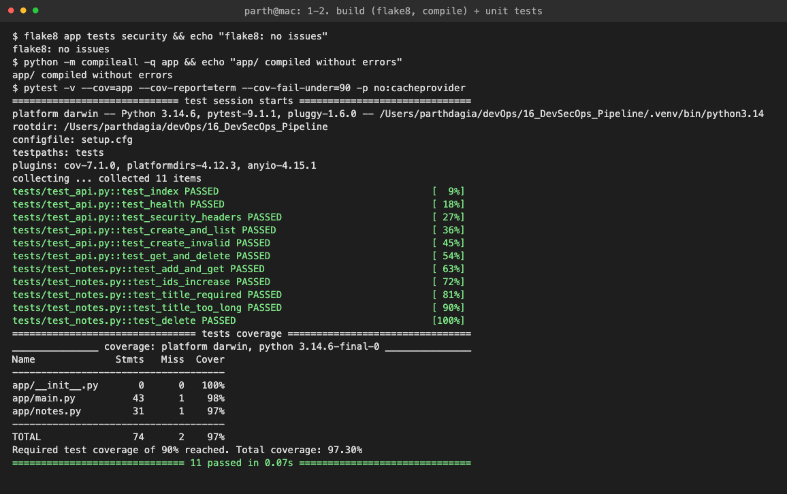 |
| 21 | 3. SAST: Bandit, Semgrep (~200 rules), Trivy config: 0 findings<br>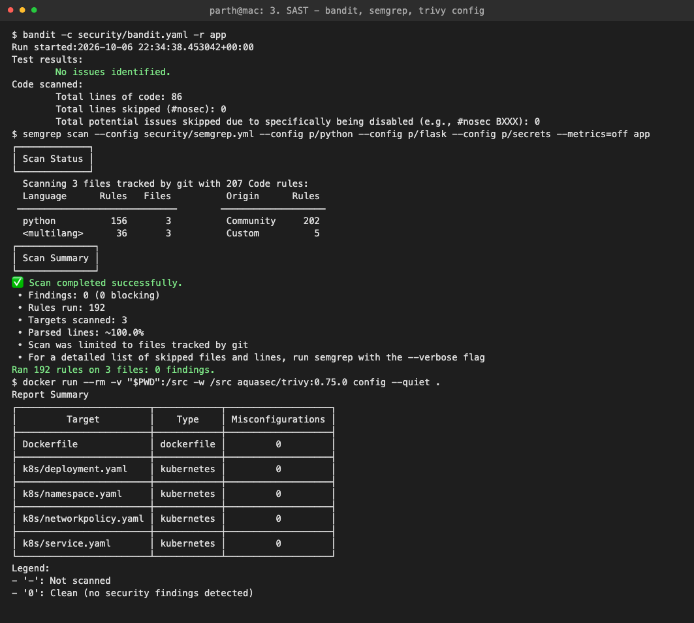 |
| 22 | 4. SCA: pip-audit + SBOM components<br>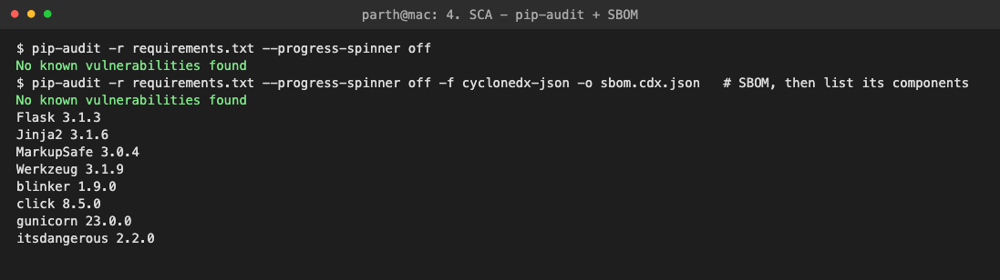 |
| 23 | 5. Secret scan: Gitleaks over the git history, no leaks<br>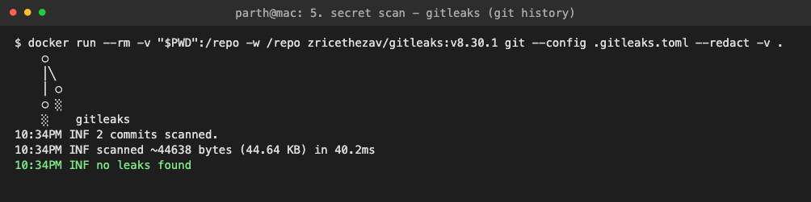 |
| 24 | 6. Docker build + smoke test: UID 10001, no pip, healthy<br>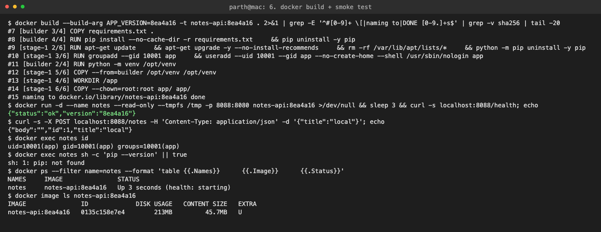 |
| 25 | 7. Trivy image scan: 0 vulnerabilities<br>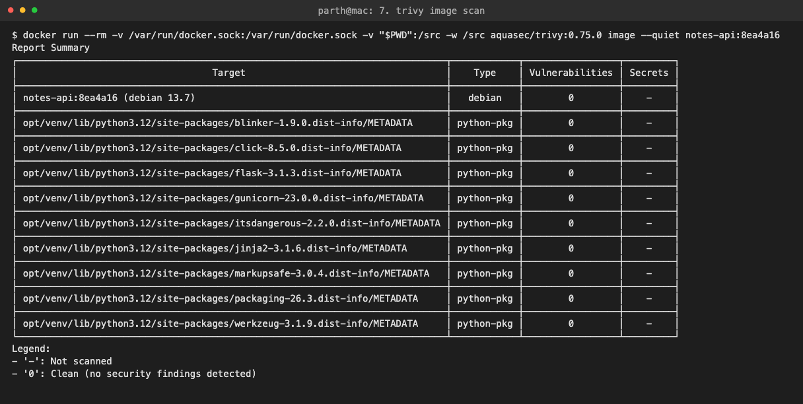 |
| 26 | 8. Security gate: PASSED<br>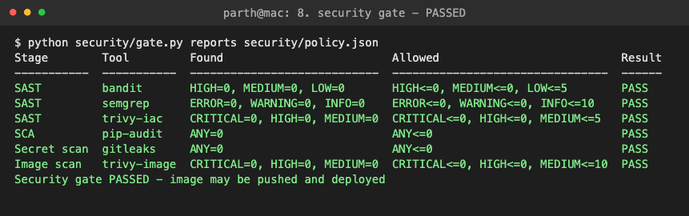 |
| 27 | 10. Deploy to kind: rollout, pods, service, network policy, PSA labels<br>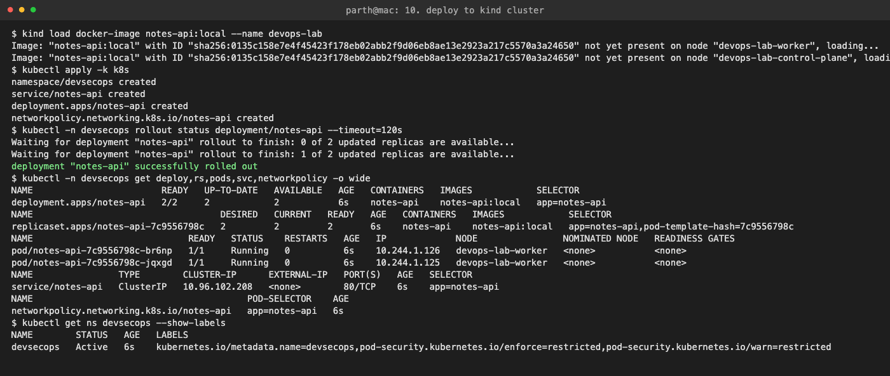 |
| 28 | Verify in Kubernetes: API works, read-only FS, root pod rejected by PSA<br>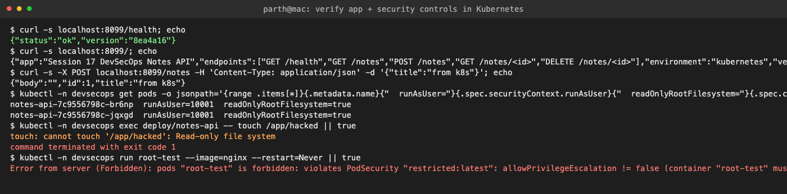 |
| 29 | First image scan: 10 MEDIUM CVEs in pip (fixed by removing pip)<br>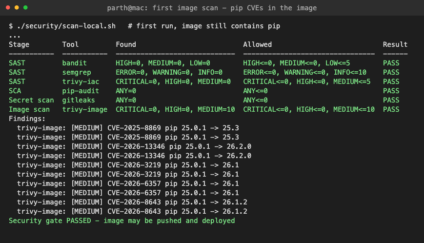 |
| 30 | Demo A: pip-audit finds vulnerable dependencies<br>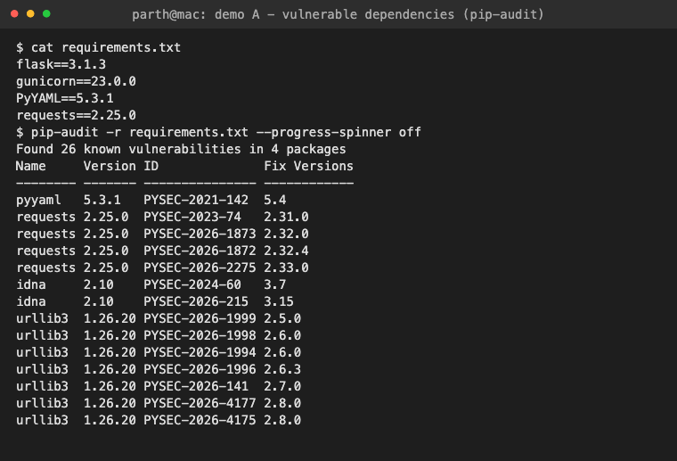 |
| 31 | Demo A: gate FAILED (SCA + image scan)<br>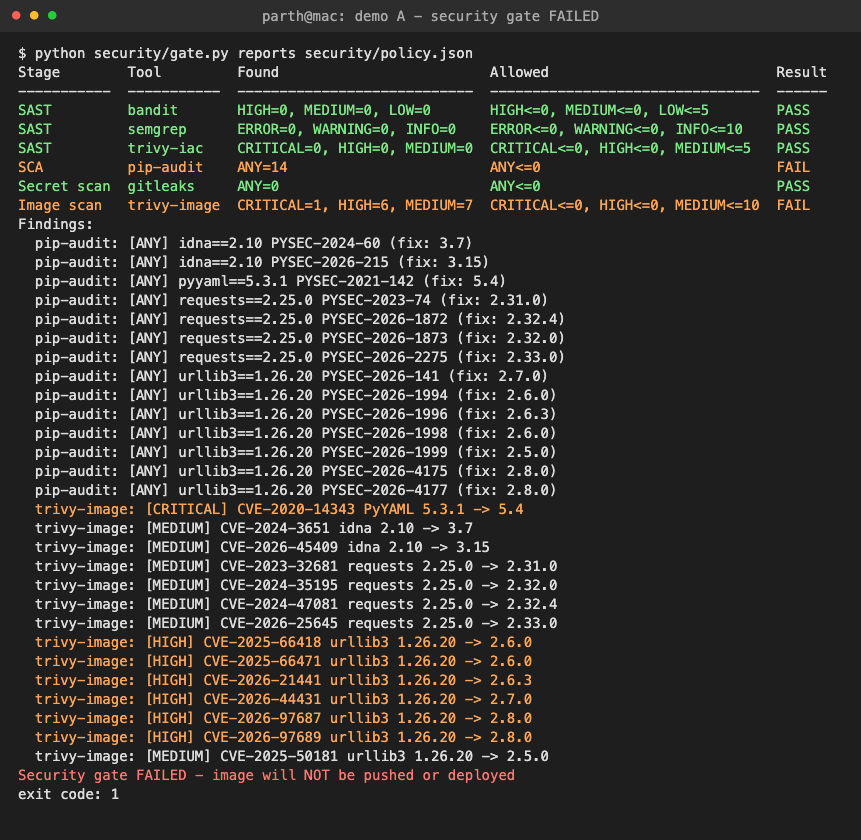 |
| 32 | Demo B: the insecure code<br>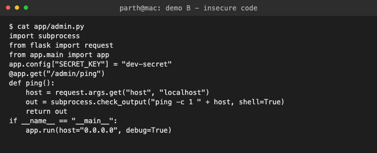 |
| 33 | Demo B: Bandit + Semgrep findings<br>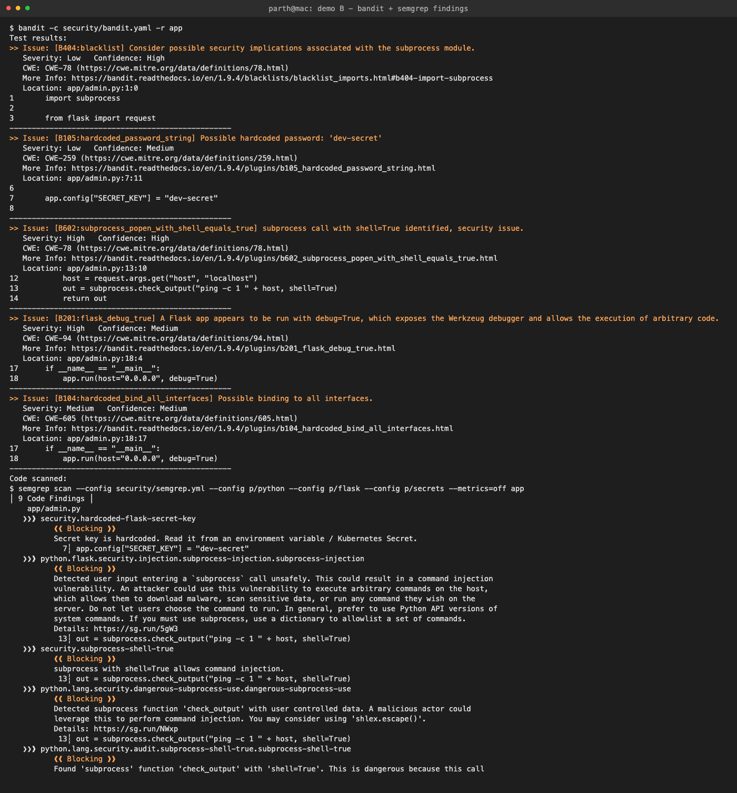 |
| 34 | Demo B: gate FAILED (SAST)<br>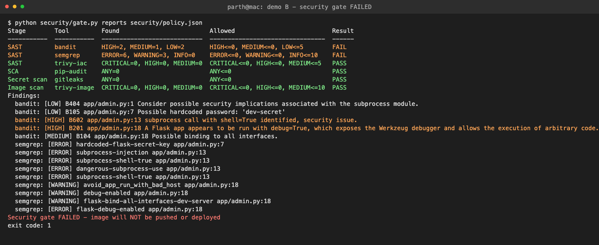 |
| 35 | Demo C: Gitleaks finds a token in a deleted file's history<br>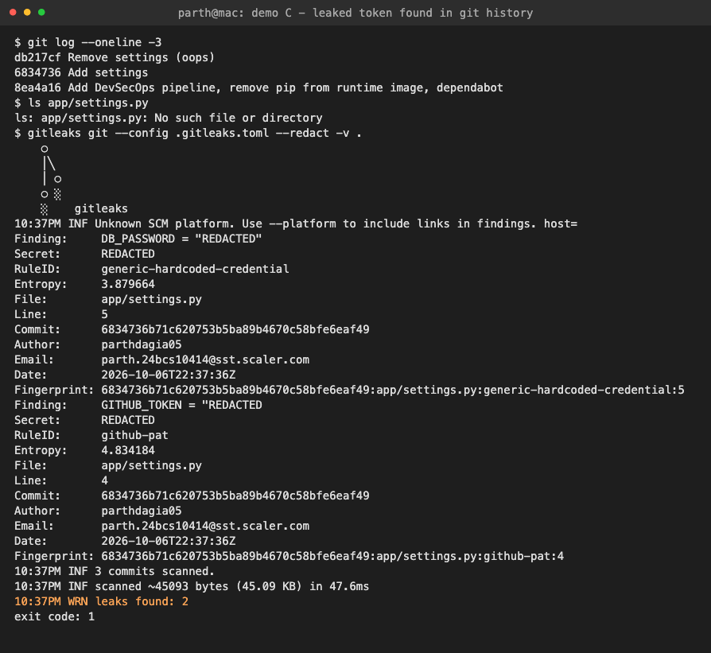 |
| 36 | Demo C: gate FAILED (secret scan)<br>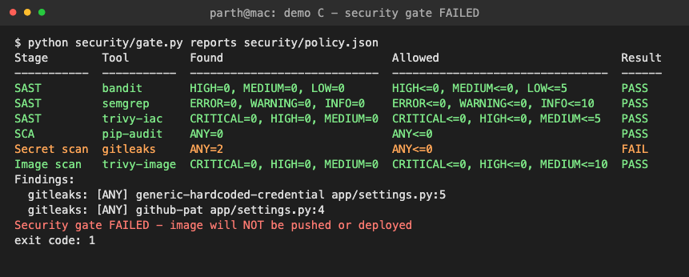 |

---

## Key learnings

1. **Security is part of the pipeline, not a separate step at the end.** Every push gets the same SAST, SCA, secret and image checks, and the result is a pass/fail anyone can see.
2. **Different scanners find different things.** SAST found the shell injection, SCA found PyYAML, Gitleaks found the token, and only the image scan saw the CVEs in pip (which isn't in `requirements.txt`).
3. **Transitive dependencies are most of the risk.** Adding one package (`requests`) brought in 13 advisories: 4 in `requests` itself and 9 in `urllib3` and `idna`, which I never asked for.
4. **Git history is permanent.** Deleting a committed secret doesn't remove it. Scan the full history, and rotate any secret that leaks.
5. **Push exactly what you scanned.** The image moves between jobs as a tarball and is never rebuilt after the scan.
6. **A gate needs evidence.** A missing report fails the gate. "The scanner didn't run" must never look like "the scanner found nothing".
7. **Defense in depth carries through to Kubernetes.** Even if something slips through, the pod runs as non-root with a read-only filesystem, no capabilities and no egress, and Pod Security Admission rejects anything less hardened.
