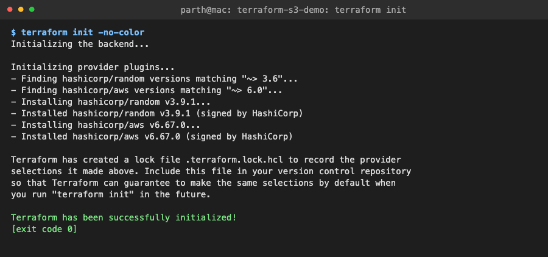
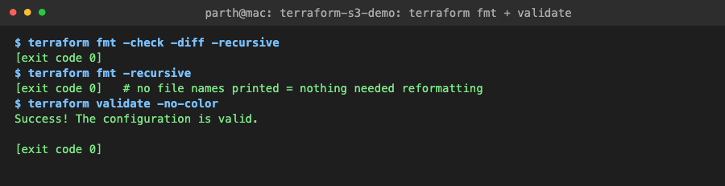
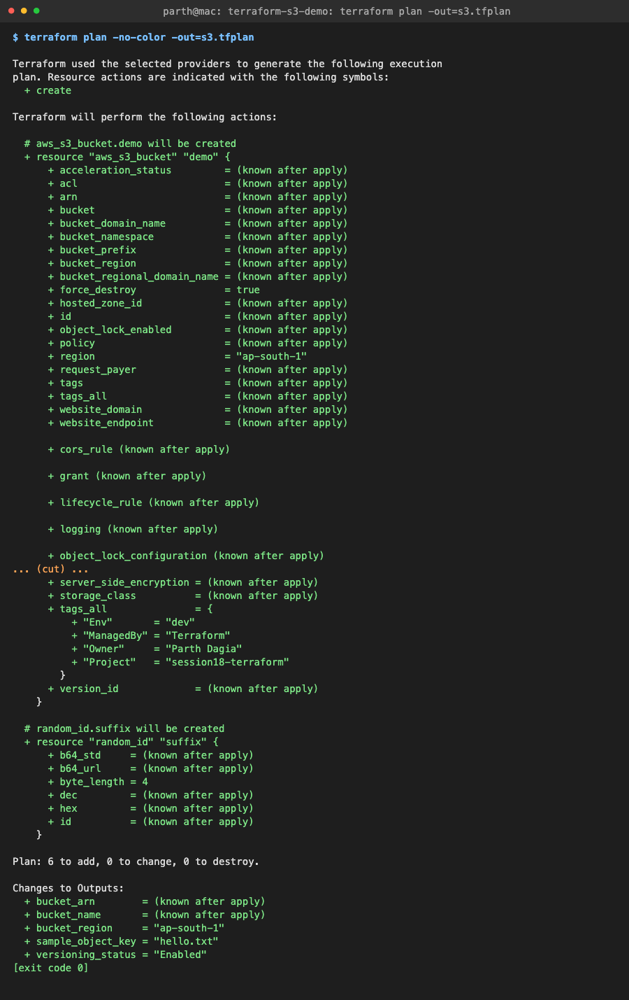
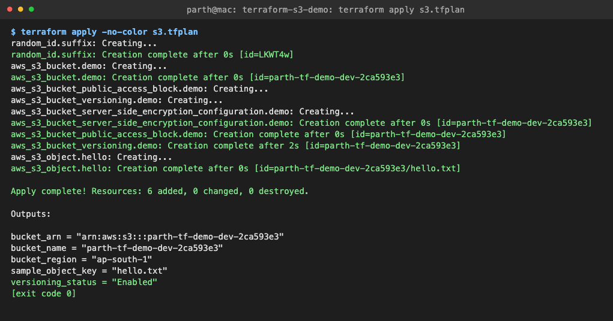
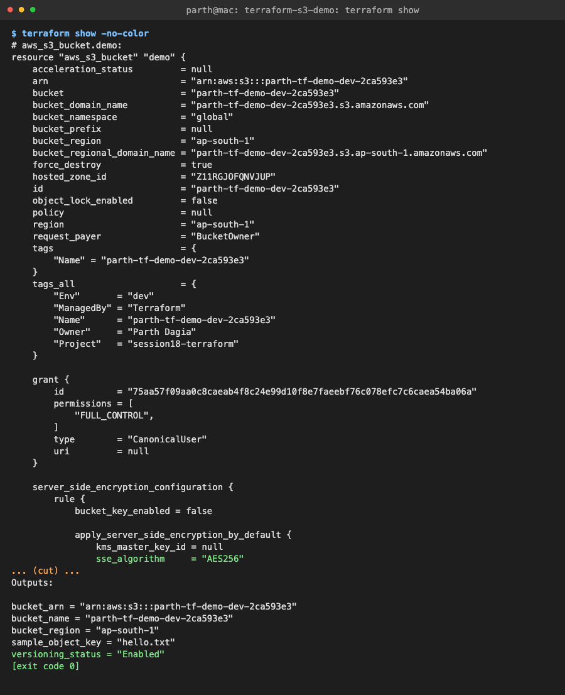
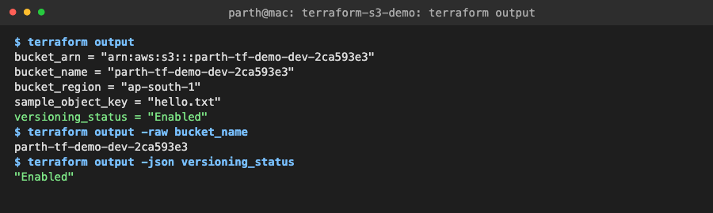
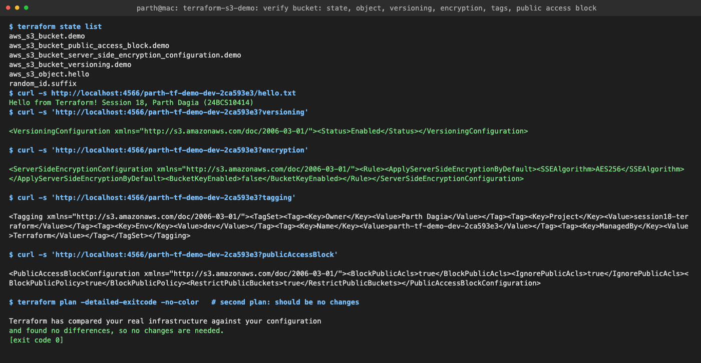
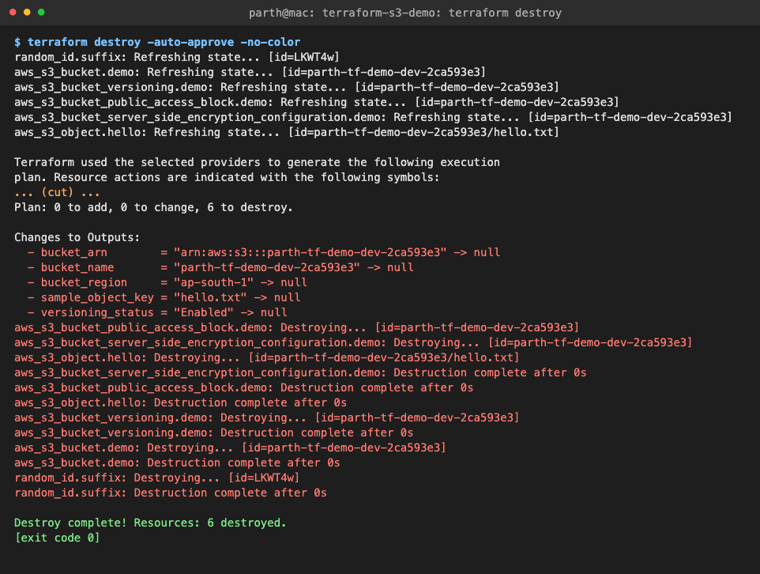
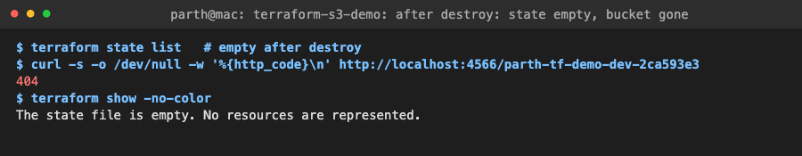

# Task 1: Terraform S3 Demo

**Name:** Parth Dagia
**Roll No:** 24BCS10414

A small Terraform project that creates an S3 bucket (with versioning, encryption, a public access block, tags and one sample object). I took it through the whole lifecycle: `init → fmt → validate → plan → apply → show → output → destroy`.

| Tool | Version |
|---|---|
| Terraform | v1.16.4 (`brew install hashicorp/tap/terraform`) |
| AWS provider | hashicorp/aws v6.67.0 |
| Random provider | hashicorp/random v3.9.1 |
| LocalStack | 4.14.0 (Docker, S3 emulator on `localhost:4566`) |

> **Why LocalStack?** I don't have an AWS account with billing set up, so I pointed the AWS provider at [LocalStack](https://github.com/localstack/localstack), which runs the S3 API locally in Docker. The Terraform code is the same code you would run on real AWS: change `use_localstack = false` in [terraform.tfvars](terraform.tfvars), run `aws configure`, and the same commands create a real bucket in `ap-south-1`. See [Running against real AWS](#running-against-real-aws).

## Contents

- [Project structure](#project-structure)
- [What each file does](#what-each-file-does)
- [Setup](#setup)
- [The workflow](#the-workflow)
  1. [terraform init](#1-terraform-init)
  2. [terraform fmt](#2-terraform-fmt)
  3. [terraform validate](#3-terraform-validate)
  4. [terraform plan](#4-terraform-plan)
  5. [terraform apply](#5-terraform-apply)
  6. [terraform show](#6-terraform-show)
  7. [terraform output](#7-terraform-output)
  8. [Verify the bucket](#8-verify-the-bucket)
  9. [terraform destroy](#9-terraform-destroy)
- [Running against real AWS](#running-against-real-aws)
- [Problem I hit: tags drift on LocalStack 4.0](#problem-i-hit-tags-drift-on-localstack-40)
- [Key learnings](#key-learnings)

## Project structure

```text
terraform-s3-demo/
├── provider.tf          # terraform {} block, required providers, AWS provider config
├── variables.tf         # input variables (with types, defaults, validation)
├── main.tf              # the resources: bucket, versioning, encryption, public access block, object
├── outputs.tf           # values printed after apply / by `terraform output`
├── terraform.tfvars     # my values for the variables
├── .terraform.lock.hcl  # provider versions pinned by `terraform init` (committed)
├── .gitignore           # ignores .terraform/, *.tfstate, *.tfplan
└── README.md
```

## What each file does

### [provider.tf](provider.tf)

- `terraform { required_providers {...} }` pins `hashicorp/aws ~> 6.0` and `hashicorp/random ~> 3.6`, and requires Terraform `>= 1.6`.
- `provider "aws"` sets the region and `default_tags` (`Project`, `Env`, `ManagedBy`, `Owner`) that get added to every AWS resource automatically.
- When `use_localstack = true` it uses dummy credentials (`test`/`test`), skips the AWS account checks, uses path-style S3 URLs, and a `dynamic "endpoints"` block sends S3/STS/IAM calls to `http://localhost:4566`. When it is `false`, none of that is set and the provider talks to real AWS.

### [variables.tf](variables.tf)

| Variable | Type | Default | Notes |
|---|---|---|---|
| `aws_region` | string | `ap-south-1` | Mumbai |
| `use_localstack` | bool | `false` | real AWS unless you opt in |
| `localstack_endpoint` | string | `http://localhost:4566` | |
| `project` | string | (required) | used in tags |
| `environment` | string | `dev` | `validation`: must be dev / stage / prod |
| `bucket_prefix` | string | (required) | `validation`: lowercase, digits, hyphens, 3 to 41 chars |
| `enable_versioning` | bool | `true` | |
| `force_destroy` | bool | `false` | allow destroying a non-empty bucket |

### [main.tf](main.tf)

| Resource | Why |
|---|---|
| `random_id.suffix` | S3 bucket names are **global** across every AWS account, so `parth-tf-demo-dev` alone could already be taken. 4 random bytes → `parth-tf-demo-dev-2ca593e3`. |
| `aws_s3_bucket.demo` | The bucket itself. |
| `aws_s3_bucket_versioning.demo` | Keeps old versions of overwritten or deleted objects. |
| `aws_s3_bucket_server_side_encryption_configuration.demo` | SSE-S3 (`AES256`) encryption at rest. |
| `aws_s3_bucket_public_access_block.demo` | All four "block public access" switches on. |
| `aws_s3_object.hello` | Uploads `hello.txt` so there is something to read back. |

Since AWS provider v4, versioning, encryption, etc. are **separate resources** and no longer arguments inside `aws_s3_bucket`. Each one references `aws_s3_bucket.demo.id`, and that reference is how Terraform knows the bucket has to be created first (implicit dependency). `aws_s3_object.hello` also has `depends_on = [aws_s3_bucket_versioning.demo]` so the object is uploaded after versioning is on and gets a version ID.

### [outputs.tf](outputs.tf)

`bucket_name`, `bucket_arn`, `bucket_region`, `versioning_status`, `sample_object_key`.

### [terraform.tfvars](terraform.tfvars)

```hcl
aws_region    = "ap-south-1"
project       = "session18-terraform"
environment   = "dev"
bucket_prefix = "parth-tf-demo"

enable_versioning = true
force_destroy     = true # demo bucket, OK to delete with objects inside

use_localstack = true
```

Terraform loads `terraform.tfvars` automatically; there's no need to pass `-var-file`.

## Setup

```bash
brew tap hashicorp/tap
brew install hashicorp/tap/terraform     # homebrew-core is stuck at 1.5.7 (last MPL release)
terraform version                        # Terraform v1.16.4 on darwin_arm64

docker run -d --name localstack -p 4566:4566 -e SERVICES=s3,sts,iam localstack/localstack:4.14
curl -s localhost:4566/_localstack/health   # "s3": "available", "version": "4.14.0"
```

## The workflow

```text
 write .tf ──▶ init ──▶ fmt ──▶ validate ──▶ plan ──▶ apply ──▶ show / output ──▶ destroy
               │        │        │            │         │          │                 │
          downloads  formats  checks       diff of   makes the  reads the       deletes
          providers  the code syntax +     desired   changes,   state file      everything
          into       (style)  types        vs real   writes                     in state
          .terraform/                      state     tfstate
```

Every command's full output is in [../logs/](../logs) and the screenshots are in [../screenshots/](../screenshots) (made from the logs with [../shot.py](../shot.py)).

### 1. terraform init

```console
$ terraform init
Initializing the backend...

Initializing provider plugins...
- Finding hashicorp/random versions matching "~> 3.6"...
- Finding hashicorp/aws versions matching "~> 6.0"...
- Installing hashicorp/random v3.9.1...
- Installed hashicorp/random v3.9.1 (signed by HashiCorp)
- Installing hashicorp/aws v6.67.0...
- Installed hashicorp/aws v6.67.0 (signed by HashiCorp)

Terraform has created a lock file .terraform.lock.hcl to record the provider
selections it made above. ...

Terraform has been successfully initialized!
```

What it did:

- **Backend**: no `backend` block, so state is stored locally in `terraform.tfstate`.
- **Providers**: downloaded the newest versions that match my constraints into `.terraform/providers/` (768 MB, mostly the AWS provider binary, which is why `.terraform/` is gitignored).
- **Lock file**: `.terraform.lock.hcl` records the exact versions and checksums. It *should* be committed so everyone gets the same provider versions. `terraform init -upgrade` moves to newer ones.



### 2. terraform fmt

```console
$ terraform fmt -check -diff -recursive
[exit code 0]
$ terraform fmt -recursive
[exit code 0]   # no file names printed = nothing needed reformatting
```

`fmt` rewrites `.tf` files into the canonical style (2-space indent, aligned `=` signs). It prints the names of files it changed. `-check` changes nothing and exits with code 3 if something *would* change, which is what you use in CI. I had written the files already aligned, so nothing changed.

### 3. terraform validate

```console
$ terraform validate
Success! The configuration is valid.
```

Checks syntax, references (e.g. `aws_s3_bucket.demo.id` exists), argument names and types, against the provider schemas. It does **not** contact AWS, so it can't know whether the bucket name is free or your credentials work. That's `plan`'s job. It needs `init` first (it needs the provider schemas).



The `validation` blocks in `variables.tf` run at plan time. For example, `environment = "test"` gives `environment must be one of: dev, stage, prod.`

### 4. terraform plan

```console
$ terraform plan -out=s3.tfplan
  # aws_s3_bucket.demo will be created
  + resource "aws_s3_bucket" "demo" {
      + arn                         = (known after apply)
      + bucket                      = (known after apply)
      + force_destroy               = true
      + region                      = "ap-south-1"
      ...
  # aws_s3_bucket_versioning.demo will be created
  # aws_s3_bucket_server_side_encryption_configuration.demo will be created
  # aws_s3_bucket_public_access_block.demo will be created
  # aws_s3_object.hello will be created
  # random_id.suffix will be created

Plan: 6 to add, 0 to change, 0 to destroy.

Changes to Outputs:
  + bucket_arn        = (known after apply)
  + bucket_name       = (known after apply)
  + bucket_region     = "ap-south-1"
  + sample_object_key = "hello.txt"
  + versioning_status = "Enabled"
```

- `plan` refreshes state, compares **desired** (the `.tf` files) with **current** (state + real infrastructure) and prints the diff. Symbols: `+` create, `-` destroy, `~` update in place, `-/+` replace.
- `(known after apply)`: the value depends on something that doesn't exist yet. The bucket name depends on `random_id`, so even the name is unknown until apply.
- `-out=s3.tfplan` saves the plan to a file. `terraform apply s3.tfplan` then does **exactly** that plan with no second prompt, so nothing changes between review and apply. (The plan file is gitignored because it can contain secrets.)

Full output (141 lines): [../logs/04-plan.log](../logs/04-plan.log)



### 5. terraform apply

```console
$ terraform apply s3.tfplan
random_id.suffix: Creating...
random_id.suffix: Creation complete after 0s [id=LKWT4w]
aws_s3_bucket.demo: Creating...
aws_s3_bucket.demo: Creation complete after 0s [id=parth-tf-demo-dev-2ca593e3]
aws_s3_bucket_public_access_block.demo: Creating...
aws_s3_bucket_versioning.demo: Creating...
aws_s3_bucket_server_side_encryption_configuration.demo: Creating...
aws_s3_bucket_server_side_encryption_configuration.demo: Creation complete after 0s [id=parth-tf-demo-dev-2ca593e3]
aws_s3_bucket_public_access_block.demo: Creation complete after 0s [id=parth-tf-demo-dev-2ca593e3]
aws_s3_bucket_versioning.demo: Creation complete after 2s [id=parth-tf-demo-dev-2ca593e3]
aws_s3_object.hello: Creating...
aws_s3_object.hello: Creation complete after 0s [id=parth-tf-demo-dev-2ca593e3/hello.txt]

Apply complete! Resources: 6 added, 0 changed, 0 destroyed.

Outputs:

bucket_arn = "arn:aws:s3:::parth-tf-demo-dev-2ca593e3"
bucket_name = "parth-tf-demo-dev-2ca593e3"
bucket_region = "ap-south-1"
sample_object_key = "hello.txt"
versioning_status = "Enabled"
```

The order follows the **dependency graph**: `random_id`, then the bucket, then the three bucket settings **in parallel** (they only depend on the bucket), then the object last (it waits for versioning because of `depends_on`). Without a saved plan, `terraform apply` makes a new plan and asks `Enter a value: yes`.

After apply, `terraform.tfstate` exists. It's a JSON file that maps each resource address (`aws_s3_bucket.demo`) to the real object's ID and attributes. It is gitignored because it can contain secrets and must not be edited by hand. Teams keep it in a remote backend (an S3 bucket with locking) instead.



### 6. terraform show

```console
$ terraform show
# aws_s3_bucket.demo:
resource "aws_s3_bucket" "demo" {
    arn                         = "arn:aws:s3:::parth-tf-demo-dev-2ca593e3"
    bucket                      = "parth-tf-demo-dev-2ca593e3"
    bucket_domain_name          = "parth-tf-demo-dev-2ca593e3.s3.amazonaws.com"
    bucket_regional_domain_name = "parth-tf-demo-dev-2ca593e3.s3.ap-south-1.amazonaws.com"
    force_destroy               = true
    id                          = "parth-tf-demo-dev-2ca593e3"
    region                      = "ap-south-1"
    tags_all                    = {
        "Env"       = "dev"
        "ManagedBy" = "Terraform"
        "Name"      = "parth-tf-demo-dev-2ca593e3"
        "Owner"     = "Parth Dagia"
        "Project"   = "session18-terraform"
    }
    ...
```

`show` prints the current **state** in a readable form: every attribute of every resource, including the ones Terraform filled in (ARN, domain names). `tags` only has `Name` (set in `main.tf`), while `tags_all` = `tags` + the provider's `default_tags`. `terraform show s3.tfplan` would instead show a saved plan, and `terraform show -json` gives machine-readable output.

Full output: [../logs/06-show.log](../logs/06-show.log)



### 7. terraform output

```console
$ terraform output
bucket_arn = "arn:aws:s3:::parth-tf-demo-dev-2ca593e3"
bucket_name = "parth-tf-demo-dev-2ca593e3"
bucket_region = "ap-south-1"
sample_object_key = "hello.txt"
versioning_status = "Enabled"
$ terraform output -raw bucket_name
parth-tf-demo-dev-2ca593e3
$ terraform output -json versioning_status
"Enabled"
```

Reads output values from state (no API calls). `-raw` prints a bare string, which is handy in scripts: `aws s3 ls s3://$(terraform output -raw bucket_name)`. `-json` is for tools like `jq`.



### 8. Verify the bucket

Not one of the required commands, but I wanted proof that the bucket really has the settings I asked for, so I queried the S3 API directly with `curl` (LocalStack accepts unsigned requests):

```console
$ terraform state list
aws_s3_bucket.demo
aws_s3_bucket_public_access_block.demo
aws_s3_bucket_server_side_encryption_configuration.demo
aws_s3_bucket_versioning.demo
aws_s3_object.hello
random_id.suffix
$ curl -s http://localhost:4566/parth-tf-demo-dev-2ca593e3/hello.txt
Hello from Terraform! Session 18, Parth Dagia (24BCS10414)
$ curl -s 'http://localhost:4566/parth-tf-demo-dev-2ca593e3?versioning'
<VersioningConfiguration ...><Status>Enabled</Status></VersioningConfiguration>
$ curl -s 'http://localhost:4566/parth-tf-demo-dev-2ca593e3?encryption'
<ServerSideEncryptionConfiguration ...><Rule><ApplyServerSideEncryptionByDefault><SSEAlgorithm>AES256</SSEAlgorithm>...
$ curl -s 'http://localhost:4566/parth-tf-demo-dev-2ca593e3?tagging'
<Tagging ...><TagSet><Tag><Key>Owner</Key><Value>Parth Dagia</Value></Tag>...<Key>ManagedBy</Key><Value>Terraform</Value>...
$ curl -s 'http://localhost:4566/parth-tf-demo-dev-2ca593e3?publicAccessBlock'
<PublicAccessBlockConfiguration ...><BlockPublicAcls>true</BlockPublicAcls><IgnorePublicAcls>true</IgnorePublicAcls><BlockPublicPolicy>true</BlockPublicPolicy><RestrictPublicBuckets>true</RestrictPublicBuckets>...

$ terraform plan -detailed-exitcode   # second plan: should be no changes
Terraform has compared your real infrastructure against your configuration
and found no differences, so no changes are needed.
[exit code 0]
```

The second `plan` is the important one: **no changes** means the code is idempotent. Running `apply` again would do nothing. `-detailed-exitcode` returns 0 = no changes, 2 = changes pending, 1 = error, which is how CI pipelines detect drift.

On real AWS the same checks would be `aws s3api get-bucket-versioning --bucket <name>`, `get-bucket-encryption`, `get-bucket-tagging`, `get-public-access-block`.



### 9. terraform destroy

```console
$ terraform destroy -auto-approve
...
Plan: 0 to add, 0 to change, 6 to destroy.

Changes to Outputs:
  - bucket_arn        = "arn:aws:s3:::parth-tf-demo-dev-2ca593e3" -> null
  ...
aws_s3_bucket_public_access_block.demo: Destroying... [id=parth-tf-demo-dev-2ca593e3]
aws_s3_bucket_server_side_encryption_configuration.demo: Destroying... [id=parth-tf-demo-dev-2ca593e3]
aws_s3_object.hello: Destroying... [id=parth-tf-demo-dev-2ca593e3/hello.txt]
...
aws_s3_bucket_versioning.demo: Destruction complete after 0s
aws_s3_bucket.demo: Destroying... [id=parth-tf-demo-dev-2ca593e3]
aws_s3_bucket.demo: Destruction complete after 0s
random_id.suffix: Destroying... [id=LKWT4w]
random_id.suffix: Destruction complete after 0s

Destroy complete! Resources: 6 destroyed.

$ terraform state list   # empty after destroy
$ curl -s -o /dev/null -w '%{http_code}\n' http://localhost:4566/parth-tf-demo-dev-2ca593e3
404
$ terraform show
The state file is empty. No resources are represented.
```

- Destroy runs the dependency graph **in reverse**: the object and bucket settings first, the bucket after them, and `random_id` last.
- It only touches what is in **state**. Anything created by hand in the console is left alone.
- An S3 bucket that still has objects (or old versions) can't be deleted. `force_destroy = true` lets Terraform empty it first. Fine for a demo; for a real bucket keep it `false` and add `lifecycle { prevent_destroy = true }`.
- I used `-auto-approve` because I ran it from a script. Interactively, `terraform destroy` shows the plan and waits for `yes`. `terraform plan -destroy` previews it without doing anything.




## Running against real AWS

```bash
aws configure                      # access key of an IAM user/role with S3 permissions, region ap-south-1
# terraform.tfvars: use_localstack = false
terraform init
terraform plan -out=s3.tfplan
terraform apply s3.tfplan
aws s3 ls | grep parth-tf-demo     # bucket is there
aws s3 cp s3://$(terraform output -raw bucket_name)/hello.txt -
terraform destroy                  # S3 storage is cheap, but clean up anyway
```

Nothing in `main.tf` changes. Only the provider block skips the LocalStack settings. A real setup would also use a remote backend so state isn't on one laptop:

```hcl
terraform {
  backend "s3" {
    bucket       = "parth-tf-state"
    key          = "session18/s3-demo.tfstate"
    region       = "ap-south-1"
    use_lockfile = true   # S3-native state locking (no DynamoDB table needed since TF 1.10)
    encrypt      = true
  }
}
```

## Problem I hit: tags drift on LocalStack 4.0

My first run used the `localstack/localstack:4.0` image. `apply` succeeded, but the second `plan` was **not** clean:

```console
  # aws_s3_bucket.demo will be updated in-place
  ~ resource "aws_s3_bucket" "demo" {
      ~ tags     = {
          + "Name" = "parth-tf-demo-dev-b8773ea6"
        }
      ~ tags_all = {
          + "Env"       = "dev"
          ...
Plan: 0 to add, 1 to change, 0 to destroy.
```

`curl '...?tagging'` returned `NoSuchTagSet`: the bucket had **no tags at all**. With `TF_LOG=DEBUG` I could see that AWS provider v6.67 no longer makes a separate `PutBucketTagging` call. It now sends the tags inside the `CreateBucket` request (AWS added tag-on-create for S3 buckets). LocalStack 4.0 is from November 2024, older than that API change, so it silently dropped the tags. Every `plan` would try to add them again.

Fix: I destroyed everything, switched to `localstack/localstack:4.14`, and re-ran the full workflow from a clean directory. The tags were saved and the second plan was clean. The logs and screenshots above are all from that clean run. Lesson: an emulator lags behind the real API, so a "perpetual diff" against it can be the emulator's fault and not your code's.

## Key learnings

1. Terraform is **declarative**: I describe the end state and `plan` works out the create/update/delete steps from the diff between code and state.
2. **State** is the source of truth for what Terraform manages. `show`, `output`, `state list` and `destroy` all work from it. Keep it out of git and in a locked remote backend for teams.
3. References between resources (`aws_s3_bucket.demo.id`) build the dependency graph. That gives the create order, parallel creation of independent resources, and reverse order on destroy.
4. `plan -out` + `apply <planfile>` guarantees you apply exactly what you reviewed.
5. Run `plan` a second time after `apply`: "no changes" proves the config is idempotent; a diff means drift or a provider/API mismatch (like my LocalStack tags issue).
6. Commit `.terraform.lock.hcl`, ignore `.terraform/` and `*.tfstate`.
7. `fmt -check` and `validate` are cheap, offline checks that belong in every CI pipeline before `plan`.
