# Session 19: Cloud & Terraform in Action

**Name:** Parth Dagia
**Roll No:** 24BCS10414

An end-to-end Terraform project that builds a small web stack on AWS: a **VPC** with a public **subnet**, an Internet Gateway and route table, a **security group**, an **EC2** instance (nginx) with an IAM role, and an **S3** bucket that holds the web page the instance serves. I ran the full lifecycle (`init`, `fmt`, `validate`, `plan`, `apply`, `output`, `state`, `graph`, `destroy`) and saved the output of every command.

> **Where it ran:** same setup as Session 18. I don't have an AWS account with billing, so the AWS provider points at [LocalStack](https://github.com/localstack/localstack) 4.14 in Docker, which emulates the EC2, S3, IAM and STS APIs on `localhost:4566`. The Terraform code is plain AWS code. Setting `use_localstack = false` in [terraform.tfvars](terraform/terraform.tfvars) sends the same 19 resources to a real AWS account in `ap-south-1` (see [Running on real AWS](#running-on-real-aws)). LocalStack doesn't boot a real VM, so `user_data` doesn't actually run there; everything else (IDs, CIDRs, rules, routes, state, the S3 object) is real API state that I checked with the AWS CLI.

## Contents

| | |
|---|---|
| Terraform project | [terraform/](terraform) |
| Architecture diagram | [diagram/architecture.png](diagram/architecture.png) ([svg](diagram/architecture.svg)) |
| Dependency graph | [diagram/dependency-graph.png](diagram/dependency-graph.png), drawn from `terraform graph` ([raw dot](diagram/terraform-graph-raw.dot)) |
| Command logs | [logs/](logs) (12 files) |
| Screenshots | [screenshots/](screenshots) (12 images, rendered from the logs with [shot.py](shot.py)) |

## Architecture

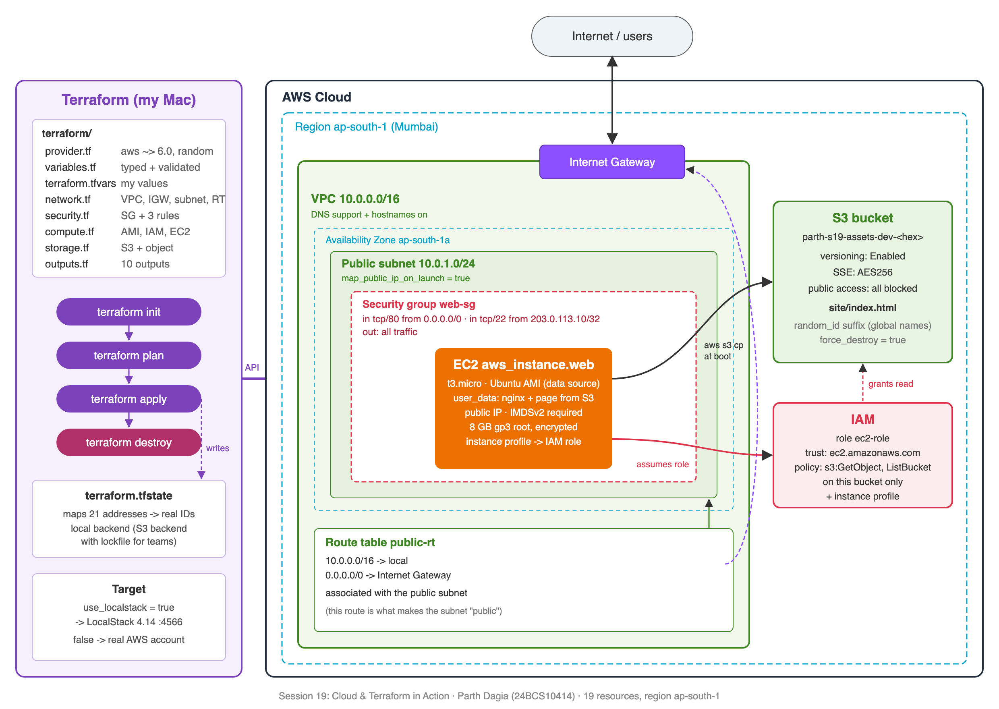

```text
Terraform
    |
    ├── VPC  10.0.0.0/16 ── Internet Gateway ── Route table (0.0.0.0/0 -> IGW)
    |
    ├── Subnet  10.0.1.0/24, public, ap-south-1a
    |
    ├── Security Group  in 80 from anywhere, in 22 from 203.0.113.10/32, out all
    |
    ├── EC2  t3.micro Ubuntu, nginx, IAM instance profile, IMDSv2, encrypted gp3
    |
    └── S3  versioned, encrypted, public access blocked, holds site/index.html
```

How a request flows: a user hits the instance's public IP, traffic enters through the Internet Gateway, the route table sends it into the public subnet, the security group lets port 80 in, and nginx serves `index.html`. At boot the instance copies that page from S3 using its IAM role, so there are no access keys on the server.

## Project layout

```text
terraform/
├── provider.tf       # terraform block, aws ~> 6.0 + random ~> 3.6, LocalStack/real AWS switch, default_tags
├── variables.tf      # 10 typed variables, 3 with validation rules
├── terraform.tfvars  # my values (loaded automatically)
├── network.tf        # VPC, Internet Gateway, public subnet, route table + association, AZ data source
├── security.tf       # security group + 2 ingress rules + 1 egress rule
├── compute.tf        # Ubuntu AMI data source, IAM role/policy/instance profile, EC2 instance
├── storage.tf        # random suffix, S3 bucket, versioning, encryption, public access block, index.html
├── outputs.tf        # 10 outputs (IDs, public IP, URL, bucket name/ARN)
└── .gitignore        # .terraform/, *.tfstate, *.tfplan
```

Splitting by layer instead of one big `main.tf` keeps each file short. Terraform loads every `.tf` file in the folder as one configuration, so the split has no effect on behaviour.

## The concepts the task asks for

### 1. Providers

[provider.tf](terraform/provider.tf) pins two providers. `terraform init` downloaded `hashicorp/aws v6.67.0` and `hashicorp/random v3.9.1` and wrote their checksums to `.terraform.lock.hcl`.

```hcl
required_providers {
  aws    = { source = "hashicorp/aws",    version = "~> 6.0" }
  random = { source = "hashicorp/random", version = "~> 3.6" }
}

provider "aws" {
  region = var.aws_region
  # use_localstack = true -> endpoints for ec2/s3/iam/sts become http://localhost:4566
  default_tags { tags = { Project = var.project, Env = var.environment, ManagedBy = "Terraform", Owner = "Parth Dagia" } }
}
```

`default_tags` puts the four tags on every AWS resource, so the individual resources only set `Name`.

### 2. Variables

Every value that might change between environments is a variable in [variables.tf](terraform/variables.tf), with a type, a description and a default where one makes sense. Three have validation rules:

| Variable | Validation |
|---|---|
| `environment` | must be `dev`, `stage` or `prod` |
| `vpc_cidr` | `can(cidrhost(var.vpc_cidr, 0))`, so it must be a valid CIDR |
| `bucket_prefix` | regex for a legal S3 name prefix, 3–41 chars |

My values are in [terraform.tfvars](terraform/terraform.tfvars). Any of them can be overridden on the command line, which is what I did in step 9 with `-var instance_type=t3.small`.

### 3. Resources and data sources

19 managed resources plus 2 data sources (21 entries in state):

| Layer | Resources |
|---|---|
| Network | `aws_vpc.main`, `aws_internet_gateway.main`, `aws_subnet.public`, `aws_route_table.public`, `aws_route_table_association.public` |
| Security | `aws_security_group.web`, `aws_vpc_security_group_ingress_rule.http`, `..._ingress_rule.ssh`, `aws_vpc_security_group_egress_rule.all` |
| Compute | `aws_iam_role.ec2`, `aws_iam_role_policy.s3_read`, `aws_iam_instance_profile.ec2`, `aws_instance.web` |
| Storage | `random_id.suffix`, `aws_s3_bucket.assets`, `aws_s3_bucket_versioning.assets`, `aws_s3_bucket_server_side_encryption_configuration.assets`, `aws_s3_bucket_public_access_block.assets`, `aws_s3_object.index` |
| Data sources (read only) | `data.aws_ami.ubuntu` (latest Canonical Ubuntu AMI), `data.aws_availability_zones.available` |

Some choices worth pointing out:

- **Security group rules as separate resources** (`aws_vpc_security_group_ingress_rule`) instead of inline `ingress {}` blocks. This is what the AWS provider docs now recommend: each rule gets its own ID and can be changed without touching the others.
- **SSH only from one IP** (`allowed_ssh_cidr`); HTTP is open because it's a web server.
- **No hard-coded AMI ID.** The `aws_ami` data source finds the latest Ubuntu image from Canonical's account (`099720109477`), so the code works in any region.
- **IAM role instead of keys.** The instance profile gives the instance temporary credentials, and the policy allows only `s3:GetObject`/`s3:ListBucket` on this one bucket.
- **IMDSv2 required** and an **encrypted root volume**, both cheap hardening settings.

### 4. Outputs

[outputs.tf](terraform/outputs.tf) exposes 10 values. After apply:

```text
ami_id = "ami-1e749f67"
availability_zone = "ap-south-1a"
bucket_arn = "arn:aws:s3:::parth-s19-assets-dev-a06fbc57"
bucket_name = "parth-s19-assets-dev-a06fbc57"
instance_id = "i-01a3b942f708b1b1c"
instance_public_ip = "54.214.118.96"
public_subnet_id = "subnet-247acf240e16e7e91"
security_group_id = "sg-9617f05a855df0bfb"
vpc_id = "vpc-5fa447bc340b3a57e"
website_url = "http://54.214.118.96"
```

I used `terraform output -raw bucket_name` etc. in my verify script, which is how outputs get passed to other tools.

### 5. Dependencies

Terraform builds a graph and creates things in dependency order, running independent resources in parallel.

**Implicit dependencies** come from references. `vpc_id = aws_vpc.main.id` in the subnet means "subnet after VPC". I never wrote that order down; Terraform worked it out.

**Explicit dependencies** use `depends_on` when there's no reference to follow. The instance's boot script needs internet access (apt, S3) and the IAM policy attached, but none of the instance's arguments mention the route table association or the role policy. So in [compute.tf](terraform/compute.tf):

```hcl
depends_on = [
  aws_route_table_association.public,
  aws_iam_role_policy.s3_read,
]
```

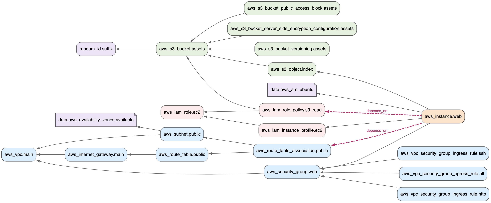

Arrows point from a resource to what it depends on; the two dashed red edges are the `depends_on` ones. You can see the order in the apply log: `aws_vpc.main` and the other no-dependency resources finish first, `aws_instance.web` is created **last**, and on destroy the order reverses: the instance goes early and `aws_vpc.main` is the **last** thing deleted.

### 6. Terraform state

State ([06-state.log](logs/06-state.log)) is the JSON file that maps each address in my code (`aws_instance.web`) to the real object (`i-01a3b942f708b1b1c`). Without it Terraform couldn't plan updates or know what to destroy.

```text
$ terraform state list          # 21 addresses
$ terraform state show aws_instance.web   # every attribute AWS returned
```

The state file holds resource IDs and sometimes secrets, so it's in `.gitignore` and not committed. For a team I'd use the S3 backend with locking; the block is in [provider.tf](terraform/provider.tf), commented out.

## Commands I ran

```bash
# 0. LocalStack with the 4 AWS APIs this project needs
docker run -d --name localstack -p 4566:4566 -e SERVICES=s3,sts,iam,ec2 localstack/localstack:4.14
alias aws='docker exec localstack awslocal --region ap-south-1'   # AWS CLI inside the container

cd terraform
terraform init
terraform fmt -check -recursive
terraform validate
terraform plan -out=tfplan
terraform apply tfplan
terraform output
terraform state list
terraform state show aws_instance.web
# verify through the AWS API (logs/07-verify.log)
terraform plan -detailed-exitcode          # second plan, must say "No changes"
terraform plan -var instance_type=t3.small # change detection, not applied
terraform graph
terraform destroy -auto-approve
terraform state list                       # empty
```

| # | Command | Result | Log | Screenshot |
|---|---|---|---|---|
| 1 | `terraform init` | aws v6.67.0 + random v3.9.1 installed, lock file created | [01](logs/01-init.log) | [png](screenshots/01-init.png) |
| 2 | `terraform fmt -check` + `validate` | formatted; `Success! The configuration is valid.` | [02](logs/02-fmt-validate.log) | [png](screenshots/02-fmt-validate.png) |
| 3 | `terraform plan -out=tfplan` | `Plan: 19 to add, 0 to change, 0 to destroy.` | [03](logs/03-plan.log) | [png](screenshots/03-plan.png) |
| 4 | `terraform apply tfplan` | `Apply complete! Resources: 19 added, 0 changed, 0 destroyed.` | [04](logs/04-apply.log) | [png](screenshots/04-apply.png) |
| 5 | `terraform output` | 10 outputs | [05](logs/05-output.log) | [png](screenshots/05-output.png) |
| 6 | `terraform state list` / `state show` | 21 addresses; full instance attributes | [06](logs/06-state.log) | [png](screenshots/06-state.png) |
| 7 | AWS CLI checks | VPC available, subnet public, route to IGW, 3 SG rules, instance running, page in S3, versioning on, public access blocked | [07](logs/07-verify.log) | [png](screenshots/07-verify.png) |
| 8 | `terraform plan -detailed-exitcode` | `No changes.` exit code 0, so the config is idempotent | [08](logs/08-second-plan.log) | [png](screenshots/08-second-plan.png) |
| 9 | `terraform plan -var instance_type=t3.small` | `aws_instance.web will be updated in-place`, `Plan: 0 to add, 1 to change` | [09](logs/09-change-plan.log) | [png](screenshots/09-change-plan.png) |
| 10 | `terraform graph` | 24 dependency edges | [10](logs/10-graph.log) | [png](screenshots/10-graph.png) |
| 11 | `terraform destroy` | `Destroy complete! Resources: 19 destroyed.` | [11](logs/11-destroy.log) | [png](screenshots/11-destroy.png) |
| 12 | after destroy | state empty, instance `terminated`, VPC `InvalidVpcID.NotFound`, bucket `NoSuchBucket` | [12](logs/12-after-destroy.log) | [png](screenshots/12-after-destroy.png) |

## Screenshots

**terraform init**

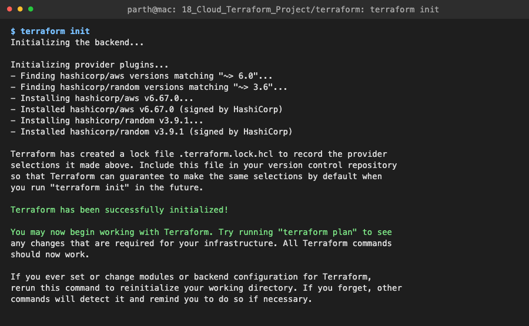

**terraform fmt + validate**

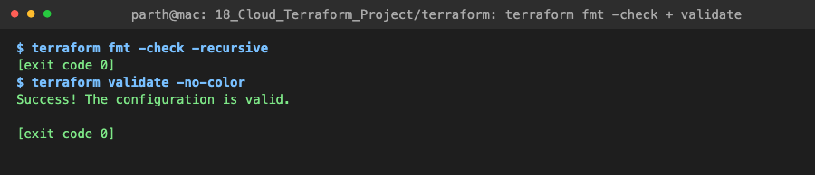

**terraform plan** (cut to the VPC block and the summary; the full 528-line plan is in [03-plan.log](logs/03-plan.log))

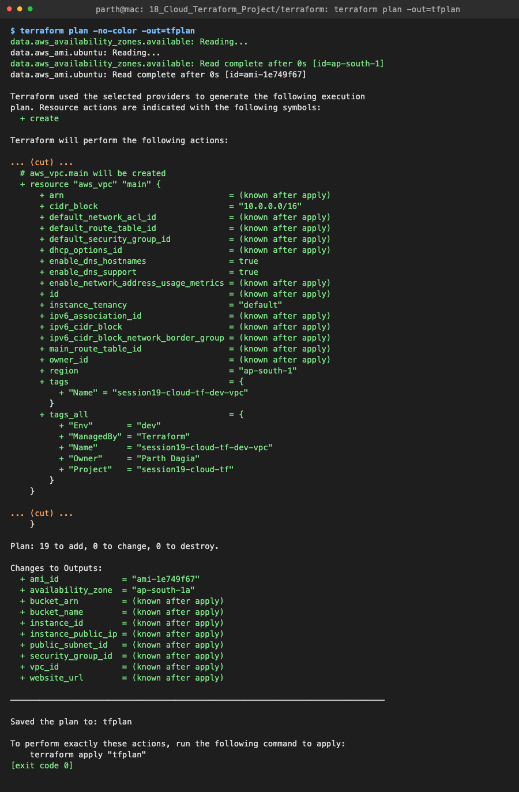

**terraform apply**: notice `aws_instance.web` is created last

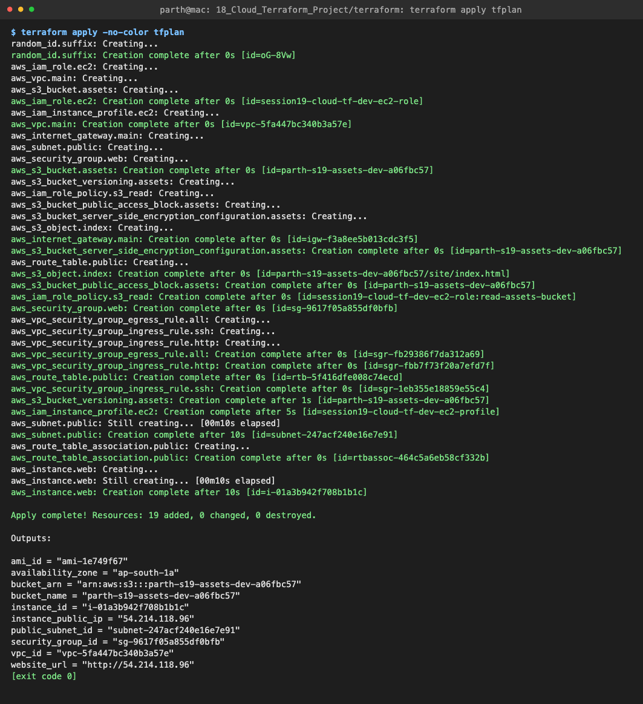

**terraform output**

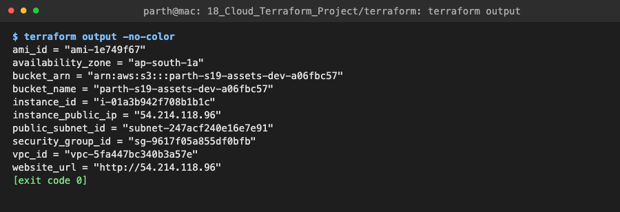

**terraform state**

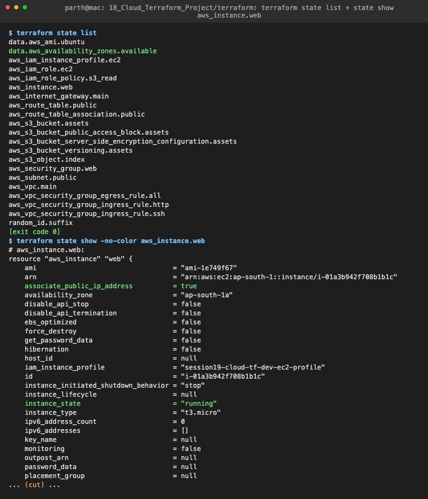

**AWS resources, checked through the AWS API**

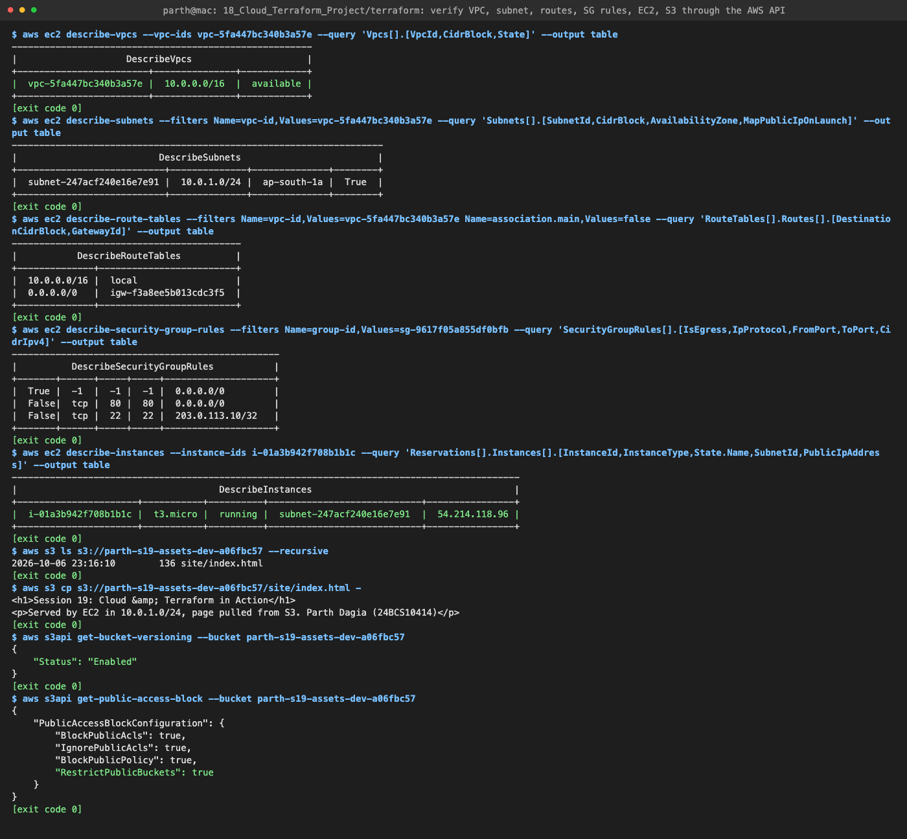

**Second plan: no changes**

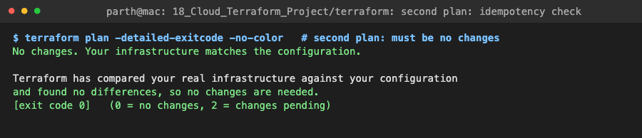

**Changing a variable: in-place update**

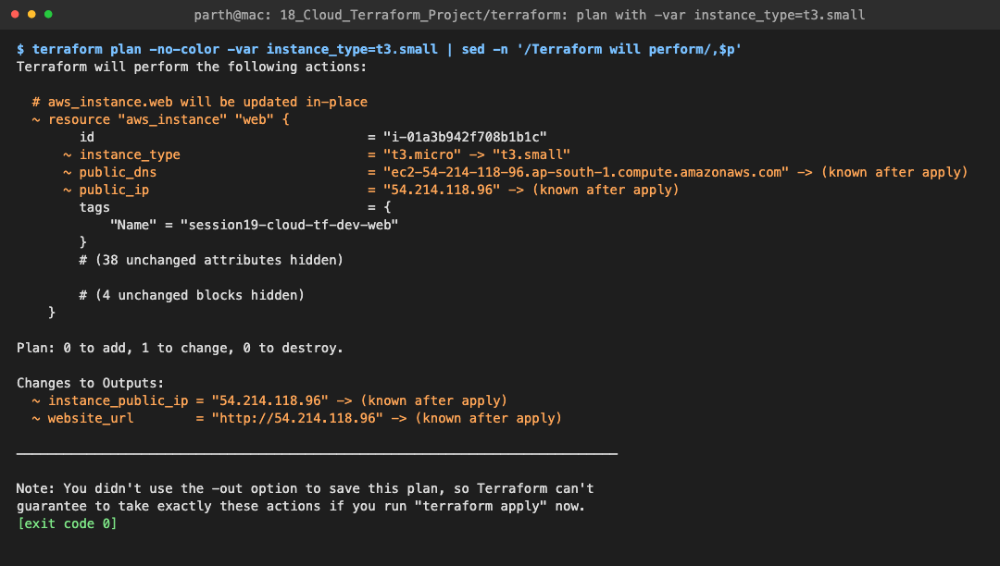

**terraform graph**

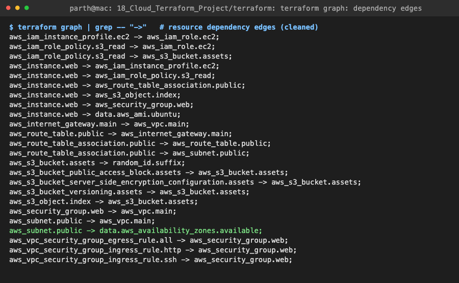

**terraform destroy**: reverse order, VPC last

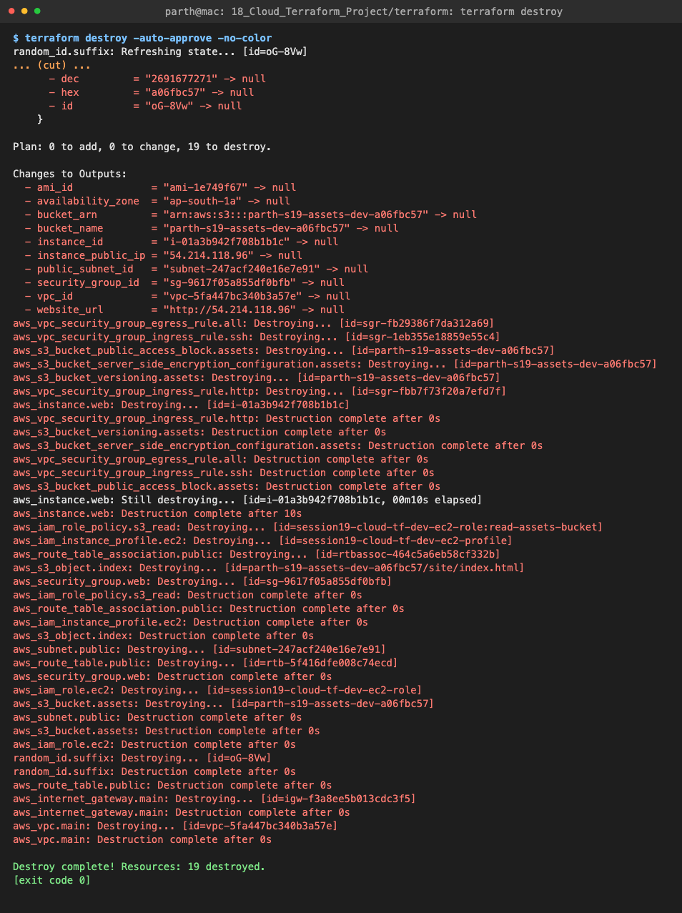

**After destroy**

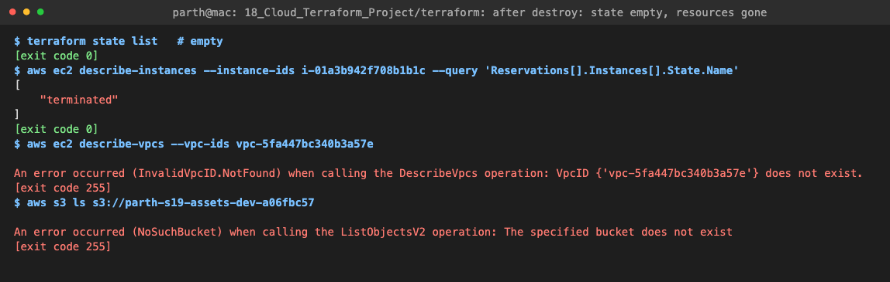

## plan vs apply vs destroy

| Command | What it does | Changes anything? |
|---|---|---|
| `terraform plan` | Refreshes state, compares it with the code, prints the diff (`+` create, `~` update, `-/+` replace, `-` destroy) | No |
| `terraform plan -out=tfplan` | Same, but saves the exact plan to a file | No |
| `terraform apply tfplan` | Runs exactly the saved plan, no new diff, no prompt | Yes |
| `terraform apply` | Plans again, asks `yes`, then applies | Yes |
| `terraform destroy` | Plans deleting everything in state, in reverse dependency order | Yes |

Saving the plan with `-out` and applying that file means what I reviewed is exactly what runs, even if someone changes the code in between. That's how CI pipelines usually do it.

Step 9 is a useful example of reading a plan: changing `instance_type` is `~ update in-place` (AWS stops the instance, changes the type and starts it again), and the public IP becomes `(known after apply)` because a stopped instance loses its auto-assigned IP. In an earlier trial I also changed `environment` to `stage`, and the plan showed `-/+ must be replaced` for the IAM role and instance profile, because their `name` contains the environment and IAM names can't be changed in place. The plan tells you which changes are safe and which recreate things before you run anything.

## Running on real AWS

```bash
aws configure                                  # access key of an IAM user with EC2/S3/IAM rights
sed -i '' 's/use_localstack = true/use_localstack = false/' terraform/terraform.tfvars
# set allowed_ssh_cidr to "$(curl -s ifconfig.me)/32"
cd terraform && terraform init && terraform plan -out=tfplan && terraform apply tfplan
curl "$(terraform output -raw website_url)"    # nginx serving the page from S3 (give it ~1 min to boot)
terraform destroy                              # t3.micro + S3 cost a few cents an hour; don't leave it running
```

On real AWS `user_data` actually runs, so the `website_url` output serves the page. Two things differ from LocalStack: the AMI data source finds a current Ubuntu image instead of LocalStack's 2017 mock image, and the S3 provider settings (`s3_use_path_style`, skip validation) switch off automatically because they're tied to `use_localstack`.

## Problems I hit

1. **First "idempotency" log was wrong.** I first ran `terraform plan -detailed-exitcode | tail -4` and logged the exit code, but that was `tail`'s exit code, not Terraform's. Piping hides the exit status of the first command. I re-ran it with the output redirected to a file and `$?` read right after `terraform plan`, which gives the real code (0 = no changes, 2 = changes).
2. **Noisy change-plan demo.** My first change plan also renamed the environment, which buried the one-line instance change under IAM replacements. I re-recorded with only `instance_type` changed. All logs and screenshots here come from one clean run in a single pass, so the IDs match across every file.
3. **`user_data` on LocalStack.** The instance shows `running` but LocalStack's EC2 is a mock with no real VM, so nginx never starts. I verified the parts LocalStack does implement (network, rules, IAM, S3) through the API and documented the real AWS steps above.

## Key learnings

1. The dependency graph is the core of Terraform. References give implicit ordering for free; `depends_on` is only for dependencies the code can't express, like "the boot script needs this route."
2. Destroy is the same graph in reverse. That's why the VPC is created first and deleted last.
3. A second `plan` showing **No changes** is the quickest check that the code and the real infrastructure agree.
4. Read the plan symbols before applying: `~` is safe, `-/+` means something gets recreated (new ID, maybe downtime).
5. State is what links code to real resources. Keep it out of git, and use a remote backend with locking when more than one person runs Terraform.
6. Variables plus one `use_localstack` flag let the same code target an emulator or a real account, with no copy-pasted configurations.
